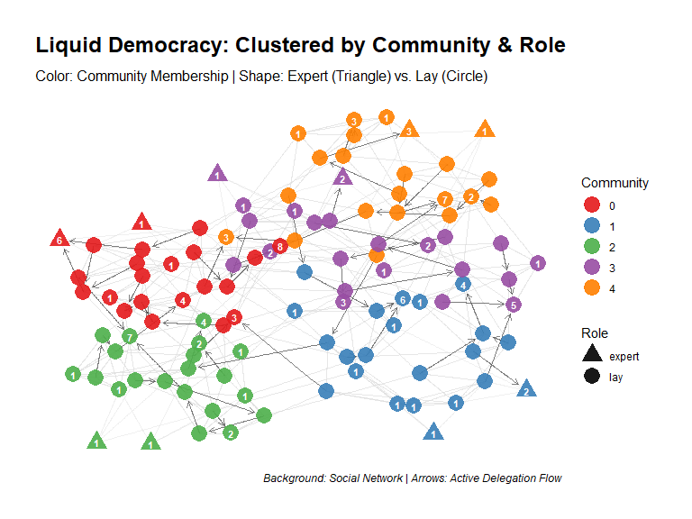
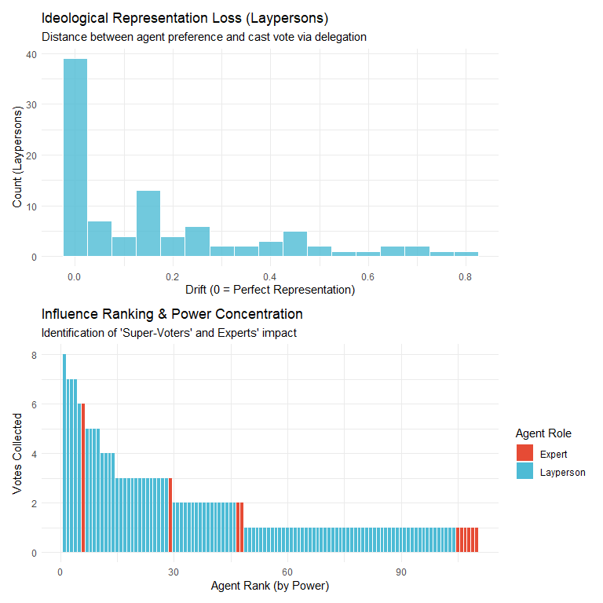

Project Log: Liquid Democracy Simulation
================
2026-02-20

- [Project Overview](#project-overview)
- [\[Baseline\] - Initial Model
  Implementation](#baseline---initial-model-implementation)
  - [Summary of the Current Base
    Code](#summary-of-the-current-base-code)
    - [Core Technical Components:](#core-technical-components)
  - [Baseline Metrics (Summary
    Function)](#baseline-metrics-summary-function)
    - [1. Representation & Efficiency](#1-representation--efficiency)
    - [2. Power Distribution &
      Inequality](#2-power-distribution--inequality)
    - [3. Network Macro-Structure](#3-network-macro-structure)
    - [4. Expert vs. Layperson
      Dynamics](#4-expert-vs-layperson-dynamics)
  - [Simulation run for
    Visualisation](#simulation-run-for-visualisation)
  - [Simulation Execution](#simulation-execution)
  - [\[Update\] - 2026-02-22:
    Visualisation](#update---2026-02-22-visualisation)
    - [1. Multi-Layer Network Mapping](#1-multi-layer-network-mapping)
    - [2. Summary Table](#2-summary-table)
    - [3. Distributional Diagnostics](#3-distributional-diagnostics)

# Project Overview

This document serves as a continuous research log for the whole Project.
It tracks any important change, parameter experiments, and key findings.

------------------------------------------------------------------------

# \[Baseline\] - Initial Model Implementation

## Summary of the Current Base Code

The baseline version implements a multi-community Liquid Democracy
environment. The simulation explores how voting power concentrates as
agents delegate their votes to peers or experts based on ideological
proximity and perceived influence.

### Core Technical Components:

#### 1. Agent Architecture

- **Types**: The population consists of **Laypersons** (regular voters)
  and **Experts** (specialized nodes).
- **Preferences**: Every agent is assigned a random preference value
  between $0$ and $1$, representing their ideological position.
- **Communities**: Agents are organized into distinct communities to
  simulate local social structures.

#### 2. Network Topologies

- **Friendship Rings**: Each community starts with a ring-lattice
  structure, representing a local social circle where everyone is
  connected to their immediate neighbors.
- **Expert Connectivity**: A defined percentage of laypersons in each
  community is connected to local experts.
- **Maslov-Sneppen Rewiring**: The model includes an optional rewiring
  mechanism to transform the local rings into Small-World networks,
  allowing for cross-community interactions.

#### 3. Delegation Logic

The decision to delegate is stochastic and based on an **Attractiveness
Score**. An agent $i$ considers delegating to a friend $j$ based on: \*
**Preference Similarity**: Agents prefer delegates with similar
ideological positions. \* **Power Responsiveness**: Agents are attracted
to delegates who already hold significant voting power.

The probability of delegation is calculated using a logistic function:
$$Attractiveness = \frac{1 - |pref_i - pref_j|}{1 + e^{-resp \cdot (power_j - power_i)}}$$

#### 4. Vote Propagation & Metrics

- **Power Counting**: The model recursively counts how many people have
  delegated (directly or indirectly) to a specific node.
- **Vote Attribution**: Preferences are propagated from the final
  representatives back through the delegation chain.
- **Lost Votes**: The system tracks “lost votes,” which occur when
  delegation cycles form or when agents have no path to a final
  representative.

------------------------------------------------------------------------

## Baseline Metrics (Summary Function)

To evaluate the state of the simulation, a comprehensive
`summary_metrics` function has been implemented. It tracks the following
key indicators:

### 1. Representation & Efficiency

- **Lost Vote Rate**: Measures the percentage of agents whose votes do
  not reach a final representative (due to cycles or isolation).
- **Average Delegation Distance**: The average length of the delegation
  chains, indicating how “liquid” or direct the democracy is.

### 2. Power Distribution & Inequality

- **Gini Coefficient (Power)**: Quantifies the inequality of voting
  power across the network ($0$ = perfect equality, $1$ = total
  concentration).
- **Max/Mean Power**: Identifies the influence of the strongest
  “super-voters” compared to the average agent.

### 3. Network Macro-Structure

- **Components**: Counts the number of isolated delegation clusters.
- **Largest Component Size**: Monitors the size of the dominant voting
  bloc.

### 4. Expert vs. Layperson Dynamics

- **Comparative Power**: Groups results by agent type to analyze if
  experts actually accumulate the majority of the community’s influence
  as intended by the model design.

------------------------------------------------------------------------

## Simulation run for Visualisation

``` r
source("Network.R") 
source("Summary.R")
source("Visualisations.R")
```

## Simulation Execution

``` r
set.seed(123)

res <- simulate_liquid_democracy(
  seed = 123,
  number_of_nodes_per_community = 20,
  number_of_communities = 5,
  node_degree = 6,
  number_of_experts_per_community = 2,
  expert_connectedness = 0.2,
  MS_rewiring_iterations = 50,
  responsiveness_to_power = 1,
  T = 200 # number of delegation updates
)
```

------------------------------------------------------------------------

## \[Update\] - 2026-02-22: Visualisation

To complement the numerical metrics, a visualization toolkit has been
implemented to evaluate the structural and qualitative performance of
the models.

### 1. Multi-Layer Network Mapping

The structural visualization distinguishes between the static social
fabric and the dynamic flow of power. \* **Community & Role**: Agents
are colored by their social community, while shapes distinguish between
**Experts (Triangles)** and **Laypersons (Circles)**. \* **Dual-Edge
Logic**: Faint grey lines represent potential social ties (Friendship),
while dark arrows track the actual path of delegated votes. \* **Power
Labels**: Numeric values indicate the final voting weight concentrated
in the hands of the representatives.

``` r
# Visualizing the Network Structure
plot_social_and_delegation(res)
```

<!-- -->

### 2. Summary Table

Contains all relevant metrics.

``` r
summary_table <- get_summary_table(res)

knitr::kable(
  summary_table,
  col.names = c("Dimension", "Metric", "Value"),
  caption = "Liquid Democracy: System Performance Overview"
)
```

| Dimension        | Metric                   |  Value |
|:-----------------|:-------------------------|-------:|
| Representation   | Lost Vote Rate (%)       |  4.550 |
| Representation   | Avg. Delegation Distance |  2.120 |
| Inequality       | Gini (Power)             |  0.361 |
| Inequality       | Max Power (Single Agent) |  8.000 |
| Opinion Dynamics | Avg. Ideological Drift   |  0.155 |
| Opinion Dynamics | Max. Ideological Drift   |  0.788 |
| Network Macro    | Active Components        | 47.000 |

Liquid Democracy: System Performance Overview

### 3. Distributional Diagnostics

Two key charts provide a “health check” of the current simulation state:
\* **Ideological Drift (Representation Loss)**: This focuses exclusively
on laypersons. It measures the distance between an agent’s true
preference and the vote eventually cast by their delegate. A
concentration near 0 indicates high-quality representation. \* **Power
Concentration**: This ranks all agents by influence. It visually
identifies the emergence of “Super-Voters” and confirms whether experts
are accumulating the majority of the community’s influence as intended.

``` r
plot_summary_stats(res)
```

<!-- -->
