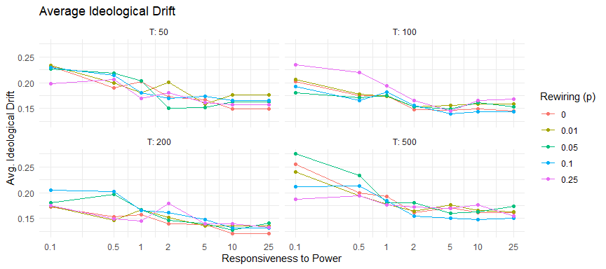
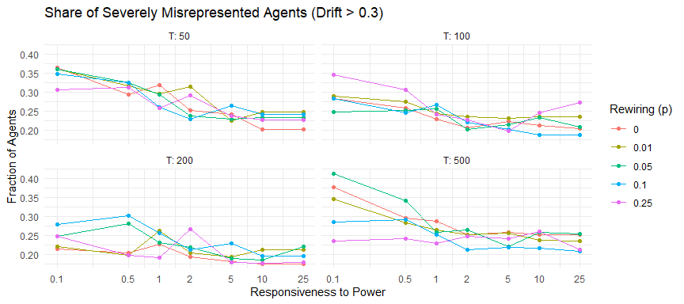
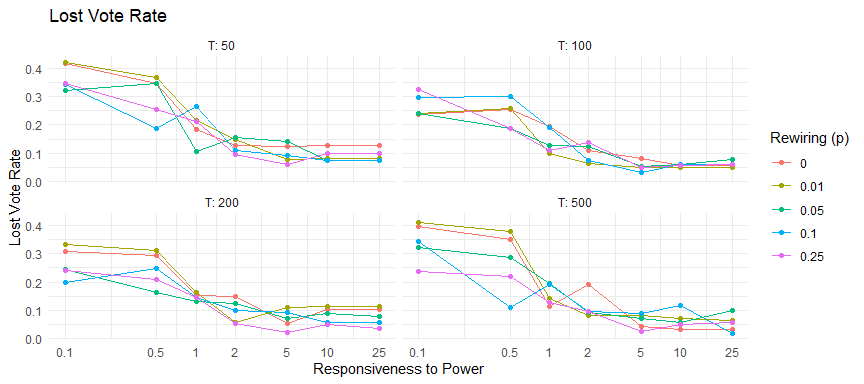
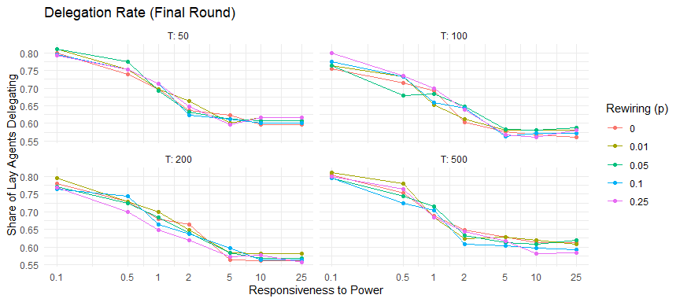
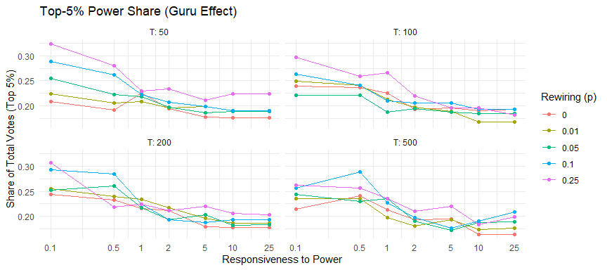
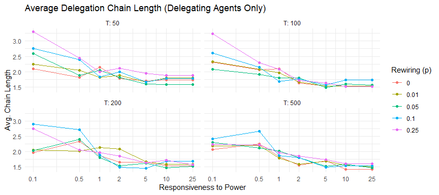
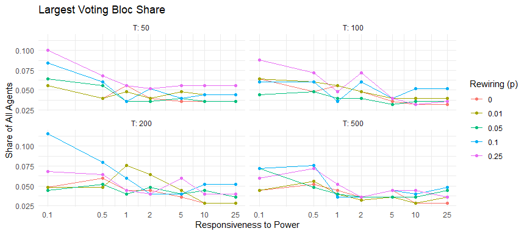
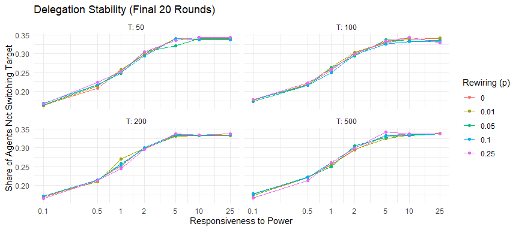
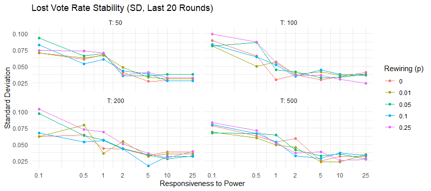
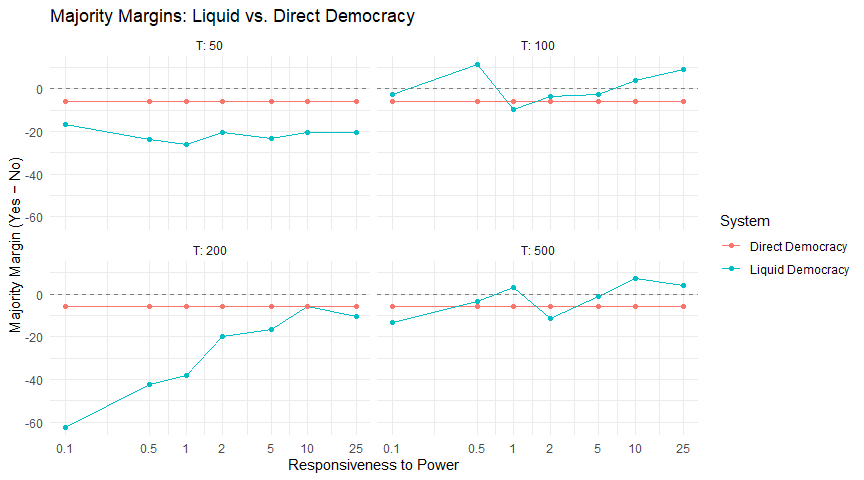

Liquid Democracy — Experiment 1: Responsiveness to Power
================
2026-03-05

## Experimental Design

This experiment explores how responsiveness to power affects the
behaviour of the Liquid Democracy system. Experts are disabled to
isolate the dynamics among lay agents only.

We systematically vary three parameters:

- **Responsiveness to power**: 0.1 → 25
- **Network rewiring probability**: 0 → 0.25
- **Delegation rounds T**: 50 → 500

``` r
responsiveness_vals <- c(0.1, 0.5, 1, 2, 5, 10, 25)
p_rewire_vals       <- c(0, 0.01, 0.05, 0.1, 0.25)
T_vals              <- c(50, 100, 200, 500)

param_grid <- expand.grid(
  responsiveness = responsiveness_vals,
  p_rewire       = p_rewire_vals,
  T              = T_vals
)

cat("Total parameter combinations:", nrow(param_grid), "\n")
```

    ## Total parameter combinations: 140

------------------------------------------------------------------------

## Simulation Function

Each row of the parameter grid is passed to `run_single_simulation()`,
which runs the full model and extracts all outcome metrics.

``` r
run_single_simulation <- function(responsiveness, p_rewire, T) {

  sim <- simulate_liquid_democracy(
    seed                    = 123,
    n_per_community         = 50,
    n_communities           = 5,
    node_degree             = 6,
    n_experts_per_community = 0,
    expert_connectedness    = 0,
    p_rewire                = p_rewire,
    responsiveness          = responsiveness,
    T                       = T
  )

  stats <- summary_metrics(sim)

  # only return outcome metrics — parameter columns already exist in param_grid
  tibble(
    # Representation quality
    avg_ideological_drift       = stats$dynamic_evaluation$avg_ideological_drift,
    med_ideological_drift       = stats$dynamic_evaluation$med_ideological_drift,
    max_ideological_drift       = stats$dynamic_evaluation$max_ideological_drift,
    pct_high_drift              = stats$dynamic_evaluation$pct_high_drift,

    # Vote loss and delegation behaviour
    lost_vote_rate              = stats$network_description$lost_vote_rate,
    delegation_rate             = stats$network_description$delegation_rate,

    # Power concentration
    gini_power                  = stats$network_description$gini_power_inequality,
    top5_power_share            = stats$network_description$top5_power_share,

    # Chain structure
    avg_chain_length_all        = stats$network_description$avg_chain_length_all,
    avg_chain_length_delegators = stats$network_description$avg_chain_length_delegators,

    # Network structure
    largest_voting_bloc_share   = stats$network_description$largest_voting_bloc_share,

    # Outcome margins
    liquid_margin               = stats$dynamic_evaluation$liquid_margin,
    direct_margin               = stats$dynamic_evaluation$direct_margin,

    # Convergence
    convergence_sd              = stats$convergence$convergence_sd,
    delegation_stability        = stats$convergence$delegation_stability
  )
}
```

------------------------------------------------------------------------

## Run All Simulations

``` r
t_start <- proc.time()

results <- param_grid %>%
  mutate(sim = purrr::pmap(
    list(responsiveness, p_rewire, T),
    run_single_simulation
  )) %>%
  unnest(sim)

t_end   <- proc.time()
elapsed <- (t_end - t_start)[["elapsed"]]

cat(sprintf("Grid completed: %d simulations in %.1f seconds (%.1f min)\n",
            nrow(param_grid), elapsed, elapsed / 60))
```

    ## Grid completed: 140 simulations in 221.9 seconds (3.7 min)

------------------------------------------------------------------------

## Results

### Representation Quality

#### Plot 1 — Average Ideological Drift

Higher responsiveness makes agents delegate to ideologically proximate
and powerful agents, reducing the distance between their own preference
and the vote cast on their behalf.

``` r
ggplot(results,
       aes(x = responsiveness, y = avg_ideological_drift,
           color = factor(p_rewire))) +
  geom_line() + geom_point() +
  facet_wrap(~T, labeller = label_both) +
  x_scale +
  labs(title   = "Average Ideological Drift",
       x       = "Responsiveness to Power",
       y       = "Avg. Ideological Drift",
       color   = "Rewiring (p)") +
  theme_minimal()
```

<!-- -->

#### Plot 2 — Share of High-Drift Agents (drift \> 0.3)

Average drift can mask heavy-tailed distributions. This plot shows the
share of agents who are severely misrepresented (drift \> 0.3).

``` r
ggplot(results,
       aes(x = responsiveness, y = pct_high_drift,
           color = factor(p_rewire))) +
  geom_line() + geom_point() +
  facet_wrap(~T, labeller = label_both) +
  x_scale +
  labs(title   = "Share of Severely Misrepresented Agents (Drift > 0.3)",
       x       = "Responsiveness to Power",
       y       = "Fraction of Agents",
       color   = "Rewiring (p)") +
  theme_minimal()
```

<!-- -->

------------------------------------------------------------------------

### Vote Loss and Delegation Behaviour

#### Plot 3 — Lost Vote Rate

Cycles cause votes to be lost entirely. High responsiveness reduces
random delegation and drives agents toward stable hubs, lowering cycle
frequency.

``` r
ggplot(results,
       aes(x = responsiveness, y = lost_vote_rate,
           color = factor(p_rewire))) +
  geom_line() + geom_point() +
  facet_wrap(~T, labeller = label_both) +
  x_scale +
  labs(title   = "Lost Vote Rate",
       x       = "Responsiveness to Power",
       y       = "Lost Vote Rate",
       color   = "Rewiring (p)") +
  theme_minimal()
```

<!-- -->

#### Plot 4 — Delegation Rate

The share of lay agents who delegated in the final round. Combined with
the lost vote rate, this distinguishes whether losses stem from high
delegation volume or from cycle-prone delegation patterns.

``` r
ggplot(results,
       aes(x = responsiveness, y = delegation_rate,
           color = factor(p_rewire))) +
  geom_line() + geom_point() +
  facet_wrap(~T, labeller = label_both) +
  x_scale +
  labs(title   = "Delegation Rate (Final Round)",
       x       = "Responsiveness to Power",
       y       = "Share of Lay Agents Delegating",
       color   = "Rewiring (p)") +
  theme_minimal()
```

<!-- -->

------------------------------------------------------------------------

### Power Concentration

#### Plot 5 — Gini Coefficient of Voting Power

Overall inequality in the power distribution among represented agents. A
Gini of 0 means all agents hold equal power; 1 means a single agent
holds all votes.

``` r
ggplot(results,
       aes(x = responsiveness, y = gini_power,
           color = factor(p_rewire))) +
  geom_line() + geom_point() +
  facet_wrap(~T, labeller = label_both) +
  x_scale +
  labs(title   = "Power Inequality (Gini Coefficient)",
       x       = "Responsiveness to Power",
       y       = "Gini Coefficient of Voting Power",
       color   = "Rewiring (p)") +
  theme_minimal()
```

<!-- -->

#### Plot 6 — Top-5% Power Share

Captures the “guru effect” (Kahng et al. 2021): the fraction of total
votes held by the most powerful 5% of agents among represented agents.
More sensitive to extreme concentration than the Gini coefficient.

``` r
ggplot(results,
       aes(x = responsiveness, y = top5_power_share,
           color = factor(p_rewire))) +
  geom_line() + geom_point() +
  facet_wrap(~T, labeller = label_both) +
  x_scale +
  labs(title   = "Top-5% Power Share (Guru Effect)",
       x       = "Responsiveness to Power",
       y       = "Share of Total Votes (Top 5%)",
       color   = "Rewiring (p)") +
  theme_minimal()
```

<!-- -->

------------------------------------------------------------------------

### Chain Structure

#### Plot 7 — Average Chain Length (Delegating Agents Only)

Chain length among agents who actually delegated. Longer chains indicate
more transitive delegation steps before reaching a final voter. Direct
voters (chain = 0) are excluded to allow fair comparison across
conditions with different delegation rates.

``` r
ggplot(results,
       aes(x = responsiveness, y = avg_chain_length_delegators,
           color = factor(p_rewire))) +
  geom_line() + geom_point() +
  facet_wrap(~T, labeller = label_both) +
  x_scale +
  labs(title   = "Average Delegation Chain Length (Delegating Agents Only)",
       x       = "Responsiveness to Power",
       y       = "Avg. Chain Length",
       color   = "Rewiring (p)") +
  theme_minimal()
```

<!-- -->

------------------------------------------------------------------------

### Network Structure

#### Plot 8 — Largest Voting Bloc Share

The largest connected delegation cluster as a share of all agents. A
large bloc indicates that a single representative controls a
disproportionate fraction of the electorate.

``` r
ggplot(results,
       aes(x = responsiveness, y = largest_voting_bloc_share,
           color = factor(p_rewire))) +
  geom_line() + geom_point() +
  facet_wrap(~T, labeller = label_both) +
  x_scale +
  labs(title   = "Largest Voting Bloc Share",
       x       = "Responsiveness to Power",
       y       = "Share of All Agents",
       color   = "Rewiring (p)") +
  theme_minimal()
```

<!-- -->

------------------------------------------------------------------------

### Convergence

#### Plot 9a — Delegation Stability (Final 20 Rounds)

Fraction of lay agents who kept the same delegation target between
consecutive rounds, averaged over the last 20 round-pairs. A value of
1.0 means nobody changed their target — the delegation structure has
fully converged. More informative than vote-loss SD alone because two
very different delegation structures can produce the same lost vote
rate.

``` r
ggplot(results,
       aes(x = responsiveness, y = delegation_stability,
           color = factor(p_rewire))) +
  geom_line() + geom_point() +
  facet_wrap(~T, labeller = label_both) +
  x_scale +
  labs(title   = "Delegation Stability (Final 20 Rounds)",
       x       = "Responsiveness to Power",
       y       = "Share of Agents Not Switching Target",
       color   = "Rewiring (p)") +
  theme_minimal()
```

<!-- -->

#### Plot 9b — Lost Vote Rate Stability (SD, Final 20 Rounds)

Standard deviation of the lost vote rate over the final 20 rounds.
Complements delegation stability by showing whether the overall fraction
of lost votes has settled, independent of which specific agents are
cycling.

``` r
ggplot(results,
       aes(x = responsiveness, y = convergence_sd,
           color = factor(p_rewire))) +
  geom_line() + geom_point() +
  facet_wrap(~T, labeller = label_both) +
  x_scale +
  labs(title   = "Lost Vote Rate Stability (SD, Last 20 Rounds)",
       x       = "Responsiveness to Power",
       y       = "Standard Deviation",
       color   = "Rewiring (p)") +
  theme_minimal()
```

<!-- -->

------------------------------------------------------------------------

### Outcome Comparison

#### Plot 10 — Majority Margins: Liquid vs. Direct Democracy

`liquid_margin` and `direct_margin` show the majority margin (yes votes
minus no votes) under each system. Both are shown side by side to make
visible whether and how strongly delegation shifts the collective
outcome. A positive value indicates a Yes majority; negative indicates a
No majority.

Note: `liquid_margin` is computed over represented agents only (cycles
excluded), while `direct_margin` covers all agents — so they are not
directly commensurable in absolute terms, but the direction and sign of
each margin is meaningful on its own.

``` r
results %>%
  group_by(responsiveness, T) %>%
  summarise(
    liquid_margin = mean(liquid_margin),
    direct_margin = mean(direct_margin),
    .groups = "drop"
  ) %>%
  tidyr::pivot_longer(cols = c(liquid_margin, direct_margin),
                      names_to  = "system",
                      values_to = "margin") %>%
  mutate(system = recode(system,
                         "liquid_margin" = "Liquid Democracy",
                         "direct_margin" = "Direct Democracy")) %>%
  ggplot(aes(x = responsiveness, y = margin, color = system)) +
  geom_line() + geom_point() +
  geom_hline(yintercept = 0, linetype = "dashed", color = "grey50") +
  facet_wrap(~T, labeller = label_both) +
  x_scale +
  labs(title   = "Majority Margins: Liquid vs. Direct Democracy",
       x       = "Responsiveness to Power",
       y       = "Majority Margin (Yes − No)",
       color   = "System") +
  theme_minimal()
```

<!-- -->

------------------------------------------------------------------------

## Full Results Table

``` r
results %>%
  arrange(p_rewire, T, responsiveness) %>%
  mutate(across(where(is.numeric), ~ round(.x, 4)))
```

    ## # A tibble: 140 × 18
    ##    responsiveness p_rewire     T avg_ideological_drift med_ideological_drift
    ##             <dbl>    <dbl> <dbl>                 <dbl>                 <dbl>
    ##  1            0.1        0    50                 0.232                0.144 
    ##  2            0.5        0    50                 0.190                0.0774
    ##  3            1          0    50                 0.203                0.113 
    ##  4            2          0    50                 0.172                0.0855
    ##  5            5          0    50                 0.167                0.0657
    ##  6           10          0    50                 0.149                0.0378
    ##  7           25          0    50                 0.149                0.0378
    ##  8            0.1        0   100                 0.202                0.115 
    ##  9            0.5        0   100                 0.175                0.092 
    ## 10            1          0   100                 0.175                0.0765
    ## # ℹ 130 more rows
    ## # ℹ 13 more variables: max_ideological_drift <dbl>, pct_high_drift <dbl>,
    ## #   lost_vote_rate <dbl>, delegation_rate <dbl>, gini_power <dbl>,
    ## #   top5_power_share <dbl>, avg_chain_length_all <dbl>,
    ## #   avg_chain_length_delegators <dbl>, largest_voting_bloc_share <dbl>,
    ## #   liquid_margin <dbl>, direct_margin <dbl>, convergence_sd <dbl>,
    ## #   delegation_stability <dbl>
