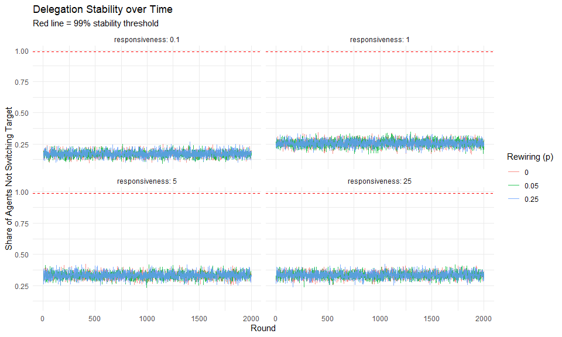
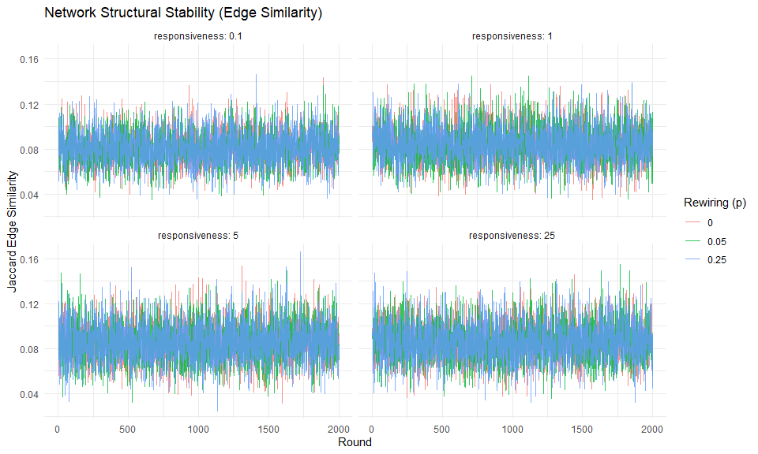
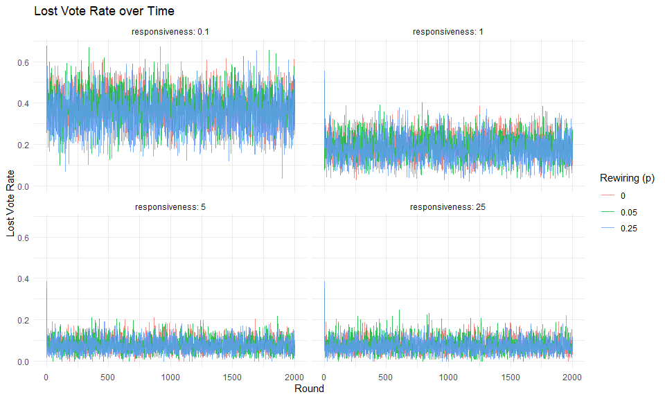

Liquid Democracy — Experiment 2: Convergence Analysis
================
2026-03-12

## Experimental Design

This experiment investigates *when* the Liquid Democracy system
converges rather than just *whether* it has converged by the final
round. We track three complementary metrics at every round:

- **Delegation stability**: fraction of lay agents not switching their
  delegation target between consecutive rounds
- **Edge similarity**: Jaccard similarity of the delegation graph
  between consecutive rounds — how similar are the two networks as a
  whole
- **Lost vote rate**: fraction of votes lost to cycles at each round

We run T = 500 rounds for a representative subset of parameter
combinations to observe the full convergence trajectory.

``` r
conv_params <- expand.grid(
  responsiveness = c(0.1, 1, 5, 25),
  p_rewire       = c(0, 0.05, 0.25)
)

cat("Convergence combinations:", nrow(conv_params), "\n")
```

    ## Convergence combinations: 12

------------------------------------------------------------------------

## Helper Function

``` r
# Computes delegation stability for every consecutive round-pair.
# Returns a vector of length T-1.
compute_stability_over_time <- function(res) {
  n_graphs <- length(res$delegation_graphs)
  n_all    <- nrow(res$agents)
  lay_ids  <- which(res$agents$type == "lay")

  sapply(2:n_graphs, function(t) {
    g_prev <- res$delegation_graphs[[t - 1]]
    g_curr <- res$delegation_graphs[[t]]

    target_prev <- integer(n_all)
    target_curr <- integer(n_all)

    el_prev <- as_edgelist(g_prev, names = FALSE)
    el_curr <- as_edgelist(g_curr, names = FALSE)

    if (nrow(el_prev)) target_prev[el_prev[, 1]] <- el_prev[, 2]
    if (nrow(el_curr)) target_curr[el_curr[, 1]] <- el_curr[, 2]

    mean(target_prev[lay_ids] == target_curr[lay_ids])
  })
}
```

------------------------------------------------------------------------

## Run Convergence Simulations

``` r
t_start <- proc.time()

conv_history <- purrr::pmap_dfr(conv_params, function(responsiveness, p_rewire) {
  
  T_val <- 2000 # <- nur hier ändern, rest passt sich an
  
  res <- simulate_liquid_democracy(
    seed                    = 123,
    n_per_community         = 50,
    n_communities           = 5,
    node_degree             = 6,
    n_experts_per_community = 0,
    expert_connectedness    = 0,
    p_rewire                = p_rewire,
    responsiveness          = responsiveness,
    inertia                 = 0,
    T                       = T_val
  )

  stability <- compute_stability_over_time(res)

  edge_similarity <- c(NA_real_, sapply(2:T_val, function(t) {
    el_prev <- as_edgelist(res$delegation_graphs[[t - 1]], names = FALSE)
    el_curr <- as_edgelist(res$delegation_graphs[[t]],     names = FALSE)
    if (nrow(el_prev) == 0 || nrow(el_curr) == 0) return(NA_real_)
    edges_prev <- paste(el_prev[, 1], el_prev[, 2])
    edges_curr <- paste(el_curr[, 1], el_curr[, 2])
    length(intersect(edges_prev, edges_curr)) / length(union(edges_prev, edges_curr))
  }))

  tibble(
    round           = 1:T_val,
    lost_vote_rate  = res$history_lost,
    stability       = c(NA_real_, stability),
    edge_similarity = edge_similarity,
    responsiveness  = responsiveness,
    p_rewire        = p_rewire
  )
})

t_end   <- proc.time()
elapsed <- (t_end - t_start)[["elapsed"]]
cat(sprintf("Completed in %.1f seconds (%.1f min)\n", elapsed, elapsed / 60))
```

    ## Completed in 304.4 seconds (5.1 min)

------------------------------------------------------------------------

## Results

### Plot 1 — Delegation Stability over Time

A value of 1.0 means nobody switched their delegation target — the
structure is fully frozen. The red dashed line marks the 99% threshold
used as the convergence criterion.

``` r
conv_history %>%
  filter(!is.na(stability)) %>%
  ggplot(aes(x = round, y = stability, color = factor(p_rewire))) +
  geom_line(alpha = 0.8) +
  geom_hline(yintercept = 0.99, linetype = "dashed", color = "red") +
  facet_wrap(~responsiveness, labeller = label_both, ncol = 2) +
  labs(title    = "Delegation Stability over Time",
       subtitle = "Red line = 99% stability threshold",
       x        = "Round",
       y        = "Share of Agents Not Switching Target",
       color    = "Rewiring (p)") +
  theme_minimal()
```

<!-- -->

------------------------------------------------------------------------

### Plot 2 — Network Structural Stability (Edge Similarity)

Jaccard similarity between the delegation graphs of consecutive rounds.
A value of 1.0 means the full edge set is identical between rounds.

``` r
conv_history %>%
  filter(!is.na(edge_similarity)) %>%
  ggplot(aes(x = round, y = edge_similarity, color = factor(p_rewire))) +
  geom_line(alpha = 0.8) +
  facet_wrap(~responsiveness, labeller = label_both, ncol = 2) +
  labs(title = "Network Structural Stability (Edge Similarity)",
       x     = "Round",
       y     = "Jaccard Edge Similarity",
       color = "Rewiring (p)") +
  theme_minimal()
```

<!-- -->

------------------------------------------------------------------------

### Plot 3 — Lost Vote Rate over Time

Tracks whether cycles self-resolve over time or persist indefinitely.

``` r
conv_history %>%
  ggplot(aes(x = round, y = lost_vote_rate, color = factor(p_rewire))) +
  geom_line(alpha = 0.8) +
  facet_wrap(~responsiveness, labeller = label_both, ncol = 2) +
  labs(title = "Lost Vote Rate over Time",
       x     = "Round",
       y     = "Lost Vote Rate",
       color = "Rewiring (p)") +
  theme_minimal()
```

<!-- -->

------------------------------------------------------------------------

### Table — Convergence Summary

At which round does each combination first reach 99% delegation
stability? Combinations that never reach the threshold within 500 rounds
are marked \>500.

``` r
conv_history %>%
  filter(!is.na(stability)) %>%
  group_by(responsiveness, p_rewire) %>%
  summarise(
    converged_at          = {
      idx <- which(stability >= 0.99)
      if (length(idx)) as.character(min(idx) + 1L) else ">500"
    },
    final_stability       = round(last(stability), 3),
    final_edge_similarity = round(last(edge_similarity[!is.na(edge_similarity)]), 3),
    final_lost_rate       = round(last(lost_vote_rate), 3),
    lost_vote_sd          = round(sd(lost_vote_rate), 4),
    .groups = "drop"
  ) %>%
  arrange(responsiveness, p_rewire) %>%
  knitr::kable(
    col.names = c("Responsiveness", "Rewiring (p)", "Converged at Round",
                  "Final Stability", "Final Edge Similarity",
                  "Final Lost Rate", "Lost Vote SD"),
    caption   = "Convergence diagnostics by parameter combination"
  )
```

| Responsiveness | Rewiring (p) | Converged at Round | Final Stability | Final Edge Similarity | Final Lost Rate | Lost Vote SD |
|---:|---:|:---|---:|---:|---:|---:|
| 0.1 | 0.00 | \>500 | 0.196 | 0.094 | 0.416 | 0.0769 |
| 0.1 | 0.05 | \>500 | 0.184 | 0.092 | 0.344 | 0.0798 |
| 0.1 | 0.25 | \>500 | 0.192 | 0.084 | 0.348 | 0.0858 |
| 1.0 | 0.00 | \>500 | 0.248 | 0.082 | 0.228 | 0.0571 |
| 1.0 | 0.05 | \>500 | 0.276 | 0.091 | 0.144 | 0.0570 |
| 1.0 | 0.25 | \>500 | 0.268 | 0.095 | 0.128 | 0.0583 |
| 5.0 | 0.00 | \>500 | 0.340 | 0.080 | 0.092 | 0.0336 |
| 5.0 | 0.05 | \>500 | 0.332 | 0.069 | 0.068 | 0.0346 |
| 5.0 | 0.25 | \>500 | 0.332 | 0.073 | 0.060 | 0.0330 |
| 25.0 | 0.00 | \>500 | 0.364 | 0.087 | 0.084 | 0.0331 |
| 25.0 | 0.05 | \>500 | 0.340 | 0.079 | 0.104 | 0.0344 |
| 25.0 | 0.25 | \>500 | 0.360 | 0.083 | 0.044 | 0.0323 |

Convergence diagnostics by parameter combination
