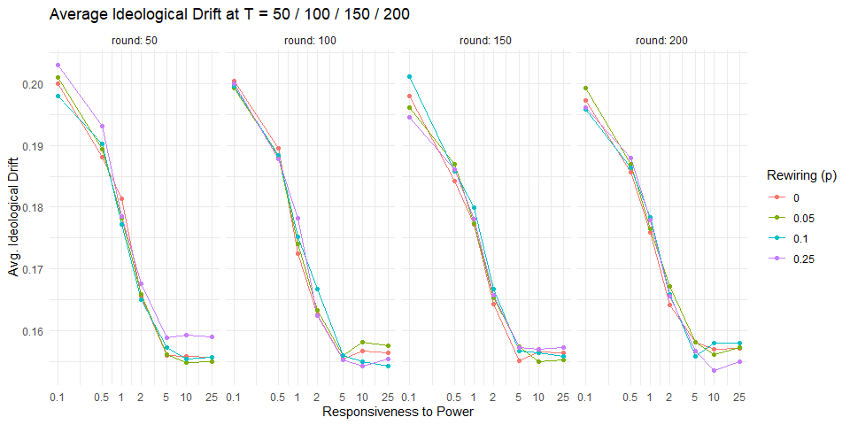
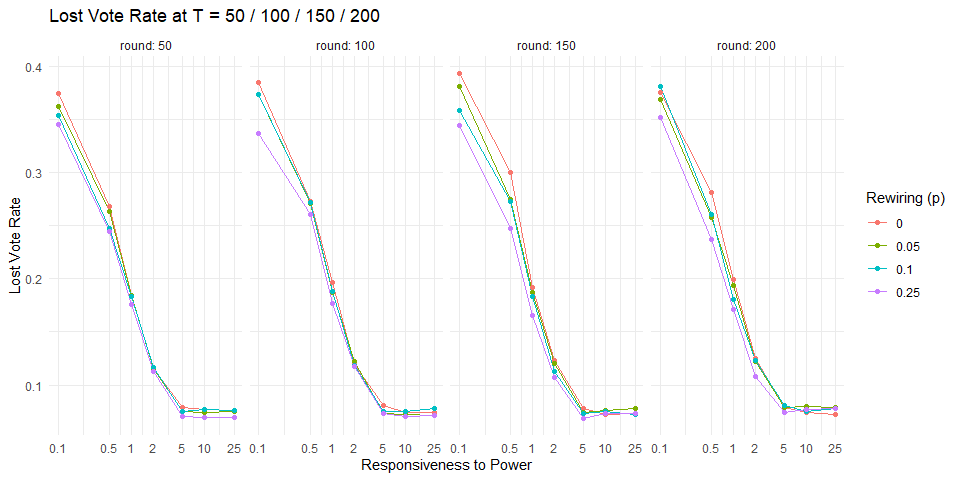
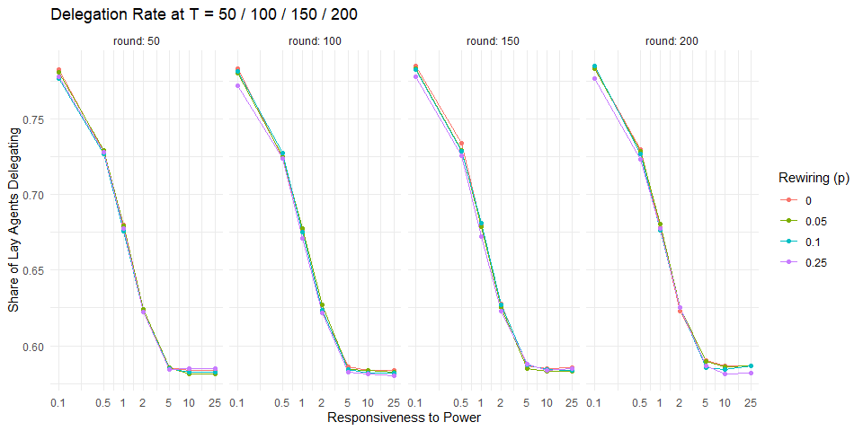
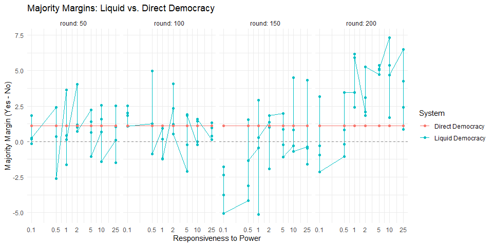
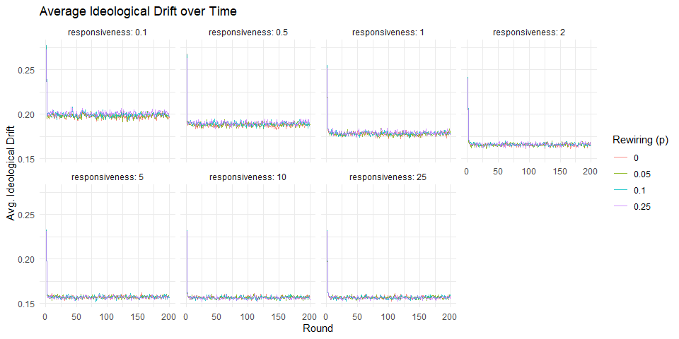
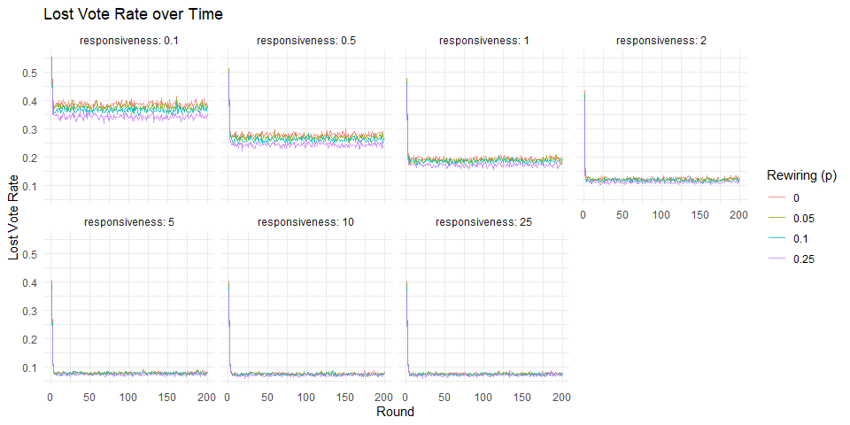
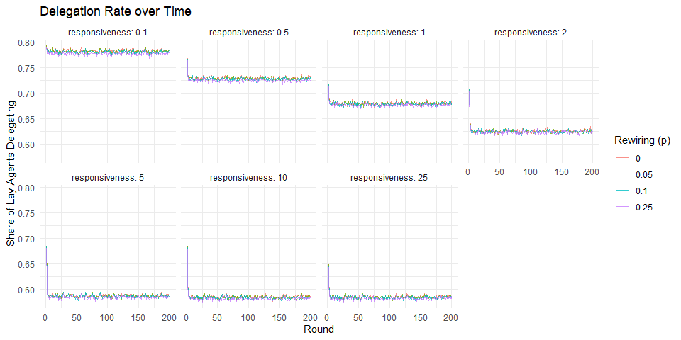
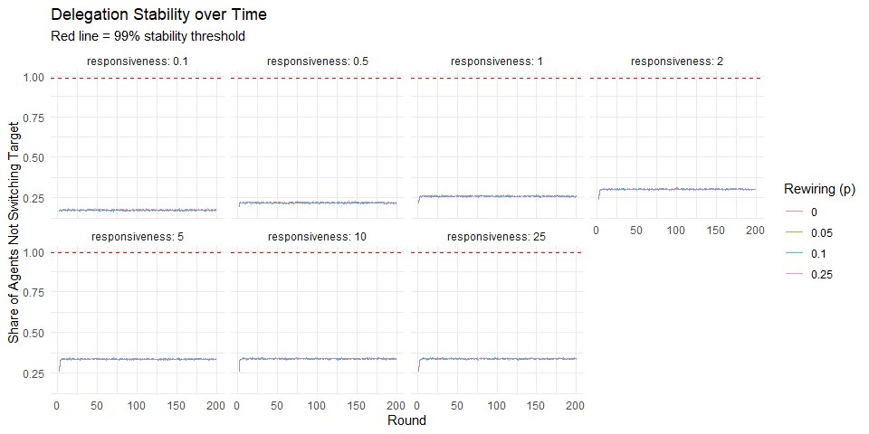

Simulation 3 - Responsiveness to Power
================
2026-03-20

## Experimental Design

This experiment runs a Watts-Strogatz network of 250 agents over 100
random seeds to obtain stable average estimates, removing seed-specific
noise.

- **Community**: 1 community, 250 lay agents
- **Seeds**: 1-100
- **Responsiveness**: 0.1, 0.5, 1, 2, 5, 10, 25
- **Rewiring (p)**: 0, 0.05, 0.10, 0.25
- **T**: 200 (snapshots at 50, 100, 150, 200)

``` r
responsiveness_vals <- c(0.1, 0.5, 1, 2, 5, 10, 25)
p_rewire_vals       <- c(0, 0.05, 0.10, 0.25)
seed_vals           <- 1:100

param_grid <- expand.grid(
  responsiveness = responsiveness_vals,
  p_rewire       = p_rewire_vals,
  seed           = seed_vals
)

cat("Total combinations:", nrow(param_grid), "\n")
```

    ## Total combinations: 2800

------------------------------------------------------------------------

## Simulation Function

``` r
run_single_simulation <- function(responsiveness, p_rewire, seed) {
  sim <- simulate_liquid_democracy(
    seed                    = seed,
    n_per_community         = 250,
    n_communities           = 1,
    node_degree             = 6,
    n_experts_per_community = 0,
    expert_connectedness    = 0,
    p_rewire                = p_rewire,
    responsiveness          = responsiveness,
    inertia                 = 0,
    T                       = 200
  )

  list(
    # Full time series for cheap metrics (200 rows)
    history = tibble(
      round                = seq_len(200),
      lost_vote_rate       = sim$history_lost,
      avg_drift            = sim$history_drift,
      delegation_rate      = sim$history_delegation,
      delegation_stability = sim$history_stability
    ),
    # Snapshots with all metrics at T = 50, 100, 150, 200
    snapshots = sim$snapshots
  )
}
```

------------------------------------------------------------------------

## Run Simulations

``` r
library(furrr)

results_file <- here::here("Simulations/results_sim3.rds")

if (file.exists(results_file)) {
  # Load saved results - skip simulation entirely
  saved             <- readRDS(results_file)
  results_time      <- saved$results_time
  results_snapshots <- saved$results_snapshots
  results           <- saved$results
  cat("Loaded saved results.\n")
  cat(sprintf("Snapshots: %d rows\n", nrow(results_snapshots)))
  cat(sprintf("Time series: %d rows\n", nrow(results_time)))

} else {
  # Run simulation only if no saved results exist
  plan(multisession, workers = parallel::detectCores() - 1)
  t_start <- proc.time()

  raw <- param_grid %>%
    mutate(sim = furrr::future_pmap(
      list(responsiveness, p_rewire, seed),
      run_single_simulation,
      .options = furrr_options(seed = TRUE)
    ))

  # Full time series averaged over seeds
  results_time <- raw %>%
    mutate(h = map(sim, "history")) %>%
    select(responsiveness, p_rewire, seed, h) %>%
    unnest(h) %>%
    group_by(responsiveness, p_rewire, round) %>%
    summarise(across(where(is.numeric), mean, .names = "{.col}"),
              .groups = "drop")

  # Snapshots averaged over seeds
  results_snapshots <- raw %>%
    mutate(s = map(sim, "snapshots")) %>%
    select(responsiveness, p_rewire, seed, s) %>%
    unnest(s) %>%
    group_by(responsiveness, p_rewire, round, pct_T) %>%
    summarise(across(where(is.numeric), mean, .names = "{.col}"),
              .groups = "drop")

  # Final round only
  results <- results_snapshots %>%
    filter(pct_T == 1.00) %>%
    select(-round, -pct_T)

  plan(sequential)

  t_end   <- proc.time()
  elapsed <- (t_end - t_start)[["elapsed"]]
  cat(sprintf("Completed: %d simulations in %.1f seconds (%.1f min)\n",
              nrow(param_grid), elapsed, elapsed / 60))

  saveRDS(list(
    results_time      = results_time,
    results_snapshots = results_snapshots,
    results           = results
  ), results_file)

  cat(sprintf("Results saved to %s\n", results_file))
}
```

    ## Loaded saved results.
    ## Snapshots: 112 rows
    ## Time series: 5600 rows

------------------------------------------------------------------------

## Results

### Snapshot Plots (T = 50 / 100 / 150 / 200)

``` r
results_snapshots %>%
  ggplot(aes(x = responsiveness, y = avg_drift,
             color = factor(p_rewire))) +
  geom_line() + geom_point() +
  facet_wrap(~round, labeller = label_both, ncol = 4) +
  x_scale +
  labs(title   = "Average Ideological Drift at T = 50 / 100 / 150 / 200",
       x       = "Responsiveness to Power",
       y       = "Avg. Ideological Drift",
       color   = "Rewiring (p)") +
  theme_minimal()
```

<!-- -->

``` r
results_snapshots %>%
  ggplot(aes(x = responsiveness, y = lost_vote_rate,
             color = factor(p_rewire))) +
  geom_line() + geom_point() +
  facet_wrap(~round, labeller = label_both, ncol = 4) +
  x_scale +
  labs(title   = "Lost Vote Rate at T = 50 / 100 / 150 / 200",
       x       = "Responsiveness to Power",
       y       = "Lost Vote Rate",
       color   = "Rewiring (p)") +
  theme_minimal()
```

<!-- -->

``` r
results_snapshots %>%
  ggplot(aes(x = responsiveness, y = delegation_rate,
             color = factor(p_rewire))) +
  geom_line() + geom_point() +
  facet_wrap(~round, labeller = label_both, ncol = 4) +
  x_scale +
  labs(title   = "Delegation Rate at T = 50 / 100 / 150 / 200",
       x       = "Responsiveness to Power",
       y       = "Share of Lay Agents Delegating",
       color   = "Rewiring (p)") +
  theme_minimal()
```

<!-- -->

``` r
# Vote counts: Direct Democracy vs Liquid Democracy per snapshot
results_snapshots %>%
  mutate(
    lost_votes = direct_yes + direct_no - liquid_yes - liquid_no
  ) %>%
  select(responsiveness, p_rewire, round,
         direct_yes, direct_no,
         liquid_yes, liquid_no, lost_votes) %>%
  mutate(across(c(direct_yes, direct_no,
                  liquid_yes, liquid_no, lost_votes),
                ~ round(.x, 1))) %>%
  arrange(round, responsiveness, p_rewire) %>%
  knitr::kable(
    col.names = c("Responsiveness", "Rewiring (p)", "T",
                  "Direct Yes", "Direct No",
                  "Liquid Yes", "Liquid No", "Lost Votes"),
    caption   = "Yes / No Vote Counts at T = 50 / 100 / 150 / 200 (averaged over seeds)"
  )
```

| Responsiveness | Rewiring (p) | T | Direct Yes | Direct No | Liquid Yes | Liquid No | Lost Votes |
|---:|---:|---:|---:|---:|---:|---:|---:|
| 0.1 | 0.00 | 50 | 125.6 | 124.4 | 79.1 | 77.3 | 93.6 |
| 0.1 | 0.05 | 50 | 125.6 | 124.4 | 79.7 | 79.8 | 90.5 |
| 0.1 | 0.10 | 50 | 125.6 | 124.4 | 80.9 | 80.8 | 88.3 |
| 0.1 | 0.25 | 50 | 125.6 | 124.4 | 82.0 | 81.7 | 86.3 |
| 0.5 | 0.00 | 50 | 125.6 | 124.4 | 92.7 | 90.2 | 67.1 |
| 0.5 | 0.05 | 50 | 125.6 | 124.4 | 92.3 | 92.0 | 65.7 |
| 0.5 | 0.10 | 50 | 125.6 | 124.4 | 95.3 | 92.9 | 61.8 |
| 0.5 | 0.25 | 50 | 125.6 | 124.4 | 93.2 | 95.8 | 61.0 |
| 1.0 | 0.00 | 50 | 125.6 | 124.4 | 103.8 | 100.2 | 46.0 |
| 1.0 | 0.05 | 50 | 125.6 | 124.4 | 102.2 | 101.8 | 46.1 |
| 1.0 | 0.10 | 50 | 125.6 | 124.4 | 101.3 | 103.0 | 45.7 |
| 1.0 | 0.25 | 50 | 125.6 | 124.4 | 103.1 | 103.0 | 44.0 |
| 2.0 | 0.00 | 50 | 125.6 | 124.4 | 112.6 | 108.6 | 28.9 |
| 2.0 | 0.05 | 50 | 125.6 | 124.4 | 111.1 | 109.9 | 29.0 |
| 2.0 | 0.10 | 50 | 125.6 | 124.4 | 110.9 | 109.9 | 29.2 |
| 2.0 | 0.25 | 50 | 125.6 | 124.4 | 111.2 | 110.5 | 28.2 |
| 5.0 | 0.00 | 50 | 125.6 | 124.4 | 116.3 | 114.1 | 19.6 |
| 5.0 | 0.05 | 50 | 125.6 | 124.4 | 116.3 | 114.9 | 18.8 |
| 5.0 | 0.10 | 50 | 125.6 | 124.4 | 115.9 | 115.3 | 18.8 |
| 5.0 | 0.25 | 50 | 125.6 | 124.4 | 115.7 | 116.8 | 17.6 |
| 10.0 | 0.00 | 50 | 125.6 | 124.4 | 115.7 | 115.1 | 19.2 |
| 10.0 | 0.05 | 50 | 125.6 | 124.4 | 116.6 | 115.0 | 18.5 |
| 10.0 | 0.10 | 50 | 125.6 | 124.4 | 116.6 | 114.0 | 19.4 |
| 10.0 | 0.25 | 50 | 125.6 | 124.4 | 115.5 | 117.0 | 17.5 |
| 25.0 | 0.00 | 50 | 125.6 | 124.4 | 115.5 | 115.4 | 19.1 |
| 25.0 | 0.05 | 50 | 125.6 | 124.4 | 116.1 | 115.1 | 18.8 |
| 25.0 | 0.10 | 50 | 125.6 | 124.4 | 116.8 | 114.3 | 19.0 |
| 25.0 | 0.25 | 50 | 125.6 | 124.4 | 115.6 | 117.0 | 17.4 |
| 0.1 | 0.00 | 100 | 125.6 | 124.4 | 78.0 | 76.0 | 96.0 |
| 0.1 | 0.05 | 100 | 125.6 | 124.4 | 79.7 | 77.1 | 93.2 |
| 0.1 | 0.10 | 100 | 125.6 | 124.4 | 79.2 | 77.4 | 93.4 |
| 0.1 | 0.25 | 100 | 125.6 | 124.4 | 83.5 | 82.4 | 84.0 |
| 0.5 | 0.00 | 100 | 125.6 | 124.4 | 91.6 | 90.3 | 68.1 |
| 0.5 | 0.05 | 100 | 125.6 | 124.4 | 91.8 | 90.5 | 67.7 |
| 0.5 | 0.10 | 100 | 125.6 | 124.4 | 93.5 | 88.5 | 68.0 |
| 0.5 | 0.25 | 100 | 125.6 | 124.4 | 92.0 | 92.9 | 65.1 |
| 1.0 | 0.00 | 100 | 125.6 | 124.4 | 100.9 | 100.0 | 49.1 |
| 1.0 | 0.05 | 100 | 125.6 | 124.4 | 101.7 | 101.6 | 46.7 |
| 1.0 | 0.10 | 100 | 125.6 | 124.4 | 101.0 | 102.1 | 46.9 |
| 1.0 | 0.25 | 100 | 125.6 | 124.4 | 102.3 | 103.6 | 44.1 |
| 2.0 | 0.00 | 100 | 125.6 | 124.4 | 111.2 | 108.9 | 29.9 |
| 2.0 | 0.05 | 100 | 125.6 | 124.4 | 110.3 | 109.1 | 30.6 |
| 2.0 | 0.10 | 100 | 125.6 | 124.4 | 112.2 | 108.2 | 29.6 |
| 2.0 | 0.25 | 100 | 125.6 | 124.4 | 110.6 | 110.1 | 29.3 |
| 5.0 | 0.00 | 100 | 125.6 | 124.4 | 113.9 | 116.0 | 20.1 |
| 5.0 | 0.05 | 100 | 125.6 | 124.4 | 115.7 | 116.0 | 18.3 |
| 5.0 | 0.10 | 100 | 125.6 | 124.4 | 116.5 | 114.6 | 18.8 |
| 5.0 | 0.25 | 100 | 125.6 | 124.4 | 116.8 | 115.0 | 18.3 |
| 10.0 | 0.00 | 100 | 125.6 | 124.4 | 115.6 | 115.8 | 18.6 |
| 10.0 | 0.05 | 100 | 125.6 | 124.4 | 115.9 | 115.9 | 18.2 |
| 10.0 | 0.10 | 100 | 125.6 | 124.4 | 116.3 | 114.8 | 18.9 |
| 10.0 | 0.25 | 100 | 125.6 | 124.4 | 116.9 | 115.4 | 17.7 |
| 25.0 | 0.00 | 100 | 125.6 | 124.4 | 115.8 | 115.7 | 18.5 |
| 25.0 | 0.05 | 100 | 125.6 | 124.4 | 116.6 | 115.6 | 17.9 |
| 25.0 | 0.10 | 100 | 125.6 | 124.4 | 115.9 | 114.6 | 19.5 |
| 25.0 | 0.25 | 100 | 125.6 | 124.4 | 116.3 | 115.9 | 17.8 |
| 0.1 | 0.00 | 150 | 125.6 | 124.4 | 74.7 | 77.0 | 98.2 |
| 0.1 | 0.05 | 150 | 125.6 | 124.4 | 75.5 | 79.2 | 95.3 |
| 0.1 | 0.10 | 150 | 125.6 | 124.4 | 79.3 | 81.0 | 89.7 |
| 0.1 | 0.25 | 150 | 125.6 | 124.4 | 79.5 | 84.6 | 85.9 |
| 0.5 | 0.00 | 150 | 125.6 | 124.4 | 85.4 | 89.6 | 75.0 |
| 0.5 | 0.05 | 150 | 125.6 | 124.4 | 89.2 | 92.3 | 68.5 |
| 0.5 | 0.10 | 150 | 125.6 | 124.4 | 91.7 | 90.2 | 68.1 |
| 0.5 | 0.25 | 150 | 125.6 | 124.4 | 93.5 | 94.8 | 61.7 |
| 1.0 | 0.00 | 150 | 125.6 | 124.4 | 100.8 | 101.2 | 48.0 |
| 1.0 | 0.05 | 150 | 125.6 | 124.4 | 99.1 | 104.2 | 46.7 |
| 1.0 | 0.10 | 150 | 125.6 | 124.4 | 103.5 | 100.6 | 45.8 |
| 1.0 | 0.25 | 150 | 125.6 | 124.4 | 104.4 | 104.1 | 41.4 |
| 2.0 | 0.00 | 150 | 125.6 | 124.4 | 110.2 | 108.9 | 30.9 |
| 2.0 | 0.05 | 150 | 125.6 | 124.4 | 110.4 | 109.4 | 30.1 |
| 2.0 | 0.10 | 150 | 125.6 | 124.4 | 110.0 | 111.9 | 28.1 |
| 2.0 | 0.25 | 150 | 125.6 | 124.4 | 112.5 | 110.7 | 26.8 |
| 5.0 | 0.00 | 150 | 125.6 | 124.4 | 116.2 | 114.2 | 19.6 |
| 5.0 | 0.05 | 150 | 125.6 | 124.4 | 115.7 | 115.9 | 18.5 |
| 5.0 | 0.10 | 150 | 125.6 | 124.4 | 116.2 | 115.4 | 18.4 |
| 5.0 | 0.25 | 150 | 125.6 | 124.4 | 115.8 | 116.9 | 17.2 |
| 10.0 | 0.00 | 150 | 125.6 | 124.4 | 115.8 | 116.1 | 18.1 |
| 10.0 | 0.05 | 150 | 125.6 | 124.4 | 115.9 | 115.1 | 19.0 |
| 10.0 | 0.10 | 150 | 125.6 | 124.4 | 117.8 | 113.3 | 18.8 |
| 10.0 | 0.25 | 150 | 125.6 | 124.4 | 115.4 | 116.1 | 18.4 |
| 25.0 | 0.00 | 150 | 125.6 | 124.4 | 115.7 | 116.0 | 18.3 |
| 25.0 | 0.05 | 150 | 125.6 | 124.4 | 114.4 | 116.0 | 19.6 |
| 25.0 | 0.10 | 150 | 125.6 | 124.4 | 118.1 | 113.8 | 18.1 |
| 25.0 | 0.25 | 150 | 125.6 | 124.4 | 115.6 | 116.1 | 18.3 |
| 0.1 | 0.00 | 200 | 125.6 | 124.4 | 77.6 | 78.5 | 93.9 |
| 0.1 | 0.05 | 200 | 125.6 | 124.4 | 78.8 | 79.1 | 92.1 |
| 0.1 | 0.10 | 200 | 125.6 | 124.4 | 78.9 | 75.8 | 95.3 |
| 0.1 | 0.25 | 200 | 125.6 | 124.4 | 79.9 | 82.1 | 88.0 |
| 0.5 | 0.00 | 200 | 125.6 | 124.4 | 89.4 | 90.4 | 70.2 |
| 0.5 | 0.05 | 200 | 125.6 | 124.4 | 92.7 | 92.8 | 64.5 |
| 0.5 | 0.10 | 200 | 125.6 | 124.4 | 92.9 | 92.0 | 65.1 |
| 0.5 | 0.25 | 200 | 125.6 | 124.4 | 97.1 | 93.6 | 59.3 |
| 1.0 | 0.00 | 200 | 125.6 | 124.4 | 101.8 | 98.3 | 49.9 |
| 1.0 | 0.05 | 200 | 125.6 | 124.4 | 102.0 | 99.6 | 48.4 |
| 1.0 | 0.10 | 200 | 125.6 | 124.4 | 105.6 | 99.4 | 45.1 |
| 1.0 | 0.25 | 200 | 125.6 | 124.4 | 106.6 | 100.7 | 42.7 |
| 2.0 | 0.00 | 200 | 125.6 | 124.4 | 110.4 | 108.4 | 31.2 |
| 2.0 | 0.05 | 200 | 125.6 | 124.4 | 111.3 | 108.2 | 30.5 |
| 2.0 | 0.10 | 200 | 125.6 | 124.4 | 110.5 | 108.7 | 30.9 |
| 2.0 | 0.25 | 200 | 125.6 | 124.4 | 114.2 | 108.9 | 26.9 |
| 5.0 | 0.00 | 200 | 125.6 | 124.4 | 117.5 | 112.8 | 19.7 |
| 5.0 | 0.05 | 200 | 125.6 | 124.4 | 117.7 | 112.6 | 19.7 |
| 5.0 | 0.10 | 200 | 125.6 | 124.4 | 117.5 | 112.2 | 20.3 |
| 5.0 | 0.25 | 200 | 125.6 | 124.4 | 118.3 | 113.2 | 18.5 |
| 10.0 | 0.00 | 200 | 125.6 | 124.4 | 119.4 | 112.1 | 18.5 |
| 10.0 | 0.05 | 200 | 125.6 | 124.4 | 115.9 | 114.2 | 19.9 |
| 10.0 | 0.10 | 200 | 125.6 | 124.4 | 118.2 | 112.9 | 18.9 |
| 10.0 | 0.25 | 200 | 125.6 | 124.4 | 117.7 | 113.0 | 19.2 |
| 25.0 | 0.00 | 200 | 125.6 | 124.4 | 119.2 | 112.7 | 18.2 |
| 25.0 | 0.05 | 200 | 125.6 | 124.4 | 115.6 | 114.7 | 19.8 |
| 25.0 | 0.10 | 200 | 125.6 | 124.4 | 117.4 | 113.2 | 19.4 |
| 25.0 | 0.25 | 200 | 125.6 | 124.4 | 116.5 | 114.1 | 19.4 |

Yes / No Vote Counts at T = 50 / 100 / 150 / 200 (averaged over seeds)

``` r
results_snapshots %>%
  tidyr::pivot_longer(
    cols      = c(liquid_margin, direct_margin),
    names_to  = "system",
    values_to = "margin"
  ) %>%
  mutate(system = recode(system,
    "liquid_margin" = "Liquid Democracy",
    "direct_margin" = "Direct Democracy")) %>%
  ggplot(aes(x = responsiveness, y = margin, color = system)) +
  geom_line() + geom_point() +
  geom_hline(yintercept = 0, linetype = "dashed", color = "grey50") +
  facet_wrap(~round, labeller = label_both, ncol = 4) +
  x_scale +
  labs(title   = "Majority Margins: Liquid vs. Direct Democracy",
       x       = "Responsiveness to Power",
       y       = "Majority Margin (Yes - No)",
       color   = "System") +
  theme_minimal()
```

<!-- -->

------------------------------------------------------------------------

### Time Series Plots (all 200 rounds)

``` r
results_time %>%
  ggplot(aes(x = round, y = avg_drift,
             color = factor(p_rewire))) +
  geom_line(alpha = 0.8) +
  facet_wrap(~responsiveness, labeller = label_both, ncol = 4) +
  labs(title   = "Average Ideological Drift over Time",
       x       = "Round",
       y       = "Avg. Ideological Drift",
       color   = "Rewiring (p)") +
  theme_minimal()
```

<!-- -->

``` r
results_time %>%
  ggplot(aes(x = round, y = lost_vote_rate,
             color = factor(p_rewire))) +
  geom_line(alpha = 0.8) +
  facet_wrap(~responsiveness, labeller = label_both, ncol = 4) +
  labs(title   = "Lost Vote Rate over Time",
       x       = "Round",
       y       = "Lost Vote Rate",
       color   = "Rewiring (p)") +
  theme_minimal()
```

<!-- -->

``` r
results_time %>%
  ggplot(aes(x = round, y = delegation_rate,
             color = factor(p_rewire))) +
  geom_line(alpha = 0.8) +
  facet_wrap(~responsiveness, labeller = label_both, ncol = 4) +
  labs(title   = "Delegation Rate over Time",
       x       = "Round",
       y       = "Share of Lay Agents Delegating",
       color   = "Rewiring (p)") +
  theme_minimal()
```

<!-- -->

``` r
results_time %>%
  filter(!is.na(delegation_stability)) %>%
  ggplot(aes(x = round, y = delegation_stability,
             color = factor(p_rewire))) +
  geom_line(alpha = 0.8) +
  geom_hline(yintercept = 0.99, linetype = "dashed", color = "red") +
  facet_wrap(~responsiveness, labeller = label_both, ncol = 4) +
  labs(title    = "Delegation Stability over Time",
       subtitle = "Red line = 99% stability threshold",
       x        = "Round",
       y        = "Share of Agents Not Switching Target",
       color    = "Rewiring (p)") +
  theme_minimal()
```

<!-- -->
