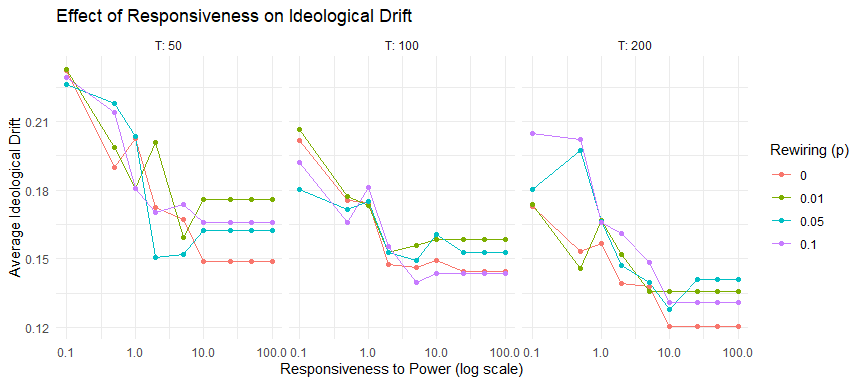
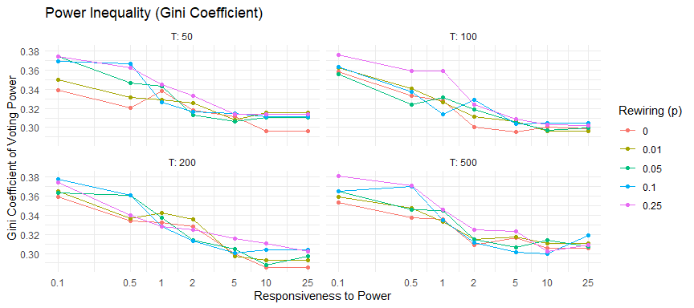

Liquid Democracy — Experiment 1: Responsiveness to Power
================
2026-03-05

## Experimental Design

This experiment explores how responsiveness to power affects the
behaviour of the Liquid Democracy system. Experts are disabled to
isolate the dynamics among lay agents only.

We systematically vary three parameters:

- **Responsiveness to power**: 0.1 → 100 (log-spaced)
- **Network rewiring probability**: 0 → 0.1
- **Delegation rounds T**: 50 → 200

``` r
responsiveness_vals <- c(0.1, 0.5, 1, 2, 5, 10, 25, 50, 100)
p_rewire_vals       <- c(0, 0.01, 0.05, 0.1)
T_vals              <- c(50, 100, 200)

param_grid <- expand.grid(
  responsiveness = responsiveness_vals,
  p_rewire       = p_rewire_vals,
  T              = T_vals
)

cat("Total parameter combinations:", nrow(param_grid), "\n")
```

    ## Total parameter combinations: 108

------------------------------------------------------------------------

## Simulation Function

Each row of the parameter grid is passed to `run_single_simulation()`,
which runs the full model and extracts the three key outcome metrics.

``` r
run_single_simulation <- function(responsiveness, p_rewire, T) {

  sim <- simulate_liquid_democracy(
    seed                    = 123,
    n_per_community         = 50,
    n_communities           = 5,
    node_degree             = 6,
    n_experts_per_community = 0,
    expert_connectedness    = 0,
    p_rewire                = p_rewire,
    responsiveness          = responsiveness,
    T                       = T
  )

  stats <- summary_metrics(sim)

  # only return outcome metrics — parameter columns already exist in param_grid
  tibble(
    avg_ideological_drift = stats$dynamic_evaluation$avg_ideological_drift,
    lost_vote_rate        = stats$network_description$lost_vote_rate,
    gini_power            = stats$network_description$gini_power_inequality
  )
}
```

------------------------------------------------------------------------

## Run All Simulations

``` r
# Record wall-clock time for the full grid
t_start <- proc.time()

results <- param_grid %>%
  mutate(sim = purrr::pmap(
    list(responsiveness, p_rewire, T),
    run_single_simulation
  )) %>%
  unnest(sim)

t_end <- proc.time()
elapsed <- (t_end - t_start)[["elapsed"]]

cat(sprintf("Grid completed: %d simulations in %.1f seconds (%.1f min)\n",
            nrow(param_grid), elapsed, elapsed / 60))
```

    ## Grid completed: 108 simulations in 127.5 seconds (2.1 min)

------------------------------------------------------------------------

## Results

### Plot 1 — Responsiveness vs. Ideological Drift

Higher responsiveness makes agents strongly prefer powerful delegates,
potentially pulling their represented vote away from their own
preference. Responsiveness is shown on a log scale as it spans three
orders of magnitude (0.1 → 100).

``` r
ggplot(results,
       aes(x     = responsiveness,
           y     = avg_ideological_drift,
           color = factor(p_rewire))) +
  geom_line() +
  geom_point() +
  facet_wrap(~T, labeller = label_both) +
  scale_x_log10() +
  labs(
    title   = "Effect of Responsiveness on Ideological Drift",
    x       = "Responsiveness to Power (log scale)",
    y       = "Average Ideological Drift",
    color   = "Rewiring (p)"
  ) +
  theme_minimal()
```

<!-- -->

### Plot 2 — Power Inequality

A higher Gini coefficient indicates that voting power is concentrated in
fewer agents. Highly responsive agents delegate to already-powerful
nodes, which may amplify inequality.

``` r
ggplot(results,
       aes(x     = responsiveness,
           y     = gini_power,
           color = factor(p_rewire))) +
  geom_line() +
  geom_point() +
  facet_wrap(~T, labeller = label_both) +
  scale_x_log10() +
  labs(
    title   = "Power Inequality under Different Responsiveness Levels",
    x       = "Responsiveness to Power (log scale)",
    y       = "Gini Coefficient of Voting Power",
    color   = "Rewiring (p)"
  ) +
  theme_minimal()
```

<!-- -->

### Plot 3 — Lost Votes

Cycles may increase when delegation becomes highly strategic, as agents
form mutual delegation loops rather than converging on a single root.

``` r
ggplot(results,
       aes(x     = responsiveness,
           y     = lost_vote_rate,
           color = factor(p_rewire))) +
  geom_line() +
  geom_point() +
  facet_wrap(~T, labeller = label_both) +
  scale_x_log10() +
  labs(
    title   = "Lost Vote Rate under Different Responsiveness Levels",
    x       = "Responsiveness to Power (log scale)",
    y       = "Lost Vote Rate",
    color   = "Rewiring (p)"
  ) +
  theme_minimal()
```

<!-- -->

------------------------------------------------------------------------

## Full Results Table

``` r
results %>%
  arrange(p_rewire, T, responsiveness) %>%
  mutate(across(where(is.numeric), ~ round(.x, 4)))
```

    ## # A tibble: 108 × 6
    ##    responsiveness p_rewire     T avg_ideological_drift lost_vote_rate gini_power
    ##             <dbl>    <dbl> <dbl>                 <dbl>          <dbl>      <dbl>
    ##  1            0.1        0    50                 0.232          0.42       0.252
    ##  2            0.5        0    50                 0.190          0.348      0.255
    ##  3            1          0    50                 0.203          0.184      0.304
    ##  4            2          0    50                 0.172          0.128      0.297
    ##  5            5          0    50                 0.167          0.124      0.292
    ##  6           10          0    50                 0.149          0.128      0.277
    ##  7           25          0    50                 0.149          0.128      0.277
    ##  8           50          0    50                 0.149          0.128      0.277
    ##  9          100          0    50                 0.149          0.128      0.277
    ## 10            0.1        0   100                 0.202          0.236      0.312
    ## # ℹ 98 more rows
