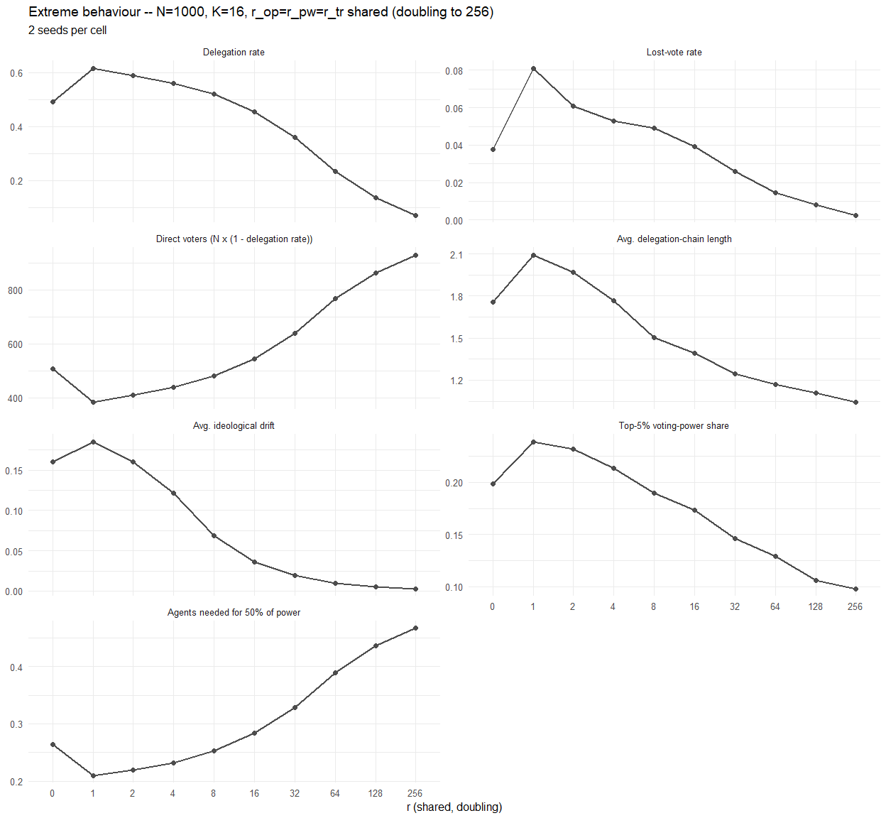
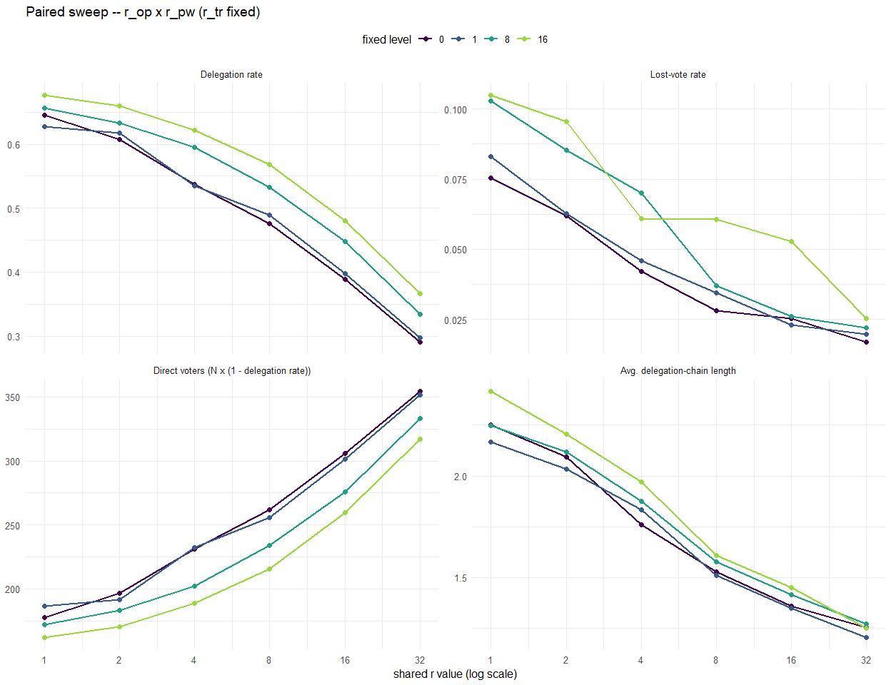
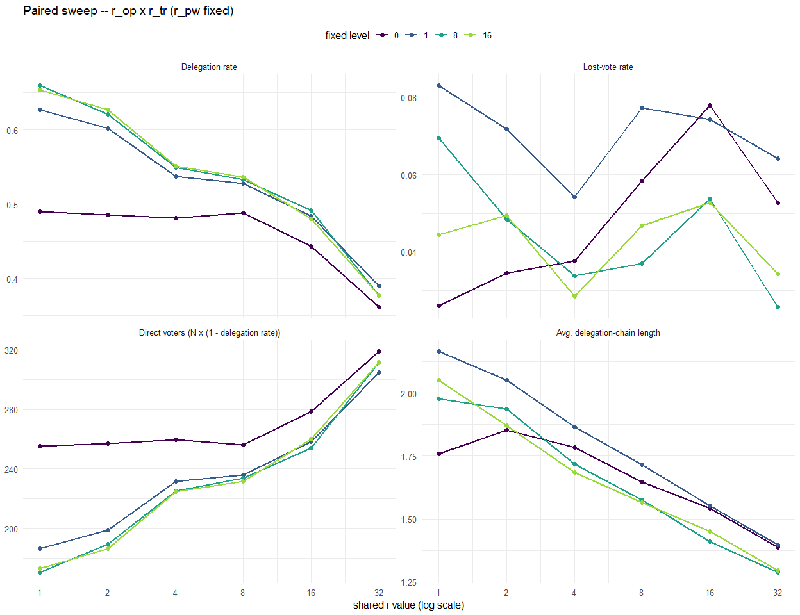
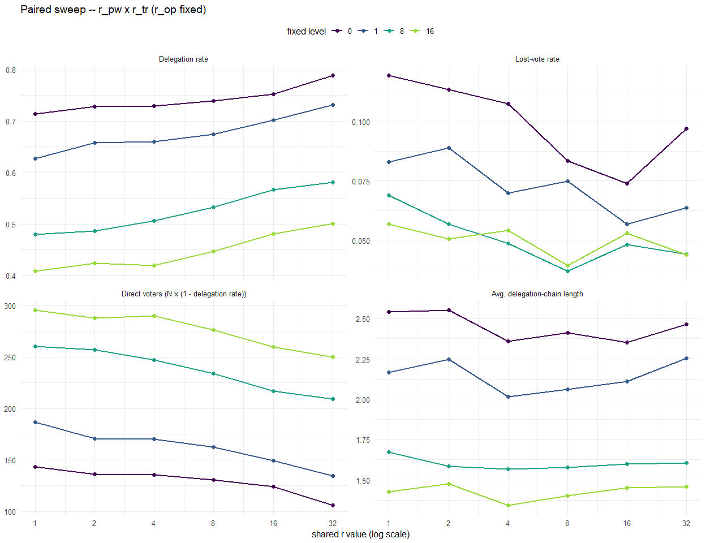
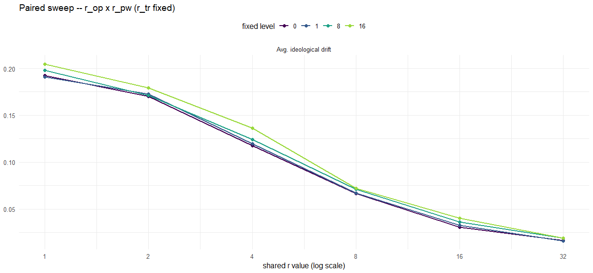
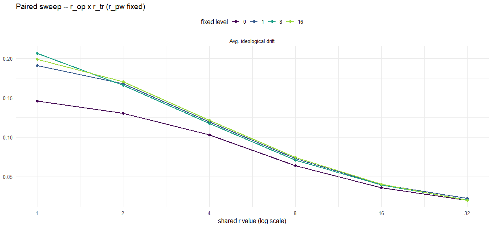
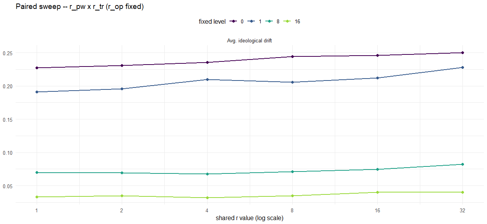
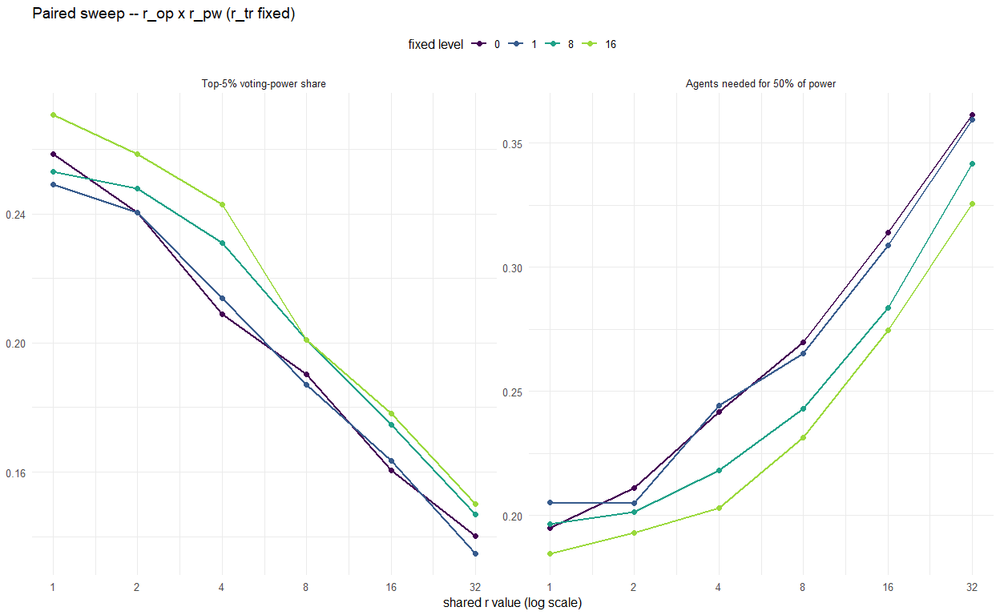
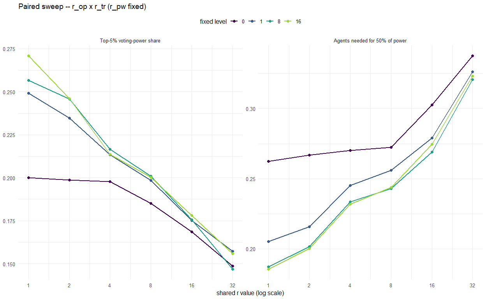
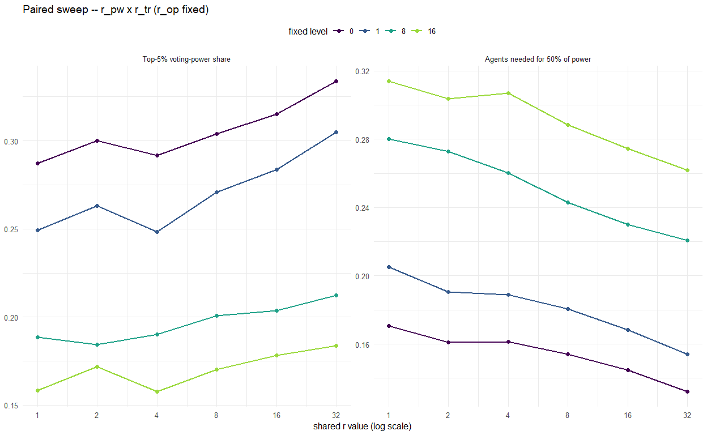

RQ1-3 – Effect of Responsiveness on Liquid Democracy Outcomes
================
2026-08-28

## Fixed inputs

**N = 500, K = 18, T = 30 (10 voting rounds), c = 0.5.**

## Extreme behaviour: single-dial responsiveness up to r=256

Before the paired sweep below (bounded at $r\le32$), a quick look across
the full doubling range this thesis considers, $r_{op}=r_{pw}=r_{tr}$
varied *together* (one shared dial) across
$r \in \{0,1,2,4,8,16,32,64,128,256\}$ (doubling from 1, plus the $r=0$
baseline) – fixed at N=1000, K=16 – showing every metric used in RQ1-3
below at once, to see where each one saturates rather than assuming the
$r\le32$ range used in the paired sweep already captures the full
picture.

<!-- -->

------------------------------------------------------------------------

## Shared design: paired sweep, third dimension held fixed

Same sweep grid for all three RQs. For each pair of responsiveness
dimensions, both are varied *together* (same shared value) across
$r \in \{1,2,4,8,16,32\}$, while the third dimension is held fixed at
one of 4 levels ($0, 1, 8, 16$) – shown as 4 coloured lines in the same
plot. Repeating this for each of the 3 possible pairs gives 3 plots per
RQ (as many metrics as that RQ needs, faceted), covering all three
responsiveness dimensions:

- $r_{op} = r_{pw} \in \{1,2,4,8,16,32\}$, $r_{tr} \in \{0,1,8,16\}$
  (fixed)
- $r_{op} = r_{tr} \in \{1,2,4,8,16,32\}$, $r_{pw} \in \{0,1,8,16\}$
  (fixed)
- $r_{pw} = r_{tr} \in \{1,2,4,8,16,32\}$, $r_{op} \in \{0,1,8,16\}$
  (fixed)

------------------------------------------------------------------------

# Simulation grid (answers RQ1, RQ2 and RQ3 at once)

------------------------------------------------------------------------

# RQ1: delegation behaviour

Metrics: delegation rate, lost-vote rate, number of direct voters,
average delegation-chain length.

<!-- -->

<!-- -->

<!-- -->

## Answering RQ1

*(Fill in once the plots above reflect the real simulation run – this is
a scaffold, not a pre-written conclusion.)*

- **Ideological responsiveness ($r_{op}$):** …
- **Competence/power responsiveness ($r_{pw}$):** …
- **Trust responsiveness ($r_{tr}$):** …
- **Interactions between dimensions:** …
- **Overall answer to RQ1:** …

------------------------------------------------------------------------

# RQ2: quality of political representation

Metric: average ideological drift (`avg_drift`) – the mean distance
between an agent’s own opinion and the opinion of the agent who
ultimately casts a vote on its behalf.

Expected: $r_{op}$ reduces drift (dissimilar neighbours become less
attractive delegates); $r_{pw}$ increases drift (powerful delegates stay
attractive even when ideologically distant); $r_{tr}$ reduces drift,
same mechanism as $r_{op}$. Because attractiveness is multiplicative,
the joint $r_{op} \times r_{pw}$ effect is expected to favour the
opinion term (net drift reduction), not a simple additive combination of
the two individual effects.

<!-- -->

<!-- -->

<!-- -->

## Answering RQ2

*(Fill in once the plots above reflect the real simulation run – this is
a scaffold, not a pre-written conclusion.)*

- **Ideological responsiveness ($r_{op}$):** …
- **Competence/power responsiveness ($r_{pw}$):** …
- **Trust responsiveness ($r_{tr}$):** …
- **Joint $r_{op} \times r_{pw}$ effect (opinion term expected to
  dominate):** …
- **Overall answer to RQ2:** …

------------------------------------------------------------------------

# RQ3: concentration of voting power

Metrics: voting-power share held by the top 5% of agents
(`top5_power_share`) and the fraction of agents needed to collectively
hold 50% of total voting power (`share_50pct`).

Expected: $r_{op}$ lowers concentration (more agents vote directly);
$r_{pw}$ raises concentration (rich-get-richer – already-powerful agents
become more attractive delegates). For the joint $r_{op} \times r_{pw}$
effect: as in RQ2, low opinion-based attractiveness is expected to
constrain how much high voting power can raise a neighbour’s overall
attractiveness – so increasing both together should yield *lower*
concentration than high $r_{pw}$ alone.

<!-- -->

<!-- -->

<!-- -->

## Answering RQ3

*(Fill in once the plots above reflect the real simulation run – this is
a scaffold, not a pre-written conclusion.)*

- **Ideological responsiveness ($r_{op}$):** …
- **Competence/power responsiveness ($r_{pw}$):** …
- **Joint $r_{op} \times r_{pw}$ effect (opinion term expected to
  constrain concentration):** …
- **Overall answer to RQ3:** …
