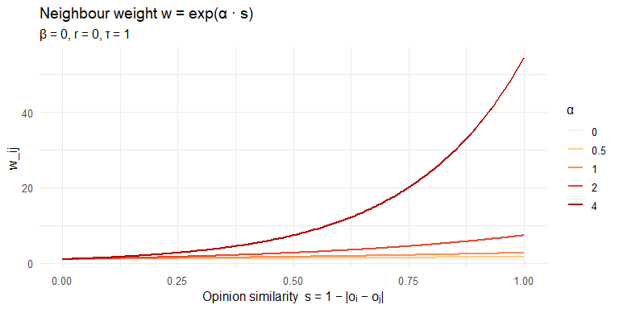
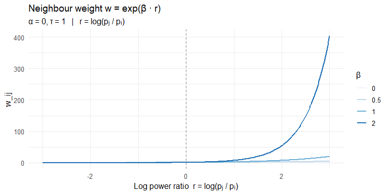
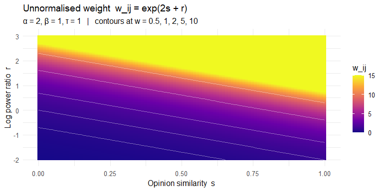
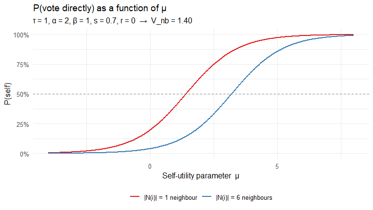
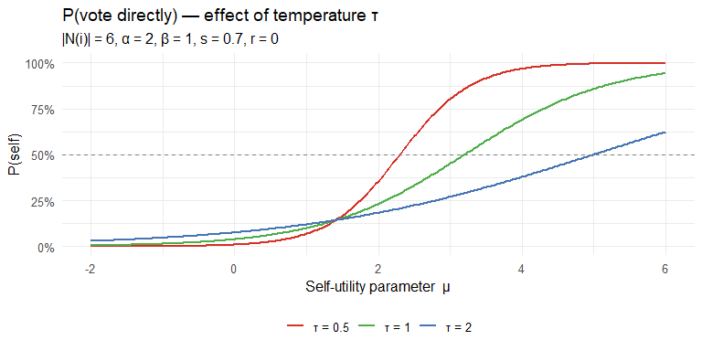
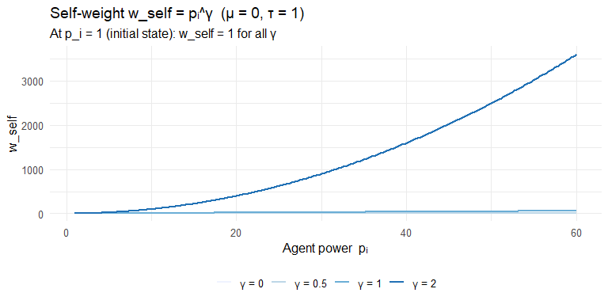
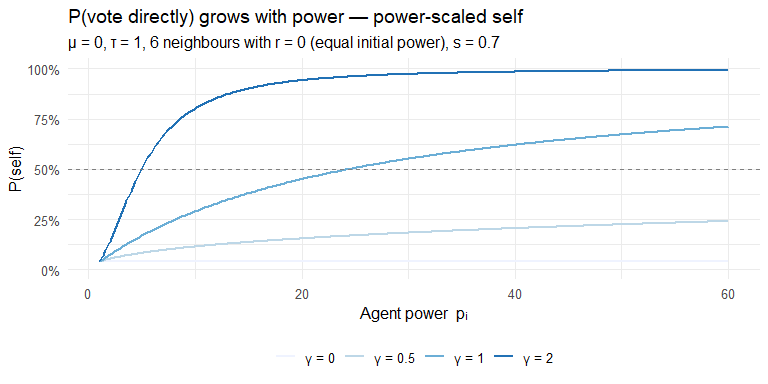
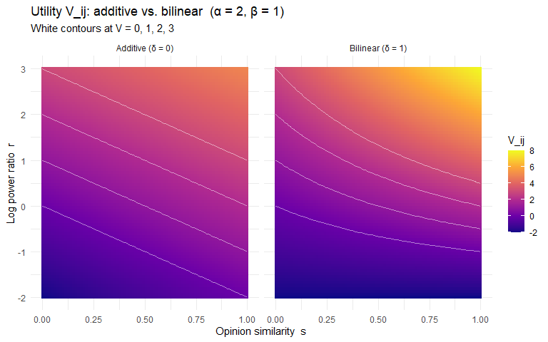
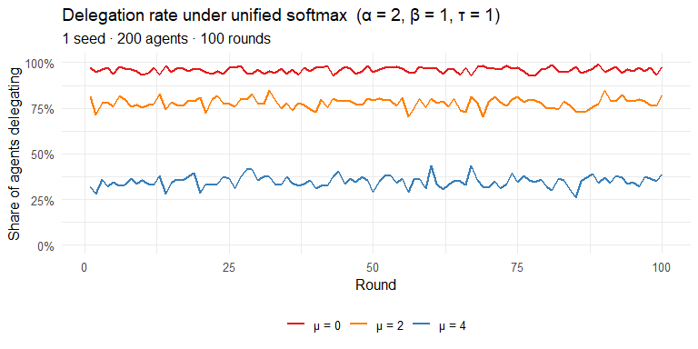
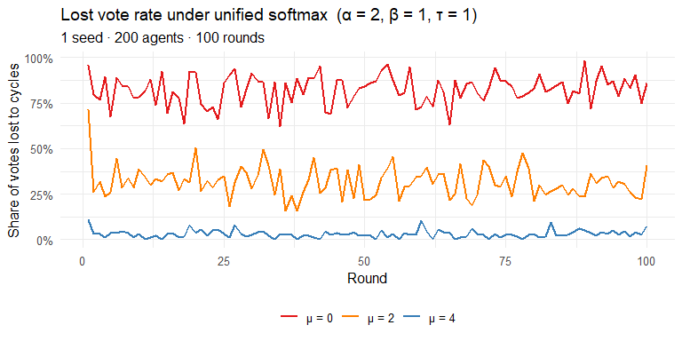

Weekly Report — Week 10 (24.04.2026 – 30.04.2026)
================
2026-04-24

## Summary

- Replaced the two-step (argmax + sigmoid self-weight) architecture with
  a unified **Multinomial Logit (MNL)** model in which all options
  compete simultaneously
- This report develops the **base model** step by step: first the
  neighbour utility, then the self utility, with analytical plots at
  each step showing limit behaviour
- Models 1–5 (Weeks 1–9) are archived at the end for reference

------------------------------------------------------------------------

## Motivation

The previous models had a structural flaw: Step 1 picked the single best
neighbour $j^*$ via $\arg\max$, and Step 2 compared the agent against
$j^*$ via a sigmoid. This threw away all information about the other
neighbours and created discontinuities — a tiny change in scores could
flip $j^*$ and abruptly change the self-weight.

The MNL model replaces both steps with a single equation. Agent $i$
assigns a **utility** $V_k$ to every option
$k \in \mathcal{C}_i = \{i\} \cup N(i)$ and draws from the resulting
softmax:

$$
P_i(k) = \frac{\exp(V_k / \tau)}{\exp(V_{i,\text{self}} / \tau)
          + \sum_{j \in N(i)} \exp(V_{ij} / \tau)}
$$

The temperature $\tau$ is the `responsiveness` parameter in the
simulation.

------------------------------------------------------------------------

## Base Model

Two decisions are made independently:

1.  **Neighbour utility** — how attractive is neighbour $j$ to agent
    $i$?
2.  **Self utility** — how strongly does $i$ prefer to keep their own
    vote?

The simplest version of each:

$$
V_{ij} = \alpha \cdot s_{ij} + \beta \cdot r_{ij}
\qquad
s_{ij} = 1 - |o_i - o_j|,\quad r_{ij} = \log\!\frac{p_j}{p_i}
$$

$$
V_{i,\text{self}} = \mu \quad \text{(constant for all agents)}
$$

The unnormalised softmax weights are $w_{ij} = e^{V_{ij}/\tau}$ and
$w_\text{self} = e^{\mu/\tau}$.

------------------------------------------------------------------------

## Part 1 — Neighbour Utility

### 1a. Effect of Opinion Similarity ($\alpha$, fixing $\beta = 0$, $r = 0$)

$$
V_{ij} = \alpha \cdot s_{ij}
\qquad \Longrightarrow \qquad
w_{ij} = e^{\alpha \cdot s}
$$

<!-- -->

**Limit behaviour:**

| $\alpha$ | Effect |
|----|----|
| $\alpha = 0$ | $w_{ij} = 1$ for every neighbour — opinion is completely irrelevant |
| $\alpha \to \infty$ | $w_{ij} \approx 0$ for $s < 1$; only the most similar neighbour counts |
| $\alpha = 1$ | The weight doubles as $s$ goes from 0 to 1 ($e^0 = 1$ to $e^1 \approx 2.7$) |

------------------------------------------------------------------------

### 1b. Effect of Relative Power ($\beta$, fixing $\alpha = 0$, $s = 0.5$)

$$
V_{ij} = \beta \cdot r_{ij}
\qquad \Longrightarrow \qquad
w_{ij} = e^{\beta \cdot r}
$$

Note that $r = \log(p_j / p_i)$: positive when $j$ is more powerful,
negative when less powerful.

<!-- -->

**Limit behaviour:**

| Condition | $r$ value | Effect |
|----|----|----|
| $p_j = p_i$ | $r = 0$ | $w_{ij} = 1$ regardless of $\beta$ — power parity |
| $p_j \gg p_i$ | $r \to +\infty$ | $w_{ij} \to \infty$ — very powerful neighbours are overwhelmingly attractive |
| $p_j \ll p_i$ | $r \to -\infty$ | $w_{ij} \to 0$ — less powerful neighbours are ignored |
| $\beta = 0$ | any | $w_{ij} = 1$ — power is irrelevant |

------------------------------------------------------------------------

### 1c. Combined Effect: Heatmap of $V_{ij} = 2s + r$

With $\alpha = 2$, $\beta = 1$, $\tau = 1$ (the default parameters used
below).

<!-- -->

The $w = 1$ contour (white line at the bottom-left) is where the
neighbour is exactly as attractive as the reference self-option (when
$\mu = 0$). Below that line, delegating to $j$ is less likely than
keeping your own vote.

------------------------------------------------------------------------

## Part 2 — Self Utility (Constant Baseline)

$$
V_{i,\text{self}} = \mu
\qquad \Longrightarrow \qquad
w_\text{self} = e^{\mu / \tau}
$$

### 2a. How $\mu$ shifts the probability of voting directly

For a typical agent with $K$ neighbours each contributing weight
$\bar{w}_{nb} = e^{V_{ij}}$:

$$
P(\text{self}) = \frac{e^{\mu/\tau}}{e^{\mu/\tau} + K \cdot \bar{w}_{nb}}
$$

Below we fix $\tau = 1$, $\alpha = 2$, $\beta = 1$, $s = 0.7$, $r = 0$
(typical agent with equally-powered neighbours and 70 % average opinion
agreement).

<!-- -->

**Limit behaviour:**

| $\mu$ | Effect |
|----|----|
| $\mu \to -\infty$ | $w_\text{self} \to 0$: agent always delegates — no self-confidence |
| $\mu = 0$ | $w_\text{self} = 1$: self has same base weight as a neighbour with $V_{ij} = 0$ |
| $\mu = V_{nb}$ | Self and each neighbour have equal weight; $P(\text{self}) = 1/(1+K)$ |
| $\mu \to +\infty$ | $w_\text{self} \to \infty$: agent never delegates |

With 6 neighbours and $V_{nb} \approx 1.4$, you need roughly
$\mu \approx 3$ (i.e. $e^3 \approx 20$) to get
$P(\text{self}) \approx 45\%$.

------------------------------------------------------------------------

### 2b. Effect of Temperature $\tau$ on the same model

Temperature $\tau$ scales all utilities — it does not change *which*
option is best, but how sharply the agent commits to it.

<!-- -->

At $\tau = 0.5$ the curve is much steeper: agents are nearly
deterministic. At $\tau = 2$ the curve is flat: differences in $\mu$
barely affect behaviour.

------------------------------------------------------------------------

## Part 3 — Extension: Power-Scaled Self

The constant $\mu$ is the same for every agent in every round. A natural
extension: let self-confidence grow with **accumulated power** $p_i$.

$$
V_{i,\text{self}} = \mu + \gamma \cdot \log(p_i)
\qquad \Longrightarrow \qquad
w_\text{self} = p_i^{\,\gamma/\tau} \cdot e^{\mu/\tau}
$$

### 3a. Self-weight as a function of $p_i$ (varying $\gamma$)

<!-- -->

### 3b. P(self) as a function of $p_i$ (6 typical neighbours)

<!-- -->

**Limit behaviour:**

| $\gamma$ | Effect |
|----|----|
| $\gamma = 0$ | Collapses to constant-$\mu$ model; power doesn’t affect self-confidence |
| $\gamma = 1$ | $w_\text{self} = p_i$: self-weight equals own power — linear feedback |
| $\gamma \to \infty$ | Even slightly powerful agents ($p_i > 1$) become near-certain direct voters |
| $p_i = 1$ (initial state) | $w_\text{self} = e^{\mu/\tau}$ for all $\gamma$ — power self = constant self in round 1 |

The key dynamic: in **round 1** every agent has $p_i = 1$, so the
power-scaled model behaves identically to the constant model with
$\mu = 0$. After delegations occur, some agents accumulate power and
their self-confidence grows — they gradually stop delegating. This is an
**endogenous feedback loop** rather than an externally fixed parameter.

------------------------------------------------------------------------

## Part 4 — Extension: Bilinear Utility

The additive model treats $s$ and $r$ as independent. A bilinear
interaction term lets power **amplify** the effect of opinion
similarity:

$$
V_{ij}^{\text{bil}} = \alpha \cdot s + \beta \cdot r + \delta \cdot s \cdot r
$$

Setting $\delta = 0$ recovers the additive case.

<!-- -->

In the **bilinear** panel, the contours become tilted: for high-power
neighbours ($r > 0$), even moderate similarity produces a high utility.
For low-power neighbours ($r < 0$), even high similarity doesn’t
compensate.

**Limit behaviour of $\delta$:**

| $\delta$ | Effect |
|----|----|
| $\delta = 0$ | Additive; $s$ and $r$ are independent |
| $\delta > 0$ | Power scales the opinion weight: effective $\alpha_\text{eff} = \alpha + \delta \cdot r$ |
| $s = 0$ | Interaction vanishes; only $\beta \cdot r$ matters regardless of $\delta$ |
| $r = 0$ | Interaction vanishes; only $\alpha \cdot s$ matters regardless of $\delta$ |

------------------------------------------------------------------------

## Unified Model: Self as a Softmax Option

### Assumption

Each agent $i$ assigns a **utility** to every possible choice — voting
directly or delegating to any of their neighbours — and draws from a
softmax over those utilities. This is the **Multinomial Logit** model
(McFadden 1974): if we assume each agent’s perceived utility has an
independent random component drawn from a Gumbel distribution, the
resulting choice probabilities are exactly the softmax.

------------------------------------------------------------------------

### Utility of delegating to neighbour $j$

$$
V_{ij}
= \alpha \cdot \bigl(1 - |o_i - o_j|\bigr)
+ \beta \cdot \log\!\left(\frac{p_j}{p_i}\right)
$$

- $1 - |o_i - o_j| \in [0,1]$: **opinion similarity**. Is 1 when $i$ and
  $j$ have identical opinions, 0 when maximally different. $\alpha > 0$
  means: the more you agree, the more attractive the delegate.

- $\log(p_j / p_i) \in \mathbb{R}$: **log power ratio**. Is 0 when both
  have equal power, positive when $j$ is more powerful, negative when
  $j$ is less powerful. Using the logarithm ensures scale-invariance: a
  10:1 ratio always contributes the same utility regardless of whether
  we are comparing 1 vs 10 votes or 100 vs 1 000 votes. $\beta > 0$
  means: more powerful neighbours are more attractive.

------------------------------------------------------------------------

### Utility of voting directly (self-option)

$$
V_{i,\text{self}} = \mu
$$

$\mu$ is a **constant baseline** — the same for every agent in every
round. It captures the general tendency to keep one’s own vote
independent of power or neighbourhood structure. $\mu > 0$: agents lean
towards voting directly. $\mu < 0$: agents lean towards delegating.
$\mu = 0$: the self-option has the same base weight as a neighbour with
$V_{ij} = 0$ (i.e. equal power and maximum opinion distance).

------------------------------------------------------------------------

### Choice probabilities via Softmax

The **softmax** converts the utilities into a proper probability
distribution over all $K+1$ options (self plus $K = |N(i)|$ neighbours):

$$
P_i(\text{vote directly}) =
\frac{
  \exp\!\left(\dfrac{\mu}{\tau}\right)
}{
  \exp\!\left(\dfrac{\mu}{\tau}\right)
  +
  \displaystyle\sum_{j \in N(i)}
  \exp\!\left(\dfrac{\alpha(1-|o_i-o_j|) + \beta\log(p_j/p_i)}{\tau}\right)
}
$$

$$
P_i(\text{delegate to } j) =
\frac{
  \exp\!\left(\dfrac{\alpha(1-|o_i-o_j|) + \beta\log(p_j/p_i)}{\tau}\right)
}{
  \exp\!\left(\dfrac{\mu}{\tau}\right)
  +
  \displaystyle\sum_{j' \in N(i)}
  \exp\!\left(\dfrac{\alpha(1-|o_i-o_{j'}|) + \beta\log(p_{j'}/p_i)}{\tau}\right)
}
$$

The **temperature** $\tau > 0$ is the `responsiveness` parameter in the
simulation. Dividing all utilities by $\tau$ uniformly scales how
sharply agents discriminate between options:

- $\tau \to 0$: near-deterministic — the option with the highest utility
  is chosen with probability approaching 1 (equivalent to $\arg\max$)
- $\tau = 1$: standard softmax — utilities enter without rescaling
- $\tau \to \infty$: uniform random — all options equally likely
  regardless of utilities

------------------------------------------------------------------------

### Why This Replaces the Two-Step Formula

In the old model, $A_{ij} = \exp(V_{ij})$ and
$w_\text{self} = \sigma(\cdot)$ are on **different scales**: the
neighbour weights are unbounded $(0, \infty)$, but the sigmoid is
bounded in $(0, 1)$. A neighbour with $V_{ij} = 4$ produces
$A_{ij} = e^4 \approx 55$, which completely dominates any sigmoid value
no matter how high.

Setting $w_\text{self} = \exp(\mu/\tau)$ puts both on the same
$\exp(\cdot)$ scale and allows the parameters to be interpreted
consistently.

|  | Old (two-step) | Unified softmax |
|----|----|----|
| Neighbour weight | $\exp(\alpha(1-|o_i-o_j|) + \beta\log(p_j/p_i))$ | $\exp\!\left(\frac{\alpha(1-|o_i-o_j|)+\beta\log(p_j/p_i)}{\tau}\right)$ |
| Self weight | $\sigma\!\left(\alpha|o_i-o_{j^*}| + \beta\log(p_{j^*}/p_i)\right) \in (0,1)$ | $\exp(\mu/\tau) \in (0,\infty)$ |
| All neighbours compete? | No — $\arg\max$ keeps only $j^*$ | Yes — every neighbour enters the sum |
| One formula? | No — $\alpha,\beta$ appear twice in different forms | Yes — one formula, one parameter set |

------------------------------------------------------------------------

### Implementation

``` r
# make_mnl_attract(alpha, beta)
# -------------------------------------------------
# Returns a function that computes the softmax weight w_ij = exp(V_ij / tau)
# for each neighbour j of agent i.
#
# The returned function takes:
#   op_i, op_j  : opinion of agent i and neighbour(s) j  (scalars or vectors)
#   pow_i, pow_j: power of agent i and neighbour(s) j
#   resp        : responsiveness = temperature tau
#
# The simulator calls it as:
#   attractiveness_fn(op[i], op[neighbours], pow[i], pow[neighbours], responsiveness)
# so op_j and pow_j are vectors — the function is automatically vectorised.
make_mnl_attract <- function(alpha, beta) {
  force(alpha); force(beta)
  function(op_i, op_j, pow_i, pow_j, resp) {
    opinion_similarity   <- 1 - abs(op_i - op_j)
    log_power_ratio      <- log(pow_j / pow_i)
    utility              <- alpha * opinion_similarity + beta * log_power_ratio
    exp(utility / resp)
  }
}

# make_mnl_self(mu)
# -------------------------------------------------
# Returns a function that computes the softmax weight for the self-option:
#   w_self = exp(mu / tau)
#
# The returned function takes:
#   i            : index of the focal agent (not used here)
#   nb           : indices of neighbours (not used here)
#   op, pow      : full opinion and power vectors (not used here)
#   responsiveness: temperature tau
#
# The interface is kept general so that future variants (e.g. power-scaled
# self-confidence) can use op[i] or pow[i] without changing the simulator.
make_mnl_self <- function(mu) {
  force(mu)
  function(i, nb, op, pow, responsiveness) exp(mu / responsiveness)
}
```

``` r
# Example: alpha = 2, beta = 1, mu = 3, tau = 1
simulate_liquid_democracy(
  attractiveness_fn = make_mnl_attract(alpha = 2, beta = 1),
  selfweight_fn     = make_mnl_self(mu = 3),
  responsiveness    = 1
)
```

------------------------------------------------------------------------

### Demo: Effect of $\mu$ on Delegation Rate

Three values of $\mu$ with fixed $\alpha = 2$, $\beta = 1$, $\tau = 1$.
1 seed, 200 agents, 100 rounds.

<!-- -->

<!-- -->

The plots confirm the analytical result from Part 2: at $\mu = 0$ the
self-weight $e^0 = 1$ cannot compete with 6 neighbours each contributing
$\approx e^{1.4} \approx 4$, so nearly everyone delegates. $\mu = 4$
($e^4 \approx 55$) shifts the balance to roughly 40 % delegation.

------------------------------------------------------------------------

## Archived: Two-Step Models (Weeks 1–9)

These five formulations are superseded by the MNL framework above. They
are kept here for reference.

### Model 1 — Additive Score, Best-Neighbour Self-Weight

$$
A_{ij} = \exp\!\left(\alpha(1-|o_i-o_j|) + \beta\log\tfrac{p_j}{p_i}\right)
\quad
j^* = \arg\max A_{ij}
\quad
w_\text{self} = \sigma\!\left(\alpha|o_i-o_{j^*}| + \beta\log\tfrac{p_{j^*}}{p_i}\right)
$$

### Model 2 — Mean-Neighbourhood Self-Weight

$$
w^\text{mean}_\text{self} = \sigma\!\left(\alpha\bar{d}_i + \beta\log\tfrac{\bar{p}_i}{p_i}\right)
\qquad
\bar{d}_i = \tfrac{1}{K}\sum_j|o_i-o_j|,\quad \bar{p}_i = \tfrac{1}{K}\sum_j p_j
$$

### Model 3 — Multiplicative Score

$$
A_{ij} = (1-|o_i-o_j|)^\alpha \cdot (p_j/p_i)^\beta
\qquad
w_\text{self} = \sigma\!\left((|o_i-o_{j^*}|)^\alpha(p_{j^*}/p_i)^\beta - 1\right)
$$

### Model 4 — Bilinear Interaction Score

$$
A_{ij} = \alpha s_{ij} + \beta r_{ij} + \gamma s_{ij} r_{ij}
\qquad
w_\text{self} = \sigma(\alpha|o_i-o_{j^*}| + \beta r_{j^*i} + \gamma|o_i-o_{j^*}|r_{j^*i})
$$

### Model 5 — Multiplicative Delegation Gate

$$
P(\text{delegate}) = (1-|o_i-o_{j^*}|)\cdot\sigma(r\ln(p_{j^*}/p_i))
\qquad
w_\text{self} = 1 - P(\text{delegate})
$$
