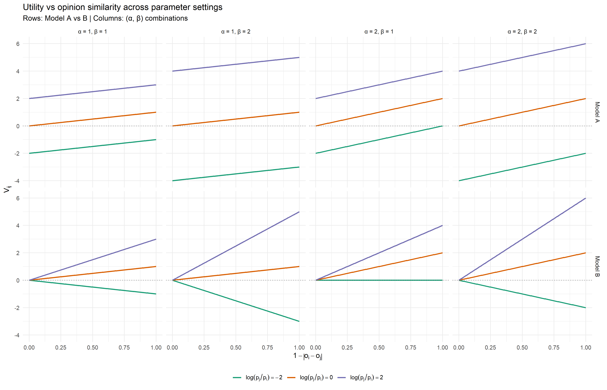
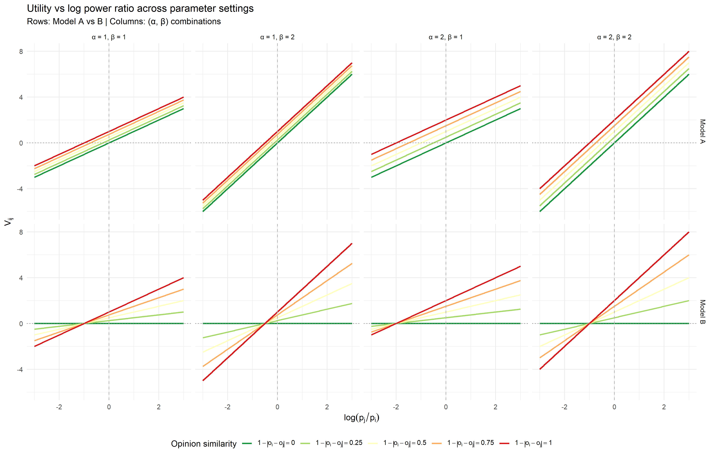
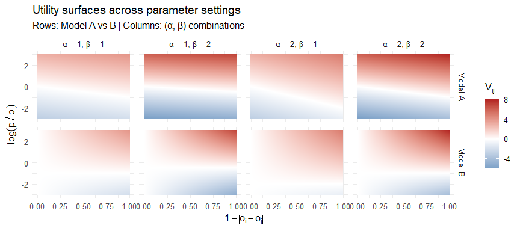

Weekly Report — Week 10 (24.04.2026 – 30.04.2026)
================
2026-04-24

<!--
  WORKFLOW NOTE
  ─────────────────────────────────────────────────────────────────
   Utility functions studied in isolation.
   No softmax, no self-weight, no simulation noise.
   Goal: understand the structural behaviour of the formulas
   before any decision mechanism is introduced.
&#10;  ─────────────────────────────────────────────────────────────────
-->

------------------------------------------------------------------------

# Phase I — Utility Analysis (No Decision Rule)

------------------------------------------------------------------------

## 1. Utility Functions: Model A and Model B

We compare two specifications for the utility agent $i$ assigns to
delegating to neighbour $j$. Both depend on the same two quantities:

$$\text{opinion similarity:} \quad (1 - |o_i - o_j|) \in [0, 1]$$

$$\text{log power ratio:} \quad \log\!\left(\frac{p_j}{p_i}\right) \in \mathbb{R}$$

**Model A — additive:**
$$V_{ij}^{(A)} \;=\; \alpha\,(1 - |o_i - o_j|) \;+\; \beta\,\log\!\left(\frac{p_j}{p_i}\right)$$

Opinion similarity and relative power contribute **independently**. A
powerful but ideologically distant neighbour can still accumulate a
large $\beta\log(p_j/p_i)$ term even when $(1-|o_i-o_j|)$ is small.

**Model B — interaction:**
$$V_{ij}^{(B)} \;=\; (1 - |o_i - o_j|)\,\left[\alpha \;+\; \beta\,\log\!\left(\frac{p_j}{p_i}\right)\right]$$

Opinion similarity acts as a **multiplicative gate** on the power term.
When agents are maximally dissimilar ($|o_i - o_j| = 1$),
$V_{ij}^{(B)} = 0$ regardless of power. This encodes a strong
behavioural assumption: *power only matters if agents are similar*.
Ideological distance is not a penalty — it is a hard exclusion.

|  | Model A | Model B |
|----|----|----|
| Structure | Additive, separable | $(1-\|o_i-o_j\|)$ gates the power term |
| Dissimilar, powerful neighbour | $V_{ij} = \beta\log(p_j/p_i) \neq 0$ | $V_{ij} = 0$ always |
| Models agree when | — | $\beta = 0$, $\log(p_j/p_i) = 0$, $o_i = o_j$ |

------------------------------------------------------------------------

## 2. 1D Analysis — Effect of Opinion Similarity

We fix $\log(p_j/p_i)$ and study how utility varies with
$(1-|o_i-o_j|)$. Each panel holds $\alpha$, $\beta$, and $\log(p_j/p_i)$
constant; only opinion similarity varies along the x-axis.

<!-- -->

**Model A** produces parallel lines: increasing opinion similarity
raises $V_{ij}$ at constant rate $\alpha$, while $\beta\log(p_j/p_i)$
adds a fixed vertical offset independent of similarity. Even at zero
similarity ($1-|o_i-o_j|=0$) the utility is nonzero whenever $\beta > 0$
— a powerful but ideologically distant neighbour still attracts. **Model
B** forces all lines through the origin at zero similarity: the entire
expression is multiplied by $(1-|o_i-o_j|)$, so maximal dissimilarity
always yields $V_{ij}=0$ regardless of power or $\alpha$. Larger $\beta$
(right columns) widens the gap between $\log(p_j/p_i)$ levels in both
models; larger $\alpha$ (bottom rows) shifts Model A upward uniformly
and steepens Model B’s slope.

------------------------------------------------------------------------

## 3. 1D Analysis — Effect of the Power Ratio

We fix $(1-|o_i-o_j|)$ and study how utility varies with
$\log(p_j/p_i)$. Each panel holds $\alpha$, $\beta$, and opinion
similarity constant; only the log power ratio varies along the x-axis.

<!-- -->

**Model A** produces perfectly parallel lines with slope $\beta$: the
log power ratio has the same influence at every similarity level, and
the lines are shifted vertically by $\alpha \cdot (1-|o_i-o_j|)$. Agents
with zero similarity ($1-|o_i-o_j|=0$, green line) still respond to
power. **Model B** shows a fan converging to zero: at full similarity
the slope equals $\beta$ (matching Model A), but it contracts
proportionally as similarity falls, reaching a completely flat zero line
for dissimilar agents. The vertical dashed line marks equal power
($\log(p_j/p_i)=0$); the dotted horizontal marks $V_{ij}=0$.

------------------------------------------------------------------------

## 4. 2D Utility Surface

Both inputs vary simultaneously. Red indicates high utility (agent $i$
strongly prefers to delegate to $j$), blue indicates low or negative
utility, white marks $V_{ij}=0$. Each panel is one $(\alpha,\beta)$
combination.

<!-- -->

The left column ($1-|o_i-o_j|=0$) makes the key difference concrete:
Model A shows a continuous gradient driven by $\log(p_j/p_i)$; Model B
is uniformly white (zero), eliminating all dissimilar agents from the
choice set irrespective of their power.

------------------------------------------------------------------------

## 5. Limit Behaviour

| Condition | V_A | V_B | Implication |
|:---|:---|:---|:---|
| \|o_i - o_j\| = 1 (max. dissimilar) | beta \* log(p_j / p_i) | 0 | B ignores dissimilar agents entirely |
| o_i = o_j (identical opinions) | alpha + beta \* log(p_j / p_i) | alpha + beta \* log(p_j / p_i) | Models are identical |
| beta = 0 | alpha \* (1 - \|o_i - o_j\|) | alpha \* (1 - \|o_i - o_j\|) | Models are identical; pure homophily |
| alpha = 0 | beta \* log(p_j / p_i) | (1 - \|o_i - o_j\|) \* beta \* log(p_j / p_i) | B still couples power to similarity |
| p_j \>\> p_i, beta \> 0, o_i ≈ o_j | → +∞ | → +∞ | Both: powerful similar agents dominate |
| p_j \>\> p_i, beta \> 0, \|o_i - o_j\| = 1 | → +∞ | 0 | A: cross-ideological pull; B: no effect |

Limit behaviour of both utility functions.

Models diverge only when $\beta \neq 0$ **and** opinion heterogeneity is
present. The two bold rows define the critical qualitative difference.
