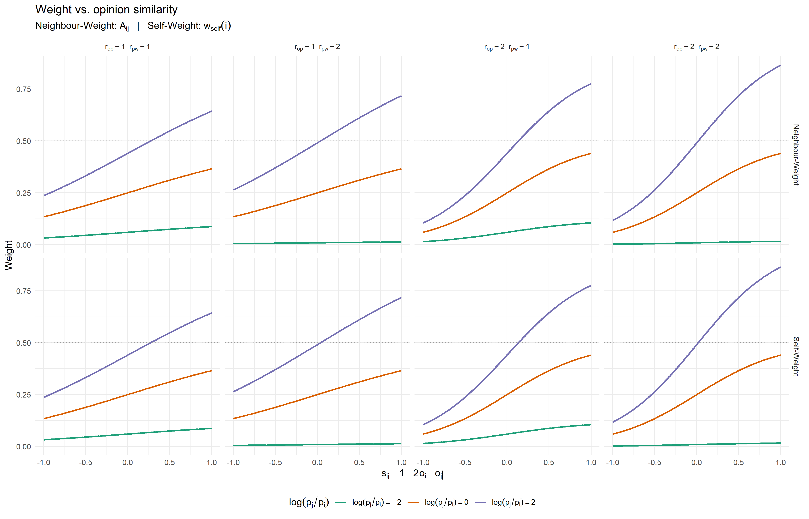
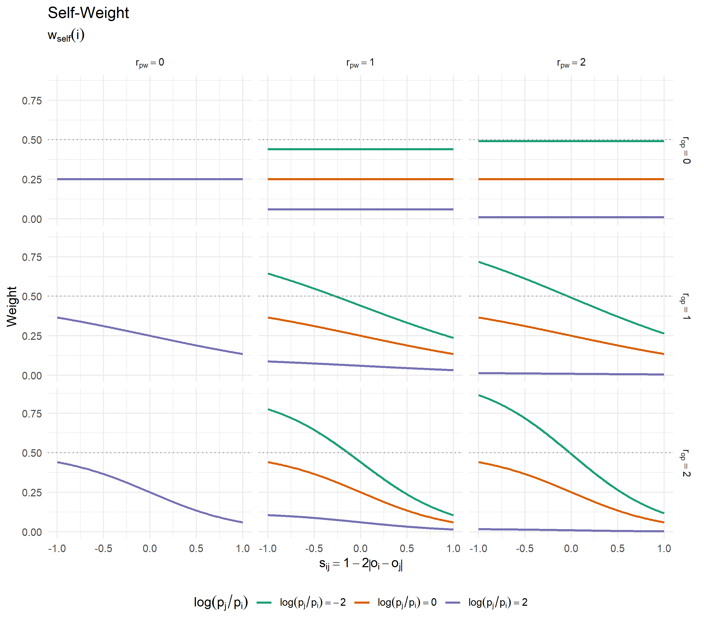
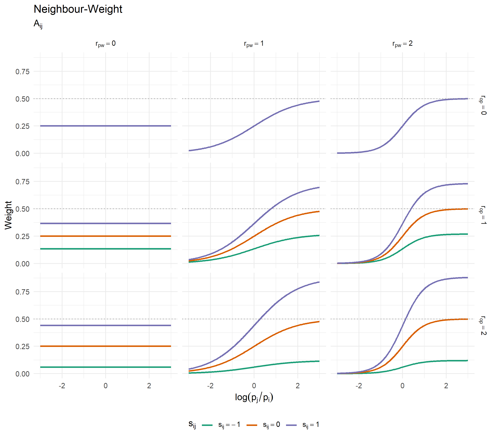
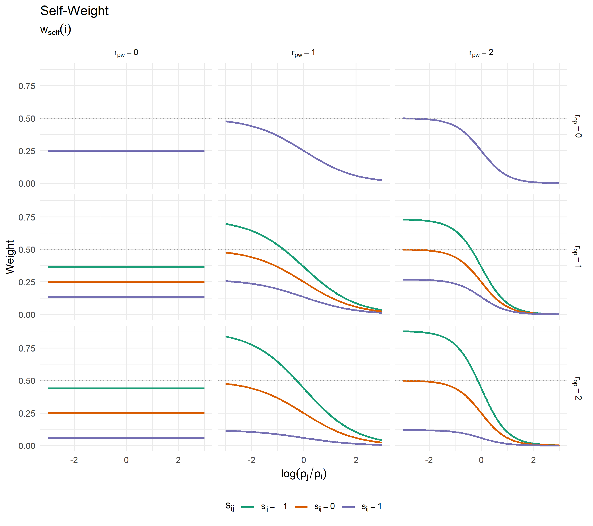
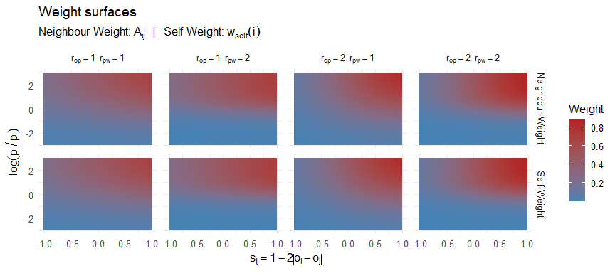
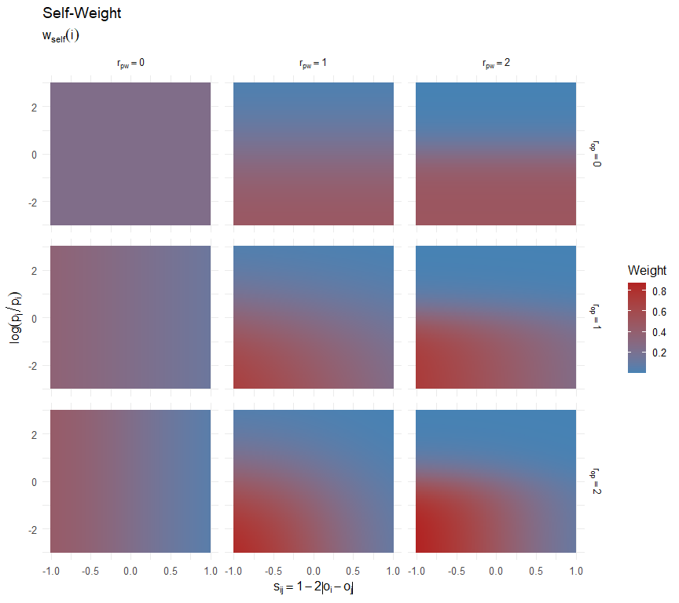
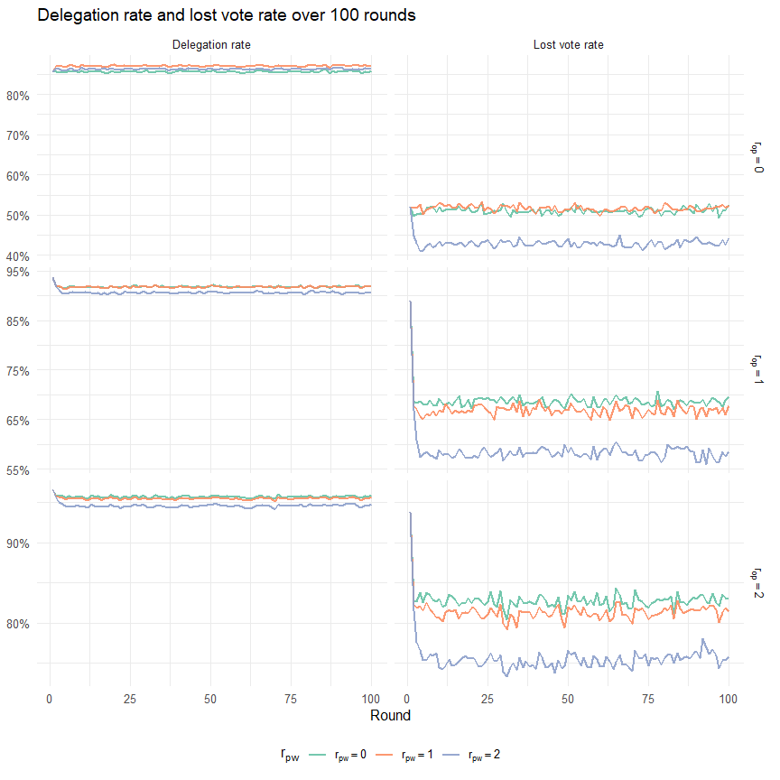

Weekly Report — Week 11 (01.05.2026 – 07.05.2026)
================
2026-05-05

## 1. Formulas

### Neighbour-Weight (Attractiveness)

$$A_{ij} = \sigma\!\left(r_{op} \cdot (1 - 2\,|o_i - o_j|)\right) \cdot \sigma\!\left(r_{pw} \cdot \log\frac{p_j}{p_i}\right)$$

### Self-Weight

Let $j^\ast = \arg\max_{j \in N(i)} A_{ij}$ denote the most attractive
neighbour of agent $i$.

$$w_{\text{self}}(i) = \sigma\!\left(r_{op} \cdot \bigl(2\,|o_i - o_{j^\ast}| - 1\bigr)\right) \cdot \sigma\!\left(r_{pw} \cdot \log\frac{p_i}{p_{j^\ast}}\right)$$

------------------------------------------------------------------------

## 2. Weight Surfaces (1-D Slices)

<!-- --><!-- -->

## 3. Weight vs. Power Ratio (1-D Slices)

<!-- --><!-- -->

## 4. Weight Surfaces (2-D Heatmaps)

<!-- --><!-- -->

## 4. Simulation — Delegation Rate & Lost Vote Rate

The simulation runs `simulate_liquid_democracy` from `Network.R` using
the Neighbour-Weight and Self-Weight formulas across a $3\times3$ grid
of $r_{op},r_{pw} \in \{0,\,1,\,2\}$ ($n=250$ agents, $T=100$ rounds,
averaged over 100 independent runs).

<!-- -->

| r_op | r_pw | Del. mean | Del. SD | Lost mean | Lost SD |
|-----:|-----:|----------:|--------:|----------:|--------:|
|    0 |    0 |     0.856 |   0.002 |     0.511 |   0.008 |
|    0 |    1 |     0.871 |   0.002 |     0.517 |   0.007 |
|    0 |    2 |     0.863 |   0.002 |     0.429 |   0.012 |
|    1 |    0 |     0.918 |   0.002 |     0.688 |   0.022 |
|    1 |    1 |     0.918 |   0.003 |     0.671 |   0.024 |
|    1 |    2 |     0.907 |   0.004 |     0.586 |   0.033 |
|    2 |    0 |     0.957 |   0.002 |     0.828 |   0.013 |
|    2 |    1 |     0.955 |   0.002 |     0.814 |   0.014 |
|    2 |    2 |     0.946 |   0.003 |     0.756 |   0.021 |
