Weekly Report – Week 13 (15.05.2026 – 21.05.2026)
================
2026-05-15

## Design

Two simulation sweeps underpin this report.

**Large sweep** ($r_{op}, r_{pw} \in \{0,\ldots,15\}$, N $\in$ {300,
1000}, node degree = 6, 25 seeds per combination): used for GAM overview
plots that capture the global, potentially nonlinear response surface.

**Robustness sweep** ($r_{op}, r_{pw} \in \{0,1,2\}$, N $\in$ {100, 200,
…, 1000}, node degree = 6, 100 seeds per combination): used for LMM
inference (N = 300 subset) and N-scaling analysis across all ten network
sizes.

All metrics are averaged over simulation rounds 15–20.

    ## Large sweep:    66 min 36.2 sec  |  512 parameter combinations  |  12800 simulations

    ## Robust sweep:   39 min 55.1 sec  |  90 parameter combinations  |  9000 simulations

------------------------------------------------------------------------

# Overview – Delegation & Lost Vote Rate

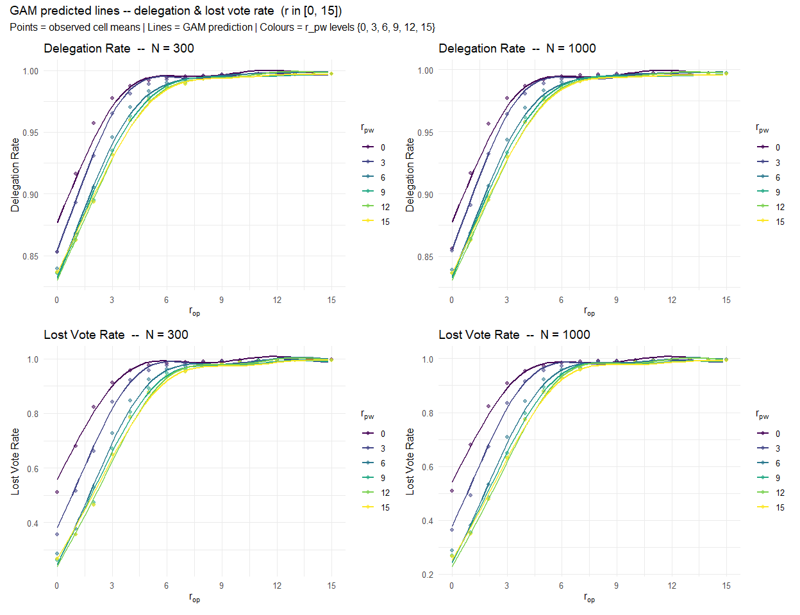<!-- -->

Checked for reasonable r values. Plots show a very high delegation +
lost vote rate for any value higher than r = 2. Therefore for the
following simulations + models r values in {0, 1, 2}.

------------------------------------------------------------------------

# Part 1 – N = 300

## 0 Preliminary Check – Seed-Level Bias

Each seed defines a unique network topology (Watts-Strogatz graph) and
initial opinion vector. If certain seeds consistently produce higher
delegation rates or longer chains regardless of parameter settings,
ignoring this structure inflates model residuals. The mixed model in
Part 1 includes a seed-level random intercept `(1|seed)` to absorb this
variation.

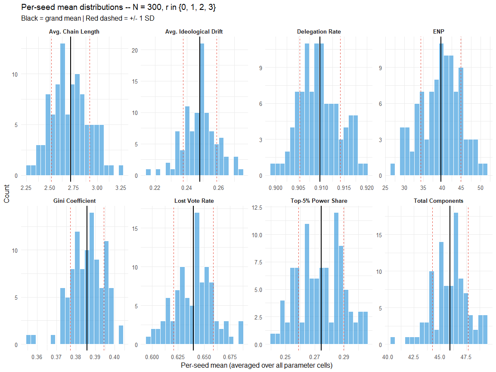<!-- -->

| Metric                 | Grand mean |     SD |     CV |
|:-----------------------|-----------:|-------:|-------:|
| Delegation Rate        |     0.9097 | 0.0044 | 0.0049 |
| Lost Vote Rate         |     0.6399 | 0.0189 | 0.0296 |
| Avg. Chain Length      |     2.7157 | 0.2010 | 0.0740 |
| Avg. Ideological Drift |     0.2482 | 0.0106 | 0.0426 |
| Gini Coefficient       |     0.3857 | 0.0086 | 0.0224 |
| Top-5% Power Share     |     0.2743 | 0.0155 | 0.0567 |
| ENP                    |    39.5779 | 5.2716 | 0.1332 |
| Total Components       |    45.9467 | 1.7064 | 0.0371 |

Seed-level variability – CV \> 0.05 indicates meaningful seed bias
warranting a random intercept.

CV values above 0.05 confirm that network topology and initial opinions
introduce non-negligible between-seed variation, justifying the random
intercept `(1|seed)`.

------------------------------------------------------------------------

## 1 LMM – fine grid (r ∈ {0, 1, 2}, N = 300)

Within the approximately linear regime ($r \leq 2$) the interaction
model

$$y_{ijk} = \beta_0 + \beta_1\,r_{op} + \beta_2\,r_{pw} + \beta_3\,(r_{op} \cdot r_{pw}) + u_k + \varepsilon_{ijk}$$

is fitted. $u_k \sim \mathcal{N}(0, \sigma_u^2)$ is the seed random
intercept.

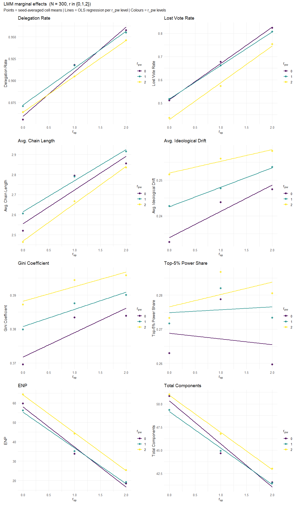<!-- -->

- **ENP** ($1/\sum s_i^2$): effective number of equally powerful agents;
  *higher = less concentrated*

| Metric | b1 (r_op) | b2 (r_pw) | b3 (r_op:r_pw) | LRT χ² | R2m | R2c |
|:---|:---|:---|:---|:---|---:|---:|
| Delegation Rate | 0.0497\*\* (\< .001) | 0.0023\*\* (\< .001) | -0.005\*\* (\< .001) | 186.66\*\* (\< .001) | 0.956 | 0.966 |
| Lost Vote Rate | 0.1521\*\* (\< .001) | -0.0426\*\* (\< .001) | 0.0011 (0.543) | 0.37 (0.542) | 0.922 | 0.934 |
| Avg. Chain Length | 0.1605\*\* (\< .001) | -0.0429 (0.118) | 0.0089 (0.675) | 0.18 (0.674) | 0.090 | 0.182 |
| Avg. Ideological Drift | 0.0074\*\* (\< .001) | 0.009\*\* (\< .001) | -0.002\*\* (0.004) | 8.52\*\* (0.004) | 0.159 | 0.424 |
| Gini Coefficient | 0.007\*\* (\< .001) | 0.0082\*\* (\< .001) | -0.0014 (0.063) | 3.46 (0.063) | 0.152 | 0.291 |
| Top-5% Power Share | -0.0017 (0.444) | 0.0039 (0.083) | 0.0026 (0.127) | 2.33 (0.127) | 0.024 | 0.105 |
| ENP | -20.1163\*\* (\< .001) | 3.0745\*\* (\< .001) | 0.5936 (0.137) | 2.22 (0.136) | 0.757 | 0.817 |
| Total Components | -4.5229\*\* (\< .001) | 0.2971 (0.094) | 0.3238\* (0.019) | 5.55\* (0.018) | 0.556 | 0.652 |

LMM fixed effects – all metrics, r in {0,1,2}, N = 300. \* p \< 0.05,
\*\* p \< 0.01. LRT χ² tests interaction term (r_op:r_pw) against
additive model. R2m = marginal, R2c = conditional.

**Interpretation:**

**Note**  
- All results must be interpreted with considering a very high
delegation rate and therefore a very high lost vote rate especially for
higher r values. Meaning some results might be related to the enormous
loss of votes instead of their “true” effects.

**Delegation Dynamics: Delegation Rate and Lost Vote Rate**  
- Opinion responsiveness strongly increases both delegation activity and
the likelihood of votes becoming lost within delegation chains. Agents
are therefore substantially more likely to delegate when ideological
similarity is prioritized, but this simultaneously creates more fragile
delegation structures in which votes fail to reach an active
representative. In contrast, power responsiveness slightly stabilizes
the system by reducing lost votes, likely because if an agent is more
powerful than his neighbours it is very unlikely that he/she will not
cast his/her vote. Overall, the results suggest that ideological
delegation promotes participation but also increases the lost vote rate
due to cycles.

**Delegation Structure: Average Chain Length and Ideological Drift**  
- Higher opinion responsiveness produces longer delegation chains,
indicating that agents delegate through sequences of ideologically
similar intermediaries rather than directly to highly central actors. At
the same time, both opinion responsiveness and power responsiveness
increase (slightly) ideological drift. However, the negative interaction
effect suggests that the simultaneous presence of both mechanisms
partially constrains this increase in drift, whereas this effect is
almost 0.  
Note: All effects are very very small!

**Power Concentration: Gini Coefficient, Top-5% Share, and ENP**  
- Both responsiveness to opinion and responsiveness to power contribute
to a small increase in overall inequality of political influence,
although the effects are generally small. However, they act along
different structural dimensions: opinion responsiveness strongly reduces
the effective number of influential agents, which is most likely due to
higher lost vote rate, while power responsiveness tends to distribute
influence across multiple competing hubs rather than reinforcing a
single dominant center. The absence of strong effects on the Top-5%
power share suggests that concentration emerges more gradually across
the system rather than through extreme domination by a very small elite.
The absence of strong effects on the Top-5% power share suggests that
concentration does not primarily take the form of extreme
winner-takes-all (“rich-get-richer”) dynamics at the very top. Overall,
the results are not what I expected especially from r_pw, I stil think
the delegation rate has a strong effect on the power concentration.

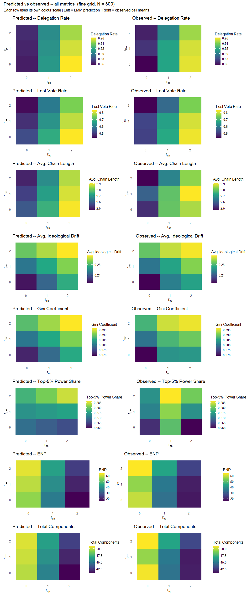<!-- -->

Close agreement between predicted and observed heatmaps confirms that
the linear interaction model captures the dominant structure within
$r \leq 2$. Systematic deviations (e.g. curvature in corners) would
indicate residual nonlinearity not captured by $\beta_3$.

------------------------------------------------------------------------

# Part 2 – Robustness: Effect of Network Size N

The robustness sweep covers N $\in$ {100, 200, , 1000} at
$r_{op}, r_{pw} \in \{0,1,2\}$. Three complementary analyses address
whether the parameter effects are N-dependent: (1) raw metric
trajectories at a fixed reference point, (2) N included directly as a
predictor to estimate the per-unit effect, and (3) separate LMMs at N =
200, 500, 1000 compared side by side.

ENP and Total Components are normalised for Part 2 comparisons across N:
ENP is divided by the number of direct voters ($n_\text{voters}$) and
Total Components by $N$.

------------------------------------------------------------------------

## 2.1 Metric trends across N (r_op = r_pw = 1)

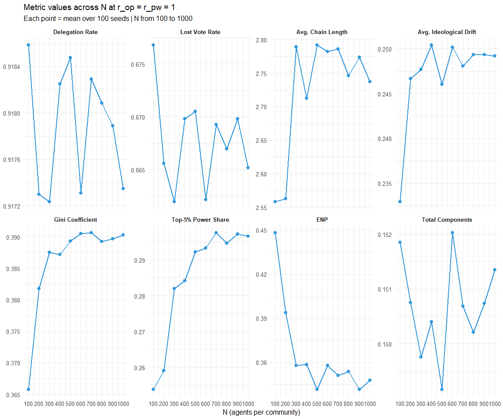<!-- -->

Across the explored range (N = 200–1000), most delegation and
concentration metrics remain relatively stable, suggesting that the
system operates in a largely size-invariant regime under
$r_{op} = r_{pw} = 1$.

The strongest size dependence appears in ENP, Top-5% Power Share and
Avg. Chain Length (for smaller sizes).

------------------------------------------------------------------------

## 2.2 Coefficient tables – N = 200, 500, 1000

| Metric | N | b1 (r_op) | b2 (r_pw) | b3 (r_op:r_pw) | LRT χ² | R2m | R2c |
|:---|---:|:---|:---|:---|:---|---:|---:|
| Delegation Rate | 200 | 0.0491\*\* (\< .001) | 0.0017\*\* (\< .001) | -0.0045\*\* (\< .001) | 129.94\*\* (\< .001) | 0.944 | 0.959 |
| Delegation Rate | 500 | 0.0488\*\* (\< .001) | 0.0018\*\* (\< .001) | -0.0047\*\* (\< .001) | 186.8\*\* (\< .001) | 0.965 | 0.969 |
| Delegation Rate | 1000 | 0.0492\*\* (\< .001) | 0.002\*\* (\< .001) | -0.0048\*\* (\< .001) | 230.23\*\* (\< .001) | 0.973 | 0.975 |
| Lost Vote Rate | 200 | 0.1532\*\* (\< .001) | -0.0461\*\* (\< .001) | 0.003 (0.132) | 2.27 (0.132) | 0.897 | 0.918 |
| Lost Vote Rate | 500 | 0.1529\*\* (\< .001) | -0.0458\*\* (\< .001) | 0.0016 (0.285) | 1.15 (0.285) | 0.939 | 0.948 |
| Lost Vote Rate | 1000 | 0.1544\*\* (\< .001) | -0.0436\*\* (\< .001) | 9e-04 (0.473) | 0.52 (0.472) | 0.960 | 0.964 |
| Avg. Chain Length | 200 | 0.054 (0.061) | -0.0437 (0.128) | 0.026 (0.242) | 1.37 (0.242) | 0.020 | 0.167 |
| Avg. Chain Length | 500 | 0.0832\*\* (\< .001) | -0.0991\*\* (\< .001) | 0.0505\*\* (0.003) | 8.97\*\* (0.003) | 0.099 | 0.232 |
| Avg. Chain Length | 1000 | 0.1942\*\* (\< .001) | -0.0777\*\* (\< .001) | 0.0036 (0.769) | 0.09 (0.769) | 0.300 | 0.393 |
| Avg. Ideological Drift | 200 | 0.0042\*\* (\< .001) | 0.0089\*\* (\< .001) | -0.0022\* (0.014) | 6\* (0.014) | 0.071 | 0.310 |
| Avg. Ideological Drift | 500 | 0.006\*\* (\< .001) | 0.0085\*\* (\< .001) | -0.0018\*\* (0.001) | 10.16\*\* (0.001) | 0.187 | 0.436 |
| Avg. Ideological Drift | 1000 | 0.0065\*\* (\< .001) | 0.0085\*\* (\< .001) | -0.0021\*\* (\< .001) | 31.59\*\* (\< .001) | 0.356 | 0.555 |
| Gini Coefficient | 200 | -1e-04 (0.953) | 0.0083\*\* (\< .001) | -5e-04 (0.685) | 0.16 (0.685) | 0.049 | 0.229 |
| Gini Coefficient | 500 | 0.0045\*\* (\< .001) | 0.0076\*\* (\< .001) | -5e-04 (0.457) | 0.55 (0.457) | 0.190 | 0.335 |
| Gini Coefficient | 1000 | 0.0087\*\* (\< .001) | 0.0078\*\* (\< .001) | -0.0018\*\* (\< .001) | 19.22\*\* (\< .001) | 0.444 | 0.510 |
| Top-5% Power Share | 200 | -6e-04 (0.819) | 0.0065\* (0.020) | -7e-04 (0.755) | 0.1 (0.755) | 0.011 | 0.159 |
| Top-5% Power Share | 500 | -0.0016 (0.370) | 0.0011 (0.555) | 0.0046\*\* (\< .001) | 11.16\*\* (\< .001) | 0.041 | 0.165 |
| Top-5% Power Share | 1000 | 0.011\*\* (\< .001) | 0.0026\* (0.023) | 6e-04 (0.514) | 0.43 (0.514) | 0.212 | 0.291 |
| ENP | 200 | -0.0045 (0.474) | -0.0117 (0.064) | 0.0024 (0.627) | 0.24 (0.627) | 0.005 | 0.182 |
| ENP | 500 | -0.0111\*\* (0.008) | -0.005 (0.230) | -0.0036 (0.264) | 1.25 (0.263) | 0.041 | 0.148 |
| ENP | 1000 | -0.0234\*\* (\< .001) | -0.0058 (0.057) | 5e-04 (0.847) | 0.04 (0.847) | 0.125 | 0.236 |
| Total Components | 200 | -0.015\*\* (\< .001) | 0.0012 (0.077) | 0.001 (0.068) | 3.34 (0.068) | 0.480 | 0.611 |
| Total Components | 500 | -0.0143\*\* (\< .001) | 0.0016\*\* (\< .001) | 7e-04 (0.053) | 3.75 (0.053) | 0.669 | 0.758 |
| Total Components | 1000 | -0.0143\*\* (\< .001) | 0.0011\*\* (\< .001) | 8e-04\*\* (0.002) | 9.19\*\* (0.002) | 0.797 | 0.834 |

LMM coefficients for N = 200, 500, 1000 (r in {0,1,2}). \* p \< 0.05,
\*\* p \< 0.01. LRT χ² tests interaction term against additive model.

Across all system sizes, delegation rate and lost vote dynamics remain
highly stable and strongly explained by the responsiveness parameters
($R^2_m \approx 0.95$), indicating robust and largely scale-independent
delegation behavior. In contrast, chain length, ideological drift, and
power concentration become increasingly sensitive to the parameters as
$N$ grows, reflected in rising effect sizes and higher explanatory power
at larger population sizes.

------------------------------------------------------------------------

## 2.3 Coefficient plot – N = 200, 500, 1000

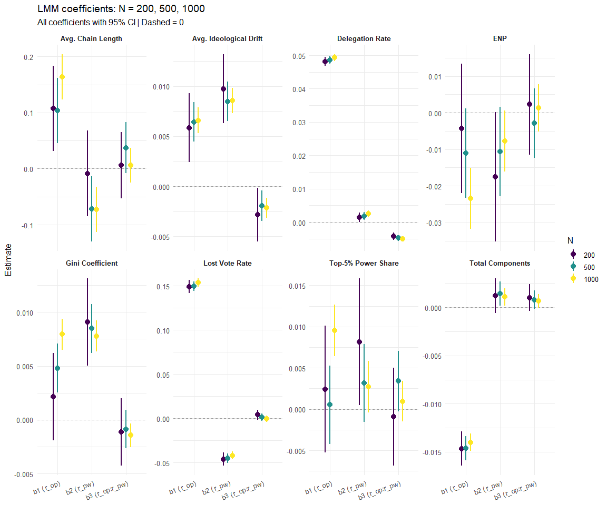<!-- -->

------------------------------------------------------------------------

# Part 3 – Trust-Weighted Delegation

## Formulas

**Trust update** (after each round, using the effective vote propagated
through $j$’s chain):

$$\tau_{ij}(t) = \lambda \cdot \tau_{ij}(t-1) - (1-\lambda)\cdot\bigl|o_i - v_j(t-1)\bigr|$$

**Modified attractiveness:**

$\tilde{A}_{ij}(t) = A_{ij} \cdot 2\sigma\bigl(\gamma\cdot\tau_{ij}(t)\bigr)$
where
$A_{ij} = \sigma\left(r_{op}(1-2|o_i-o_j|)\right)\cdot\sigma\left(r_{pw}\log(p_j/p_i)\right)$
is the baseline attractiveness from Part 1. The factor $2\sigma(\cdot)$
ensures that $\tau=0$ (no experience) gives a neutral modifier of
$2\sigma(0)=1$, recovering the unmodified $A_{ij}$ exactly. The
self-weight $w_\text{self}$ is unchanged.

The simulations in Part 1 and Part 3 used $\lambda = 0$, $\gamma = 0$,
which sets the modifier to $2\sigma(0)=1$ for all agents and rounds,
leaving the original attractiveness intact.

Here, $\lambda = 0.5$ is held fixed (exponential moving average with
half-life of one round) and $\gamma$ is varied from 0 to 3 to examine
how trust sensitivity modulates delegation patterns.

## Effect of Trust Sensitivity $\gamma$ on All Metrics

$\lambda = 0.5$ fixed; $\gamma \in [0, 3]$;
$r_{op}, r_{pw} \in \{0, 1, 2\}$. Points are seed-averaged cell means;
lines connect them. Colour encodes $r_{op}$, line type encodes $r_{pw}$.

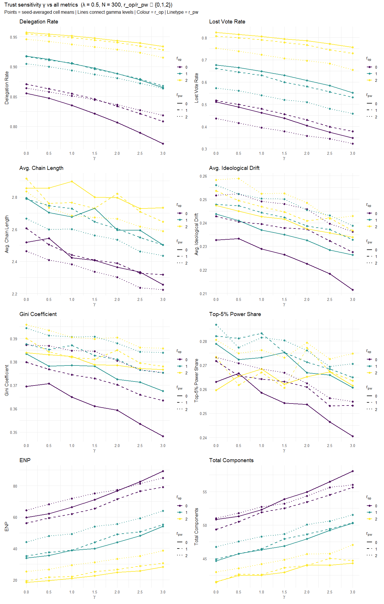<!-- -->

## LMM with Trust – Full Interaction Model

The same mixed-effects framework as in Part 1 is extended to include
$\gamma$ as a third factorial predictor:

$$y_{ijk} = \beta_0 + \beta_1 r_{op} + \beta_2 r_{pw} + \beta_\gamma \gamma + \beta_3 (r_{op} \cdot r_{pw}) + \beta_4 (r_{op} \cdot \gamma) + \beta_5 (r_{pw} \cdot \gamma) + \beta_6 (r_{op} \cdot r_{pw} \cdot \gamma) + u_k + \varepsilon_{ijk}$$

$\lambda = 0.5$ is held fixed throughout. The LRT tests whether the
three-way interaction $\beta_6$ significantly improves fit over the
model containing all two-way interactions but no three-way term.

| Metric | b1 (r_op) | b2 (r_pw) | b_γ (γ) | b3 (r_op:r_pw) | b4 (r_op:γ) | b5 (r_pw:γ) | b6 (r_op:r_pw:γ) | LRT χ² | R2m | R2c |
|:---|:---|:---|:---|:---|:---|:---|:---|:---|---:|---:|
| Delegation Rate | 0.0477\*\* (\< .001) | 6e-04 (0.109) | -0.028\*\* (\< .001) | -0.0041\*\* (\< .001) | 0.0102\*\* (\< .001) | 0.0063\*\* (\< .001) | -0.0038\*\* (\< .001) | 563.05\*\* (\< .001) | 0.965 | 0.970 |
| Lost Vote Rate | 0.1513\*\* (\< .001) | -0.0456\*\* (\< .001) | -0.057\*\* (\< .001) | 0.0022 (0.082) | 0.0169\*\* (\< .001) | 0.0088\*\* (\< .001) | -0.0067\*\* (\< .001) | 90.99\*\* (\< .001) | 0.935 | 0.940 |
| Avg. Chain Length | 0.1643\*\* (\< .001) | -0.047\*\* (0.007) | -0.0984\*\* (\< .001) | -0.0029 (0.828) | 0.0204\* (0.034) | 0.0069 (0.474) | -0.0071 (0.343) | 0.9 (0.343) | 0.159 | 0.179 |
| Avg. Ideological Drift | 0.006\*\* (\< .001) | 0.0088\*\* (\< .001) | -0.0066\*\* (\< .001) | -0.0016\*\* (\< .001) | 0.001\*\* (0.002) | 9e-04\*\* (0.005) | -8e-04\*\* (0.002) | 9.29\*\* (0.002) | 0.266 | 0.415 |
| Gini Coefficient | 0.0056\*\* (\< .001) | 0.0078\*\* (\< .001) | -0.0072\*\* (\< .001) | -0.0014\* (0.012) | 0.0023\*\* (\< .001) | 0.0016\*\* (\< .001) | -9e-04\*\* (0.002) | 9.19\*\* (0.002) | 0.245 | 0.281 |
| Top-5% Power Share | -0.0021 (0.159) | 0.0031\* (0.037) | -0.0083\*\* (\< .001) | 0.0017 (0.135) | 0.004\*\* (\< .001) | 9e-04 (0.293) | -8e-04 (0.180) | 1.8 (0.180) | 0.045 | 0.070 |
| ENP | -19.1468\*\* (\< .001) | 4.3748\*\* (\< .001) | 9.967\*\* (\< .001) | -0.0789 (0.802) | -3.3527\*\* (\< .001) | -1.5289\*\* (\< .001) | 1.1205\*\* (\< .001) | 41.37\*\* (\< .001) | 0.807 | 0.826 |
| Total Components | -4.1781\*\* (\< .001) | 0.5344\*\* (\< .001) | 2.512\*\* (\< .001) | 0.1287 (0.208) | -0.7599\*\* (\< .001) | -0.3784\*\* (\< .001) | 0.2757\*\* (\< .001) | 23.66\*\* (\< .001) | 0.656 | 0.680 |

LMM with trust: y ~ r_op \* r_pw \* gamma + (1\|seed), lambda = 0.5
fixed, N = 300. \* p \< 0.05, \*\* p \< 0.01. LRT χ² tests three-way
term (b6) against full two-way model.

**Interpretation of $\gamma$ (trust sensitivity):** $\gamma$ acts
consistently as a **decentralising signal** across all metrics. Higher
trust sensitivity reduces delegation rate, chain length, lost votes,
power concentration (Gini, Top-5%), and ideological drift, whileraising
ENP and total components — indicating that agents become more selective:
they retain their voterather than delegate to an unproven agent, which
distributes power more evenly. The positive `r_op:γ` interaction (b4)
shows that opinionsensitivity amplifies this selectivity: agents who
filter by both opinion similarity *and* trust history delegate even less
and to fewer hubs. The three-way term b6 is significant for delegation,
lostvotes, Gini, drift, ENP, and components, confirming that the joint
effect of all three parameters is not simply additive — $\gamma$
reshapes how $r_{op}$ and $r_{pw}$ interact ratherthan just shifting
outcomes by a fixed offset. —

# Part 4 Node Degree Sensitivity

`node_degree = 6` is the default WS ring-lattice parameter used
throughout Parts 1, 2, and 3. A higher degree means more potential
delegation partners per agent, which directly affects chain length and
connectivity. This section checks whether the key results generalise
across a wide range of degree values.

The sweep varies `node_degree` from 6 to 30 across all nine combinations
of $r_{op}, r_{pw} \in \{0, 1, 2\}$ at $N = 300$.

## All Metrics vs Node Degree

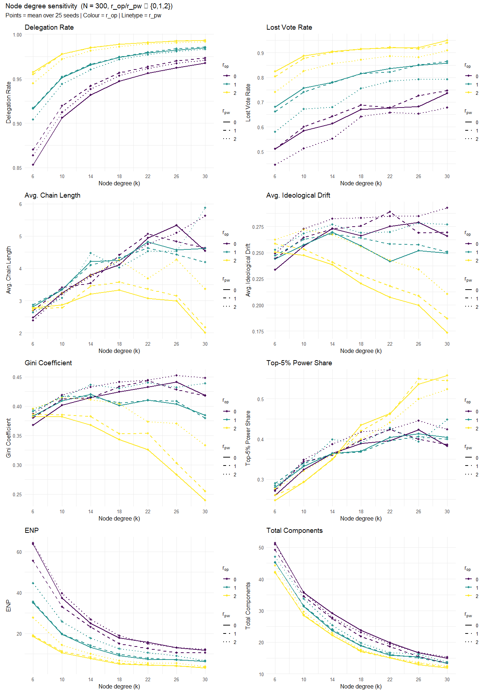<!-- -->

## Delegation Rate and Chain Length: Core Degree Effects

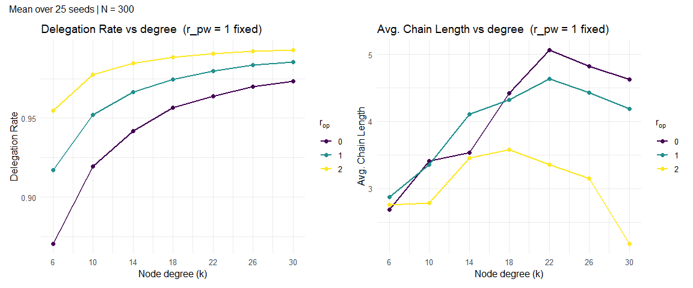<!-- -->

------------------------------------------------------------------------

# Part 5 Cycle Fallback – Lost Vote Correction

Parts 1–4 use the default simulation where agents in delegation cycles
keep their vote lost (`my_vote = NA`). This section tests three
correction mechanisms based on between-round learning: if an agent’s
vote was lost in round $t$, they adjust their delegation choice in round
$t+1$. The vote is genuinely lost in round $t$ and recorded as such; the
correction only takes effect from the following round onward.

**Option A – Direct voting** (`cycle_fallback = "direct"`): If an
agent’s vote was lost in the previous round, they cast their own opinion
directly in the current round, bypassing delegation entirely. Requires
minimal information — the agent only needs to know their own vote was
not represented. Delegation can resume in subsequent rounds if the agent
finds an attractive delegate again.

**Option B – Re-delegation, excluding bad delegate**
(`cycle_fallback = "redelegate"`): If an agent’s vote was lost in the
previous round, their previous delegate is excluded from the choice set.
The agent then selects normally from all remaining neighbours (including
the self-weight), so they may still delegate or vote directly depending
on relative attractiveness. Requires only local memory: the agent
recalls who they delegated to last round.

**Option C – Informed re-delegation** (`cycle_fallback = "informed"`):
If an agent’s vote was lost in the previous round, only neighbours whose
vote *was represented* in the previous round are considered as
delegation targets. The agent selects among these verified-valid
neighbours using the standard attractiveness weights, and falls back to
direct voting if no such neighbour exists. Requires local transparency:
the agent can observe which neighbours had an active, non-lost vote in
the previous round — analogous to LiquidFeedback’s public
delegation-status display.

All three options are compared to the **baseline** (no fallback) across
the same robustness sweep ($r_{op}, r_{pw} \in \{0,1,2\}$, N = 300, 25
seeds).

## All Metrics: Fallback Comparison ($r_{pw} = 1$ fixed)

$r_{pw} = 1$ is held fixed; $r_{op}$ varies on the x-axis. Each panel
shows one line per model; colour encodes the fallback strategy.

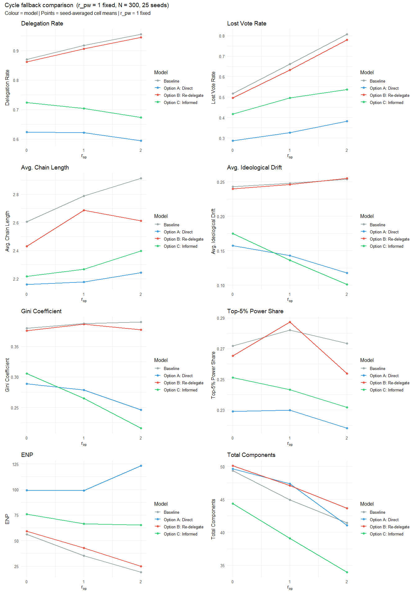<!-- -->

## Delegation Rate & Lost Vote Rate Over Rounds

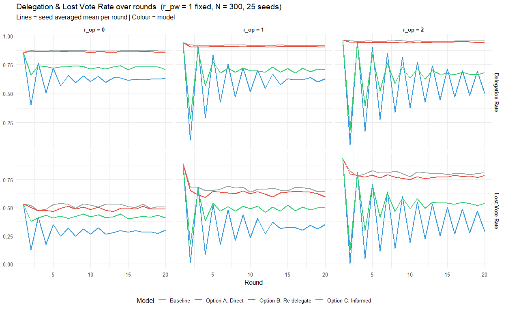<!-- -->
