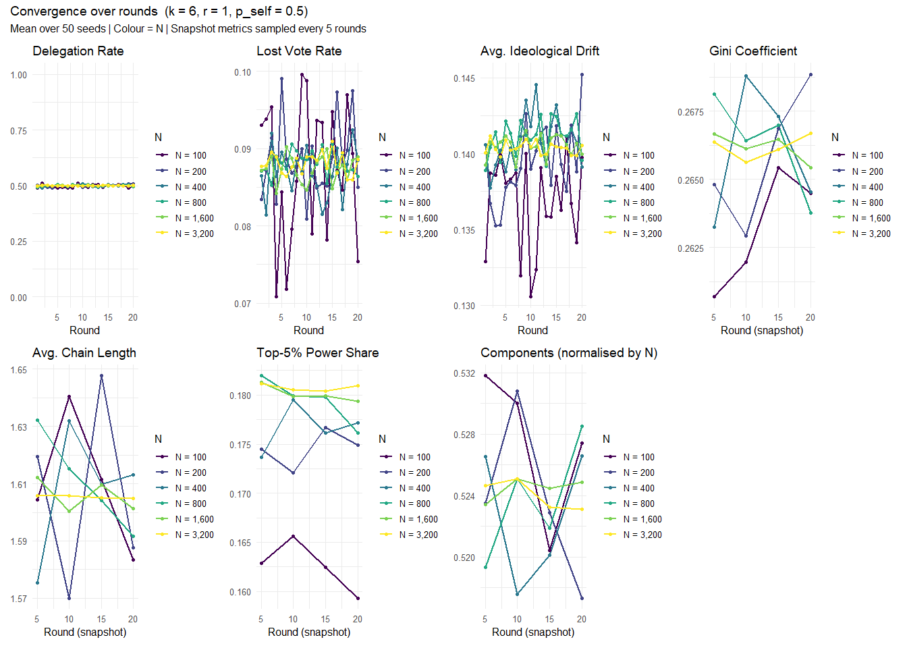
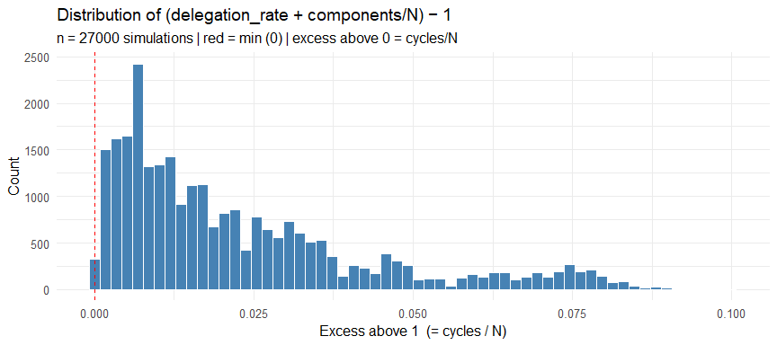
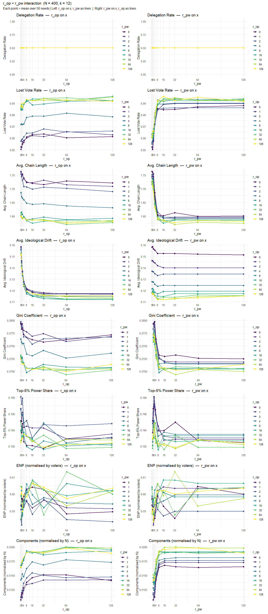
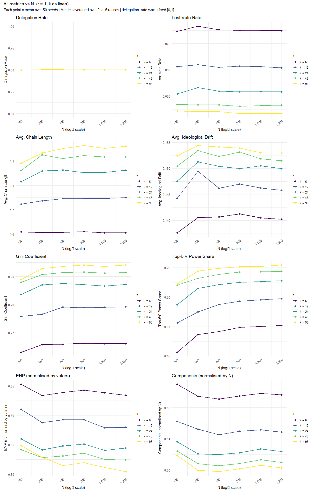
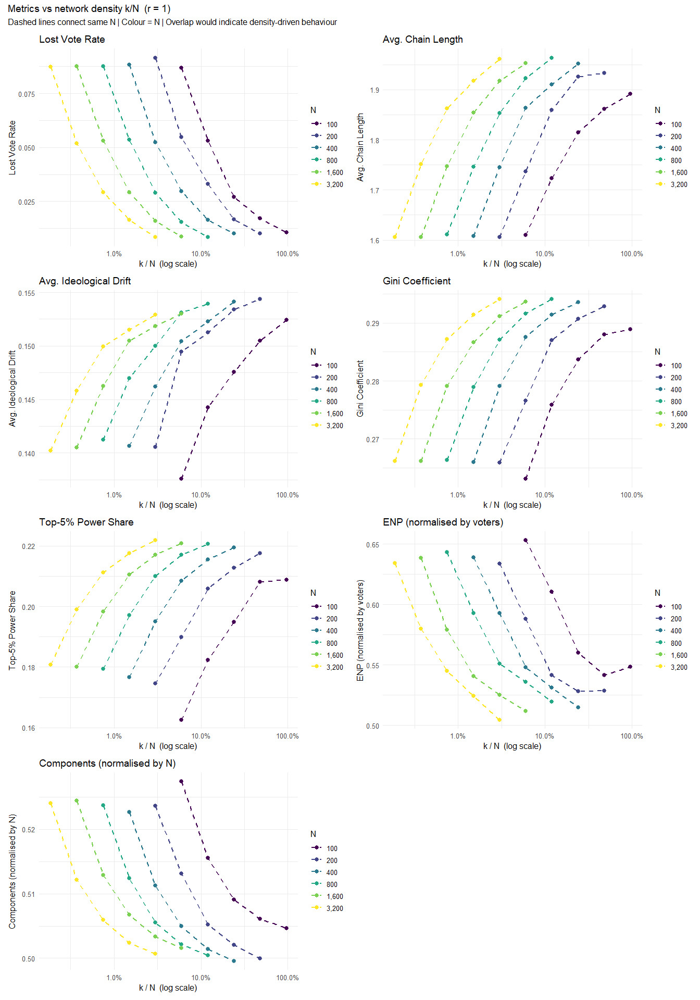
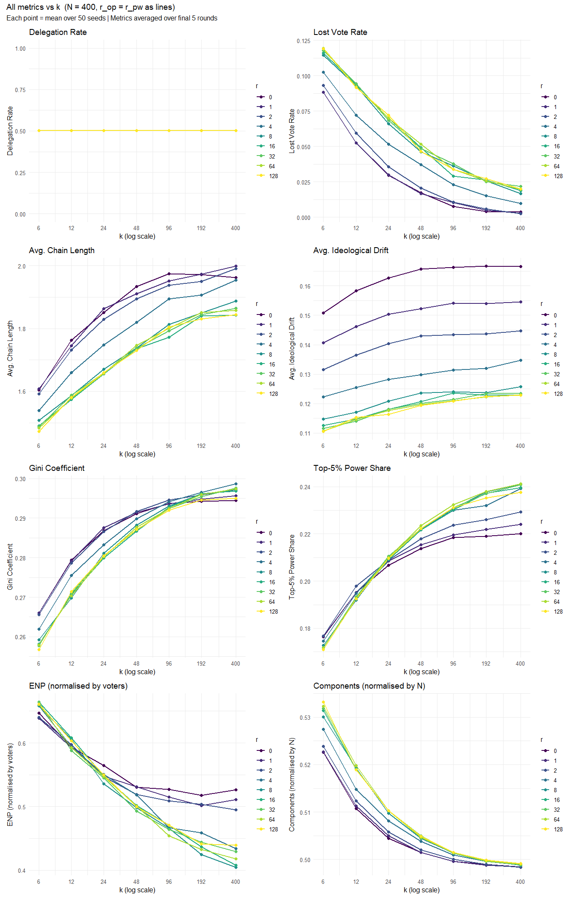
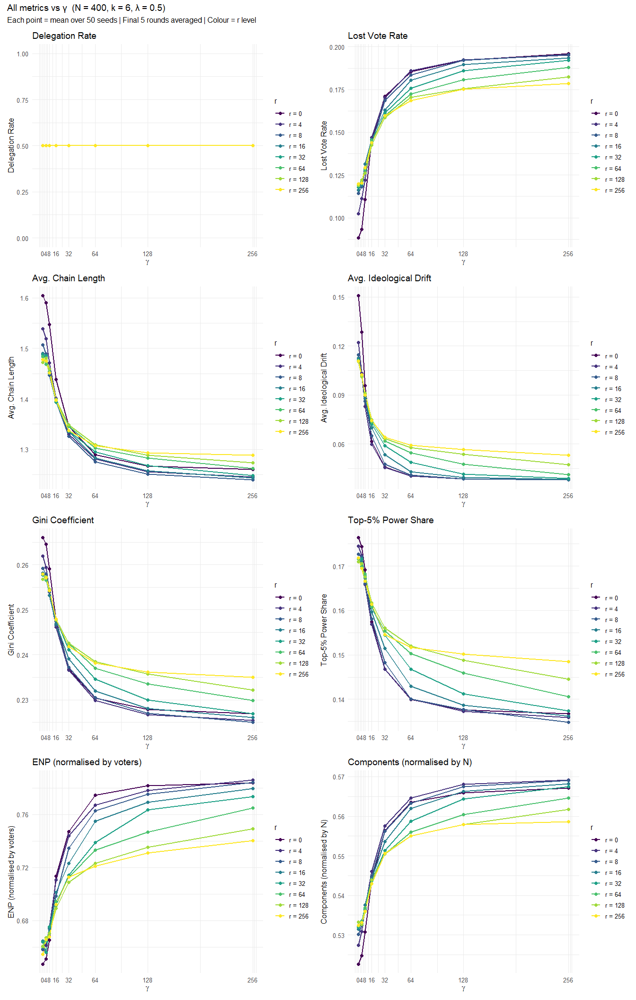
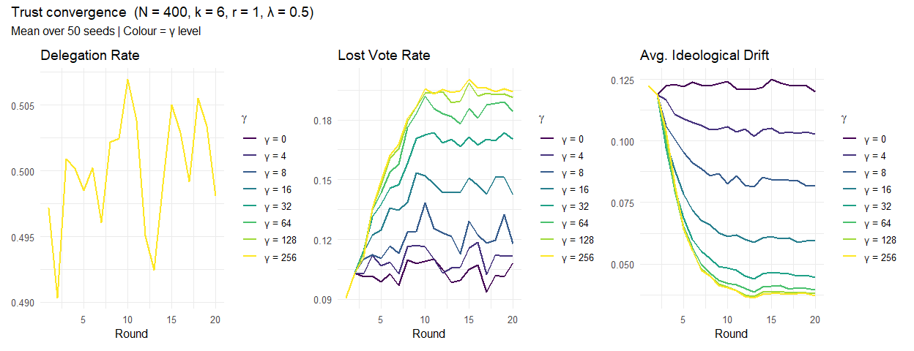

Report 14 – Systematic Parameter Analysis
================
2026-06-04

## Design

Three cached sweeps:

**Sweep A — diagonal main sweep** (r_op = r_pw, Sections 1/3/4):

| Dimension       | Values                         | Levels            |
|-----------------|--------------------------------|-------------------|
| N (agents)      | 100, 200, 400, 800, 1600, 3200 | 6 (doubling)      |
| node_degree *k* | 6, 12, 24, 48, 96              | 5 (doubling)      |
| r_op = r_pw     | 0, 1, 2, 4, 8, 16, 32, 64, 128 | 9 (doubling)      |
| p_self          | 0.5, 0.25                      | 2                 |
| λ, γ            | 0                              | fixed (trust off) |
| Seeds           | 50 per cell                    |                   |
| T               | 20 rounds                      |                   |
| **Total**       | **27000 simulations**          |                   |

**Sweep B — r_op × r_pw interaction sweep** (Section 2, N = 400, k =
12):

| Dimension | Values                         | Levels |
|-----------|--------------------------------|--------|
| r_op      | 0, 1, 2, 4, 8, 16, 32, 64, 128 | 9      |
| r_pw      | 0, 1, 2, 4, 8, 16, 32, 64, 128 | 9      |
| p_self    | 0.5, 0.25                      | 2      |
| Seeds     | 50 per cell                    |        |
| **Total** | **8100 simulations**           |        |

**Trust sweep** — γ sensitivity (N = 400, k = 6, λ = 0.5 fixed):

| Dimension   | Values                        | Levels |
|-------------|-------------------------------|--------|
| γ           | 0, 4, 8, 16, 32, 64, 128, 256 | 8      |
| r_op = r_pw | 0, 4, 8, 16, 32, 64, 128, 256 | 8      |
| Seeds       | 50 per cell                   |        |

All metrics averaged over the final 5 rounds. ENP normalised by
$n_\text{voters}$; Total Components by $N$.

    ## Main sweep (diagonal):  755 min 28.5 sec  |  540 param combinations  |  27000 simulations

    ## r×r sweep:              10 min 30.3 sec  |  162 param combinations  |  8100 simulations

    ## Trust sweep:            5 min 02.4 sec  |  64 param combinations  |  3200 simulations

------------------------------------------------------------------------

# 1 Convergence over Time

Fixed: k = 6, r_op = r_pw = 1. Each line = mean over 50 seeds; colour =
N.

**`delegation_rate` in this plot:** the round-to-round variation is
**not** convergence dynamics — it is Binomial sampling noise (each round
is an independent Bernoulli draw per agent). Variance ≈ p(1−p)/N, so
larger N → flatter line. There is no systematic drift; the expected
value is always p_self = 0.5 from round 1.

<!-- --> -The
round-to-round variance across the time series decreases noticeably as
$N$ increases. Rather than reflecting distinct convergence dynamics,
this stabilization is driven by the law of large numbers: larger agent
populations effectively average out individual binomial sampling noise.

## Structural Identity Check: delegation_rate + components/N ≥ 1

**`delegation_rate`** is the share of lay agents who have an outgoing
edge in the delegation graph in a given round — i.e. they chose to
delegate rather than vote directly.

**`total_components`** counts the number of weakly connected components
in the same delegation graph (active subgraph plus isolated nodes). Each
isolated direct voter is its own component; each delegation tree (a
direct voter at the root with delegators below) is one component; and
each delegation *cycle* — a closed loop where all members delegate and
no one votes directly — also forms its own component.

The sum $\text{delegation\_rate} + \text{components}/N \geq 1$ because
every direct voter anchors exactly one component, so components
$\geq N \times (1 - \text{delegation rate})$. Values above 1 arise
whenever delegation cycles are present: a cycle contributes one
component without containing any direct voter, pushing the sum above 1
by exactly $K/N$ where $K$ is the number of cycles.

**Variante A** (standard delegation rate) yields the diagnostic
identity:

$$\text{delegation rate} + \frac{\text{components}}{N} = 1 + \frac{K}{N}$$

where $K \geq 0$ is the number of delegation cycles. In graphs without
cycles ($K = 0$) the equality holds exactly; any deviation above 1
quantifies cycle density.

**Variante B** (effective delegation rate) counts only agents whose
delegation chain eventually reaches a direct voter — cycle members are
excluded:

$$b := \text{eff delegation rate} = \frac{\#\{\text{Agents who reach a direct voter}\}}{N} = 1 - \frac{\text{components}}{N}$$

This definition restores a strict identity regardless of cycles:

$$b + \frac{\text{components}}{N} = 1$$

|     Mean |      SD | Min | Max | Pct \>= 1 | Pct cycles |
|---------:|--------:|----:|----:|----------:|-----------:|
| 1.022635 | 0.02041 |   1 | 1.1 |       100 |      98.98 |

Variante A: delegation_rate + components/N (expected \>= 1; excess = K/N
= cycles/N). Both metrics averaged over snapshot rounds 5,10,15,20.

|   Mean |     SD |    Min |    Max | Mean (b + comp/N) | Max \|dev from 1\| |
|-------:|-------:|-------:|-------:|------------------:|-------------------:|
| 0.6026 | 0.1175 | 0.3975 | 0.7888 |                 1 |                  0 |

Variante B: eff_delegation_rate = 1 − components/N. The sum b +
components/N = 1 by construction (last two columns verify floating-point
precision). Metrics averaged over snapshot rounds 5,10,15,20.

<!-- -->

------------------------------------------------------------------------

# 2 r_op × r_pw Interaction (N = 400, k = 12, p_self = 0.5)

Source: main sweep filtered to N = 400, k = 12, p_self = 0.5. Each cell
averaged over 50 seeds.

**Note on `delegation_rate`:** its y-axis is fixed to \[0, 1\] in all
panels below. The Bernoulli draw is independent of r_op and r_pw, so all
lines sit at ≈ p_self = 0.5. The \[0, 1\] scale prevents auto-scaling
from making Binomial sampling noise (±0.01) look like a real effect.

<!-- -->

## Marginal Effects of r on the Diagonal (r_op = r_pw, N = 400, k = 12, p_self = 0.5)

**Table 1** — absolute mean metric values at each r level. **Table 2** —
relative change vs. the previous r level:
$(y_i - y_{i-1})\,/\,|y_{i-1}|$. Values near 0% indicate saturation.

| r | Delegation Rate | Lost Vote Rate | Avg. Chain Length | Avg. Ideological Drift | Gini Coefficient | Top-5% Power Share | ENP (normalised by voters) | Components (normalised by N) |
|:---|---:|---:|---:|---:|---:|---:|---:|---:|
| 0 | 0.5018 | 0.0524 | 1.7628 | 0.1583 | 0.2793 | 0.1952 | 0.5934 | 0.5107 |
| 1 | 0.5018 | 0.0524 | 1.7455 | 0.1462 | 0.2791 | 0.1951 | 0.5926 | 0.5113 |
| 2 | 0.5018 | 0.0594 | 1.7314 | 0.1364 | 0.2786 | 0.1979 | 0.5971 | 0.5123 |
| 4 | 0.5018 | 0.0722 | 1.6599 | 0.1255 | 0.2755 | 0.1949 | 0.5937 | 0.5148 |
| 8 | 0.5018 | 0.0928 | 1.5870 | 0.1170 | 0.2698 | 0.1920 | 0.6061 | 0.5193 |
| 16 | 0.5018 | 0.0936 | 1.5745 | 0.1148 | 0.2706 | 0.1929 | 0.6084 | 0.5190 |
| 32 | 0.5018 | 0.0942 | 1.5882 | 0.1141 | 0.2710 | 0.1934 | 0.5877 | 0.5191 |
| 64 | 0.5018 | 0.0923 | 1.5784 | 0.1145 | 0.2704 | 0.1929 | 0.5929 | 0.5198 |
| 128 | 0.5018 | 0.0916 | 1.5809 | 0.1153 | 0.2714 | 0.1924 | 0.6036 | 0.5189 |

Absolute metric values per r level (diagonal r_op = r_pw, N = 400, k =
12, p_self = 0.5).

| r-Step | Delegation Rate | Lost Vote Rate | Avg. Chain Length | Avg. Ideological Drift | Gini Coefficient | Top-5% Power Share | ENP (normalised by voters) | Components (normalised by N) |
|:---|---:|---:|---:|---:|---:|---:|---:|---:|
| 0 → 1 | +0.0% | -0.1% | -1.0% | -7.6% | -0.1% | -0.0% | -0.1% | +0.1% |
| 1 → 2 | +0.0% | +13.3% | -0.8% | -6.7% | -0.2% | +1.5% | +0.8% | +0.2% |
| 2 → 4 | +0.0% | +21.6% | -4.1% | -8.0% | -1.1% | -1.5% | -0.6% | +0.5% |
| 4 → 8 | +0.0% | +28.5% | -4.4% | -6.7% | -2.1% | -1.5% | +2.1% | +0.9% |
| 8 → 16 | +0.0% | +0.9% | -0.8% | -1.9% | +0.3% | +0.5% | +0.4% | -0.1% |
| 16 → 32 | +0.0% | +0.7% | +0.9% | -0.6% | +0.1% | +0.3% | -3.4% | +0.0% |
| 32 → 64 | +0.0% | -2.1% | -0.6% | +0.4% | -0.2% | -0.3% | +0.9% | +0.1% |
| 64 → 128 | +0.0% | -0.7% | +0.2% | +0.6% | +0.4% | -0.2% | +1.8% | -0.2% |

Relative change per r-step on the diagonal (r_op = r_pw, N = 400, k =
12, p_self = 0.5).

------------------------------------------------------------------------

# 3 N-Scaling (r_op = r_pw = 1, p_self = 0.5, k as lines)

Source: main sweep filtered to diagonal r = 1, p_self = 0.5. All k
levels shown. x-axis log-scaled (doublings). `delegation_rate` y-axis
fixed to \[0, 1\] — all lines sit at ≈ p_self.

<!-- -->

- N has a relatively small effects on (almost) all metrics while K has a
  very strong effect.

## Network Density k/N (r = 1)

Do outcomes scale with relative degree k/N or with absolute k? If
density were the sole driver, points at the same x-position (same k/N)
but different N would overlap. The doubling structure of both k and N
creates many exact density matches across network sizes — e.g. (k=6,
N=100), (k=12, N=200), (k=24, N=400) all share k/N = 6 %. Lines connect
same-N points; colour = N.

Lines do **not** overlap across N levels, indicating that **N exerts an
independent effect beyond network density**: larger networks produce
longer delegation chains and higher power concentration even when each
agent has the same share of direct neighbours.

<!-- -->

------------------------------------------------------------------------

# 4 Degree-Scaling (N = 400, p_self = 0.5, r as lines)

Fixed: N = 400, p_self = 0.5. Lines = diagonal r levels (r_op = r_pw).
x-axis log-scaled. `delegation_rate` y-axis fixed to \[0, 1\].

<!-- -->

## Saturation Check: Marginal Effects of k

Relative change $(y_i - y_{i-1})\,/\,|y_{i-1}|$ per k-step, averaged
across all r levels (N = 400, p_self = 0.5). Values near 0 % indicate
saturation.

| k-Step | Delegation Rate | Lost Vote Rate | Avg. Chain Length | Avg. Ideological Drift | Gini Coefficient | Top-5% Power Share | ENP (normalised by voters) | Components (normalised by N) |
|:---|---:|---:|---:|---:|---:|---:|---:|---:|
| 6 → 12 | +0.0% | -26.9% | +7.4% | +3.3% | +5.0% | +11.7% | -8.8% | -2.3% |
| 12 → 24 | +0.0% | -29.7% | +5.3% | +2.7% | +3.3% | +7.8% | -8.2% | -1.5% |
| 24 → 48 | +0.0% | -32.4% | +4.2% | +1.8% | +2.1% | +5.2% | -7.0% | -0.9% |
| 48 → 96 | +0.0% | -33.5% | +3.1% | +1.0% | +1.5% | +3.4% | -5.4% | -0.6% |
| 96 → 192 | +0.0% | -28.1% | +1.6% | +0.4% | +0.8% | +1.8% | -4.2% | -0.3% |
| 192 → 400 | +0.0% | -28.0% | +1.1% | +0.6% | +0.4% | +1.4% | -2.3% | -0.1% |

Relative change per k-step (N = 400, p_self = 0.5), averaged across all
r levels and 50 seeds per cell.

------------------------------------------------------------------------

# 5 Trust: $\gamma$-Sensitivity ($\lambda$ = 0.5, r as lines)

Fixed: N = 400, k = 6. x-axis = $\gamma$; lines = r levels {0, 1, 2}.
`delegation_rate` y-axis fixed to \[0, 1\].

<!-- -->

## Marginal Effects of γ (averaged across all r levels)

Absolute change in each metric per γ-step, averaged across all r levels
and seeds. Values near 0 in the last rows indicate saturation of the
trust effect.

| γ-Step | Lost Vote Rate | Avg. Chain Length | Avg. Ideological Drift | Gini Coefficient | Top-5% Power Share | ENP (normalised by voters) | Components (normalised by N) |
|:---|---:|---:|---:|---:|---:|---:|---:|
| 0 → 4 | 0.0035 | 0.0089 | 0.0127 | 0.0010 | 0.0013 | 0.0013 | 0.0015 |
| 4 → 8 | 0.0098 | 0.0319 | 0.0161 | 0.0037 | 0.0041 | 0.0118 | 0.0041 |
| 8 → 16 | 0.0192 | 0.0650 | 0.0204 | 0.0074 | 0.0077 | 0.0273 | 0.0084 |
| 16 → 32 | 0.0193 | 0.0638 | 0.0139 | 0.0076 | 0.0079 | 0.0257 | 0.0092 |
| 32 → 64 | 0.0138 | 0.0453 | 0.0069 | 0.0058 | 0.0062 | 0.0223 | 0.0064 |
| 64 → 128 | 0.0076 | 0.0221 | 0.0038 | 0.0032 | 0.0033 | 0.0132 | 0.0038 |
| 128 → 256 | 0.0046 | 0.0130 | 0.0027 | 0.0022 | 0.0028 | 0.0100 | 0.0022 |

Absolute marginal effects per γ-step, averaged over all r levels and 50
seeds per cell (N = 400, k = 6, λ = 0.5)

| γ-Step | Lost Vote Rate | Avg. Chain Length | Avg. Ideological Drift | Gini Coefficient | Top-5% Power Share | ENP (normalised by voters) | Components (normalised by N) |
|:---|---:|---:|---:|---:|---:|---:|---:|
| 0 → 4 | +3.1% | -0.6% | -10.7% | -0.4% | -0.7% | +0.2% | +0.3% |
| 4 → 8 | +8.5% | -2.1% | -15.3% | -1.4% | -2.4% | +1.8% | +0.8% |
| 8 → 16 | +15.3% | -4.4% | -22.8% | -2.9% | -4.6% | +4.1% | +1.6% |
| 16 → 32 | +13.4% | -4.5% | -20.2% | -3.1% | -4.9% | +3.7% | +1.7% |
| 32 → 64 | +8.4% | -3.4% | -12.6% | -2.4% | -4.1% | +3.1% | +1.2% |
| 64 → 128 | +4.3% | -1.7% | -7.9% | -1.4% | -2.3% | +1.8% | +0.7% |
| 128 → 256 | +2.5% | -1.0% | -6.2% | -1.0% | -2.0% | +1.3% | +0.4% |

Relative change (%) per γ-step, averaged over all r levels and 50 seeds
per cell (N = 400, k = 6, λ = 0.5)

------------------------------------------------------------------------

# 6 Trust: Convergence over Time

Convergence of delegation rate and drift for all $\gamma$ levels at r =
4. Mean over 50 seeds.

<!-- -->
