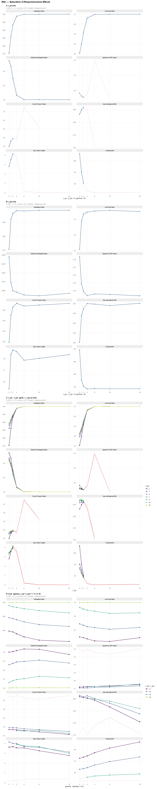
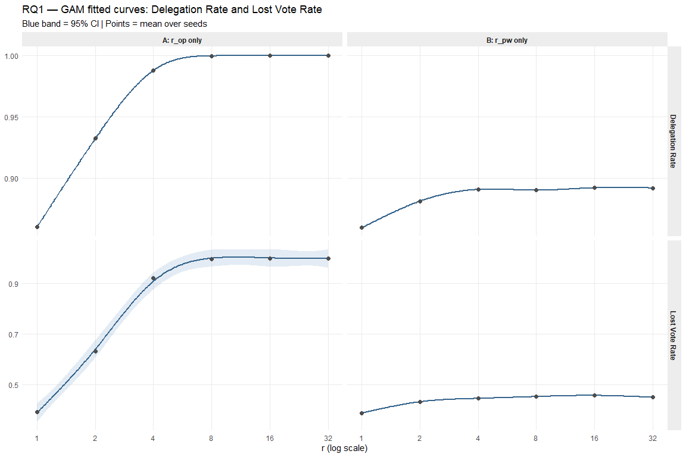
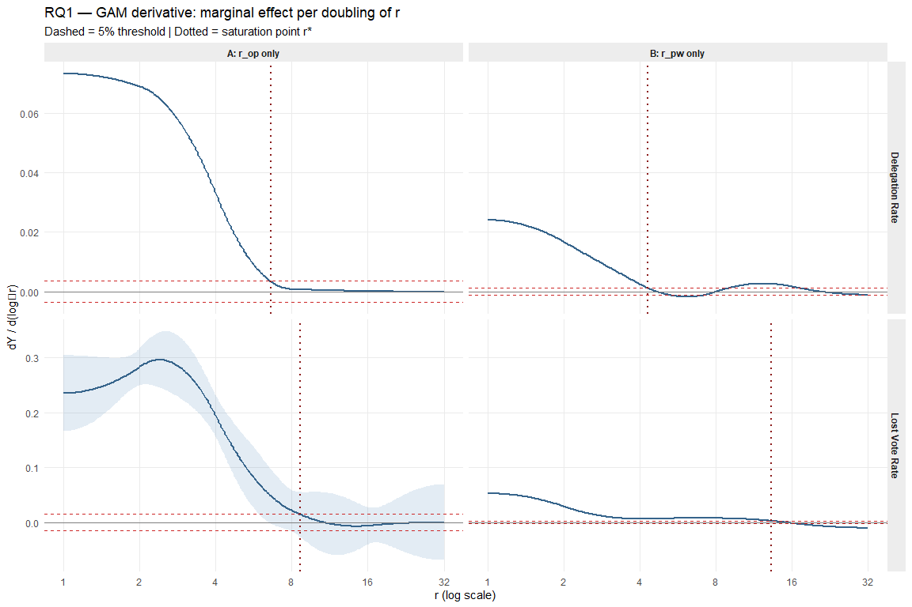
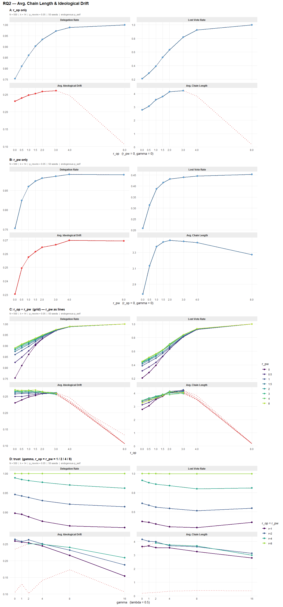
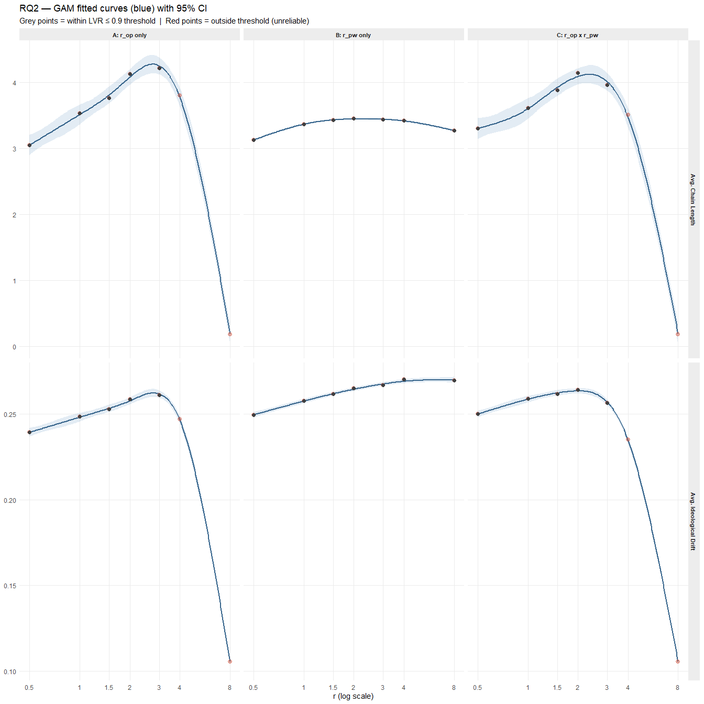
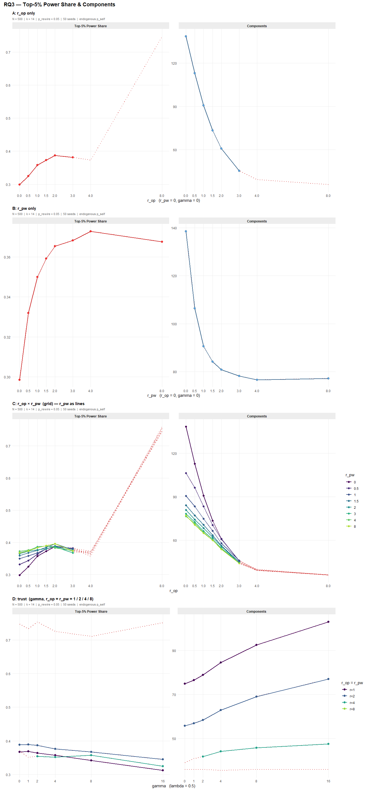
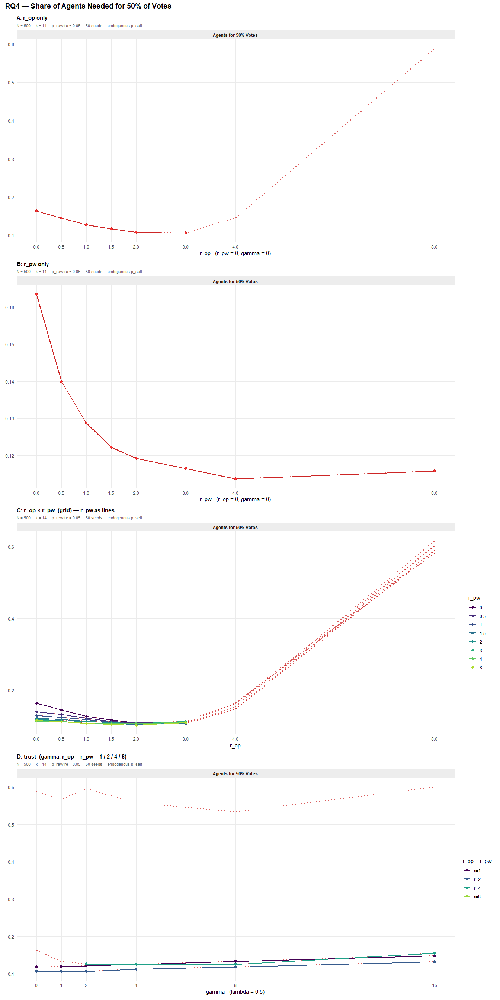

Weekly Report – Week 16: Research Questions + Hypotheses
================
2026-05-24

# 1 Research Questions

## Part 1: Core Network dynamics

**RQ1**: When are the effects of responsiveness parameters saturating?

- H1a: The relationship between opinion responsiveness (r_op) and
  delegation network metrics is non-linear, exhibiting diminishing
  returns beyond some moderate threshold.

- H2a: The relationship between power responsiveness (r_pw) and
  delegation network metrics is non-linear, exhibiting diminishing
  returns beyond some moderate threshold.

- H3a: When both r_op and r_pw increase jointly (r_op = r_pw), the
  combined effect on delegation network metrics is non-linear,
  exhibiting diminishing returns beyond some moderate threshold.

- H4a: The relationship between trust sensitivity (γ) and delegation
  network metrics is non-linear, exhibiting diminishing returns beyond
  some moderate threshold.

**RQ2**: How far drifts the average opinion of an agent when he
delegates?

- H1b: Increasing resp. to opinion increases the average ideological
  drift

- H2b: Increasing resp. to power increases the average ideological drift

- H3b Increasing resp- to power and resp to opinion increases the
  average ideological drift

- H4b: Increasing resp. to trust reduces the influence of the effect of
  resp. to opinion and power on the average ideological drift

**RQ3**: How much power do the most powerful 5% agent within a network
have?

- H1c: Increasing resp. to opinion increases the top 5% share

- H2c: Increasing resp. to power increases the top 5% share

- H3c: Increasing resp. to opinion and power increases the the top 5%
  share

- H4c: Increasing resp. to trust has a reducing influence of the effect
  of resp. to opinion and power

**RQ4**: How many of the most influential agents do you need to get 50%
of the votes?

- H1d: Increasing resp. to opinion increases the share of agents you
  need to get 50% of the vote

- H2d: Increasing resp. to power decreases the share of agents you need
  to get 50% of the vote

- H3d: Increasing resp. to opinion and power decreases the share of
  agents you need to get 50% votes

- H4d: Increasing resp. to trust has a reducing influence of the effect
  of resp. to opinion and power

------------------------------------------------------------------------

------------------------------------------------------------------------

# RQ1 — Saturation of Responsiveness Effects

**When do the effects of responsiveness parameters on delegation network
metrics saturate?**

Each responsiveness parameter is varied across r ∈ {0, 1, 2, 4, 8, 16,
32}. Condition A isolates r_op (H1a); Condition B isolates r_pw (H2a);
Condition C shows the full r_op × r_pw grid with r_op on the x-axis and
one coloured line per r_pw level (H3a — joint effect); Condition D
varies gamma at four background r levels (H4a — trust saturation). The
**dashed red line** shows the full unfiltered curve; the **solid
coloured line** shows only the reliable range (lost vote rate ≤ 0.9).

<!-- -->

## RQ1 — GAM Saturation Analysis: Delegation Rate and Lost Vote Rate

### Statistical model: Generalised Additive Model (GAM)

A **Generalised Additive Model** replaces the straight line of OLS
regression with a flexible smooth curve $f(\cdot)$ estimated directly
from the data, without assuming a specific shape such as linear or
exponential. The smoothness of $f$ is controlled automatically by a
penalty on curvature (REML), preventing overfitting while allowing the
curve to capture rises, peaks, and plateaus. The effective degrees of
freedom (edf) of the smooth summarise its complexity: edf $\approx 1$
means the relationship is essentially linear; edf $> 2$ means it is
clearly curved.

For each metric $Y$ and each condition a separate GAM is fitted:

$$\boxed{Y_i \;=\; f\!\bigl(\log_2 r_i\bigr) + \varepsilon_i,
\qquad \varepsilon_i \sim \mathcal{N}(0, \sigma^2)}$$

- $Y_i$: metric value at parameter setting $r_i$, averaged over 25 seeds
- $f(\cdot)$: unknown smooth function — shape estimated from data, not
  assumed
- $\log_2 r$: the predictor is **log₂-transformed** because the
  simulation sweeps $r$ over doublings. On the original scale the steps
  are unequal; on the log₂ scale they are equidistant, so each step
  carries equal information. One unit on the log₂ scale = one doubling
  of $r$. So the log transformation makes equal multiplicative changes
  correspond to equal distances.
- $\varepsilon_i \sim \mathcal{N}(0,\sigma^2)$: residual error, assumed
  normally distributed with constant variance

The same GAM structure is used throughout RQ1–RQ4. Condition-specific
model specifications (1-D sweep, tensor-product interaction, trust
moderation) are described in the respective sections.

Both delegation rate and lost vote rate are monotonically increasing
with r and bounded in \[0, 1\]. The GAM on log₂(r) identifies where the
slope drops to near-zero — the practical saturation point r\* beyond
which further increases in r add negligible additional delegation or
vote loss.

<!-- -->

<!-- --> - The
derivative shows how much the fitted response changes for each doubling
of r. The saturation point r\* is the first value where this marginal
effect falls below 5% of its maximum, indicating that further increases
in r have little additional impact.

| Metric          | Condition    | edf |    R2 | p-value | r\* (sat.) |
|:----------------|:-------------|----:|------:|--------:|-----------:|
| Delegation Rate | A: r_op only | 5.0 | 1.000 | 0.00028 |        6.6 |
| Delegation Rate | B: r_pw only | 5.0 | 1.000 | 0.00053 |        4.3 |
| Lost Vote Rate  | A: r_op only | 4.3 | 0.995 | 0.05500 |        8.6 |
| Lost Vote Rate  | B: r_pw only | 5.0 | 1.000 | 0.00059 |       13.3 |

RQ1 GAM saturation summary — delegation rate and lost vote rate. edf \>
2 confirms nonlinearity. r\* = practical saturation point (first r where
slope drops below 5% of its peak value).

------------------------------------------------------------------------

# RQ2 — Ideological Drift

**What determines the average ideological drift between an agent and the
vote cast on their behalf?**

The same GAM framework introduced in the RQ1 saturation analysis
($Y_i = f(\log_2 r_i) + \varepsilon_i$) is applied here.

Condition A isolates r_op (H1b); Condition B isolates r_pw (H2b);
Condition C shows the full r_op × r_pw grid (H3b — joint effect);
Condition D varies gamma at r_op = r_pw ∈ {1, 2, 4, 8} (H4b — trust
moderation). The **dashed red line** shows the unfiltered curve; the
**solid coloured line** shows the reliable range (lost vote rate ≤ 0.9).

<!-- -->

**Note on Condition B (r_pw only):** Lost vote rate does not exceed
~0.45, even at the highest r_pw values. So most votes still reach a
direct voter.

## RQ2 — GAM Analysis

The analysis focuses on **avg. chain length** and **avg. ideological
drift** — the two metrics that directly reflect the quality of
representation in the delegation network. For each metric and each
experimental condition a GAM of the form

$$Y_i \;=\; f(x_i) + \varepsilon_i, \qquad \varepsilon_i \sim \mathcal{N}(0,\sigma^2)$$

is fitted, where $x$ is the log₂-transformed responsiveness parameter
and $f(\cdot)$ is a flexible penalised spline (REML). The table reports
edf (nonlinearity), R², p-value, and the predicted maximum within the
simulated range.

| Metric                 | Condition      |  edf |    R2 | p-value | Pred. max |
|:-----------------------|:---------------|-----:|------:|--------:|----------:|
| Avg. Chain Length      | A: r_op only   | 4.82 | 0.997 |  0.0390 |     4.279 |
| Avg. Chain Length      | B: r_pw only   | 4.59 | 0.995 |  0.0470 |     3.450 |
| Avg. Chain Length      | C: r_op x r_pw | 4.73 | 0.996 |  0.0410 |     4.125 |
| Avg. Ideological Drift | A: r_op only   | 4.96 | 0.999 |  0.0160 |     0.262 |
| Avg. Ideological Drift | B: r_pw only   | 3.18 | 0.986 |  0.0014 |     0.270 |
| Avg. Ideological Drift | C: r_op x r_pw | 4.97 | 1.000 |  0.0120 |     0.263 |

RQ2 GAM summary — one row per metric × condition. edf: effective degrees
of freedom (≈1 = linear, \>2 = clearly curved). R²: share of variance
explained. p-value: test of smooth term against a flat line (note:
near-zero values are expected in a designed simulation and confirm
non-flatness only). Pred. max: highest predicted value of the fitted
curve within the simulated range.

| Metric | r | A: r_op only | B: r_pw only | C: r_op x r_pw |
|:---|---:|:---|:---|:---|
| Avg. Chain Length | 0 | 2.774 | 2.774 | 2.774 |
| Avg. Chain Length | 1 | 3.517 \[3.369, 3.666\] | 3.369 \[3.354, 3.384\] | 3.606 \[3.452, 3.76\] |
| Avg. Chain Length | 2 | 4.085 \[3.968, 4.203\] | 3.448 \[3.436, 3.46\] | 4.094 \[3.971, 4.216\] |
| Avg. Chain Length | 4 | 3.774 \[3.629, 3.918\] | 3.418 \[3.404, 3.433\] | 3.475 \[3.325, 3.625\] |
| Avg. Chain Length | 8 | 0.193 \[0.04, 0.346\] | 3.273 \[3.257, 3.289\] | 0.195 \[0.035, 0.355\] |
| Avg. Ideological Drift | 0 | 0.23 | 0.23 | 0.23 |
| Avg. Ideological Drift | 1 | 0.248 \[0.246, 0.251\] | 0.257 \[0.256, 0.259\] | 0.259 \[0.257, 0.26\] |
| Avg. Ideological Drift | 2 | 0.258 \[0.256, 0.26\] | 0.264 \[0.263, 0.265\] | 0.263 \[0.262, 0.265\] |
| Avg. Ideological Drift | 4 | 0.246 \[0.244, 0.249\] | 0.269 \[0.268, 0.27\] | 0.235 \[0.233, 0.236\] |
| Avg. Ideological Drift | 8 | 0.106 \[0.103, 0.108\] | 0.27 \[0.268, 0.272\] | 0.106 \[0.104, 0.107\] |

RQ2 — Predicted metric values at representative r levels with 95% CI
\[lower, upper\]. r = 0 uses the observed mean (GAM fit starts at r =
0.5). Reading across columns compares the effect of r_op (A), r_pw (B),
and both jointly (C) at each responsiveness level.

<!-- -->

------------------------------------------------------------------------

# RQ3 — Top-5% Power Share & Network Components

**What share of total voting power do the most powerful 5% of agents
hold, and how does network fragmentation evolve?**

Condition A isolates r_op (H1c — top-5% share increases slightly via
lost votes, components decrease); Condition B isolates r_pw (H2c —
strong hub concentration, more components); Condition C_diag shows the
diagonal r_op = r_pw (H3c — joint); the full r_op × r_pw grid is shown
as a heatmap; Condition D adds trust at r_op = r_pw ∈ {1, 4, 8} (H4c —
trust reduces top-5% share).

## <!-- -->

# RQ4 — Share of Agents Needed for 50% of Votes

**How many of the most influential agents are jointly needed to hold 50%
of total voting power?**

`share_50pct` = k / N where k is the minimum number of agents (sorted
descending by power) whose cumulative power reaches 50% of the total. A
**lower** value means more concentrated power.

Condition A isolates r_op (H1d — decreases: more concentrated);
Condition B isolates r_pw (H2d — increases: power spread across hubs);
Condition C_diag shows the diagonal r_op = r_pw (H3d — joint); the full
r_op × r_pw grid is shown as a heatmap; Condition D adds trust at r_op =
r_pw ∈ {1, 4, 8} (H4d — increases: more even distribution).

<!-- -->
