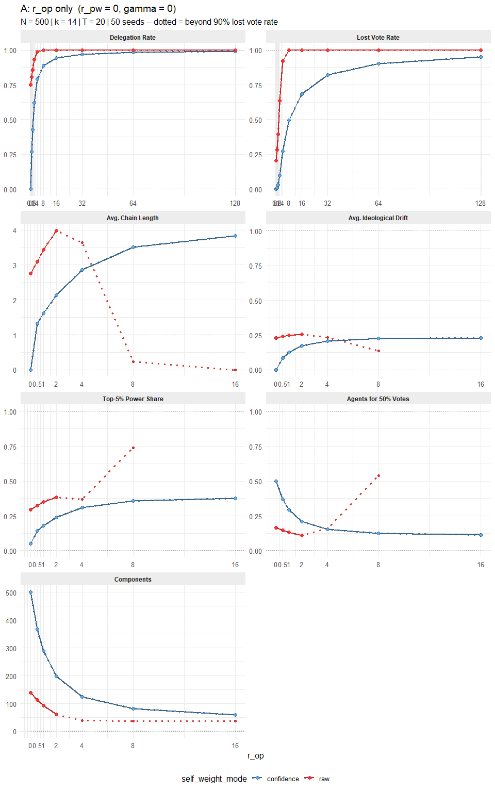
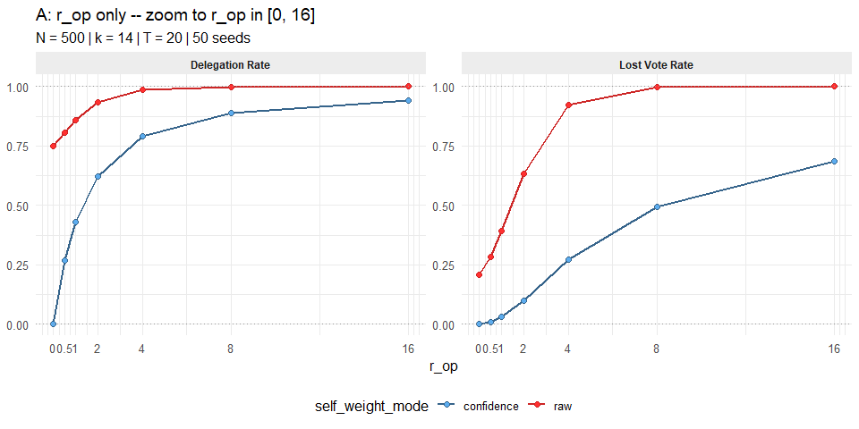
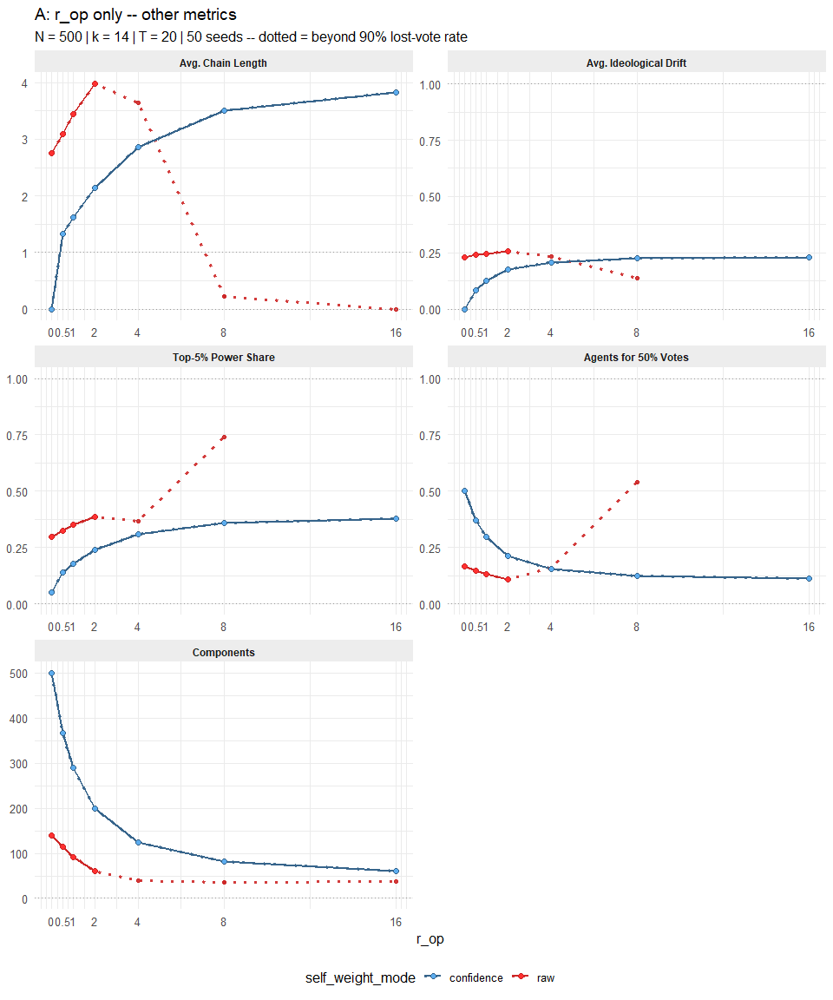
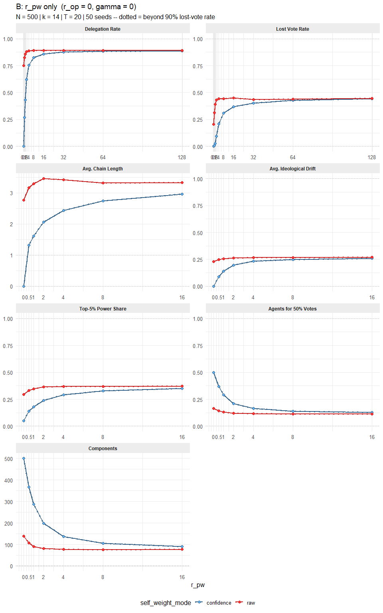
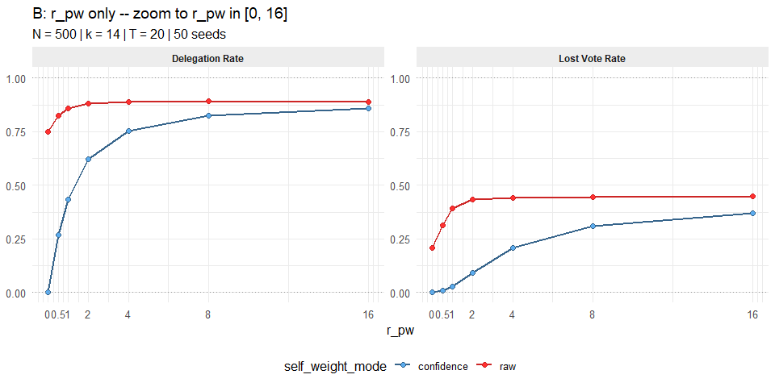
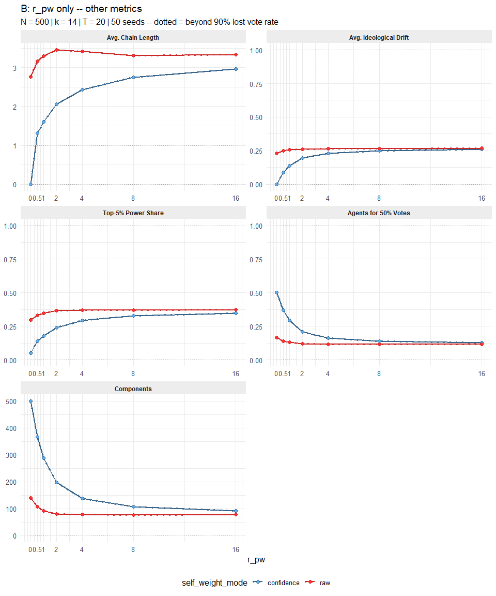
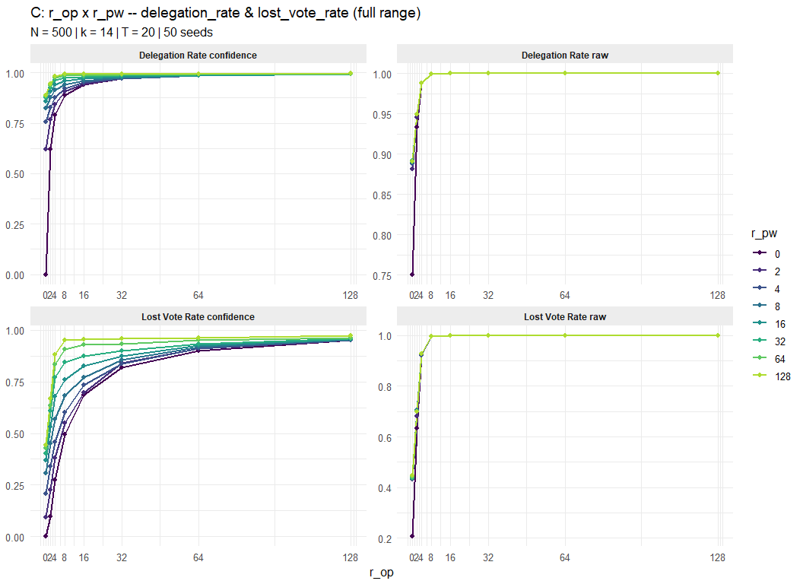
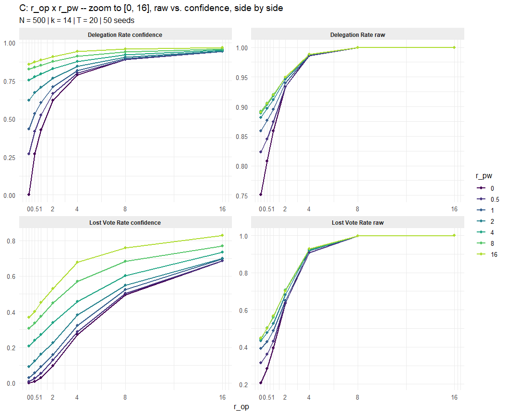
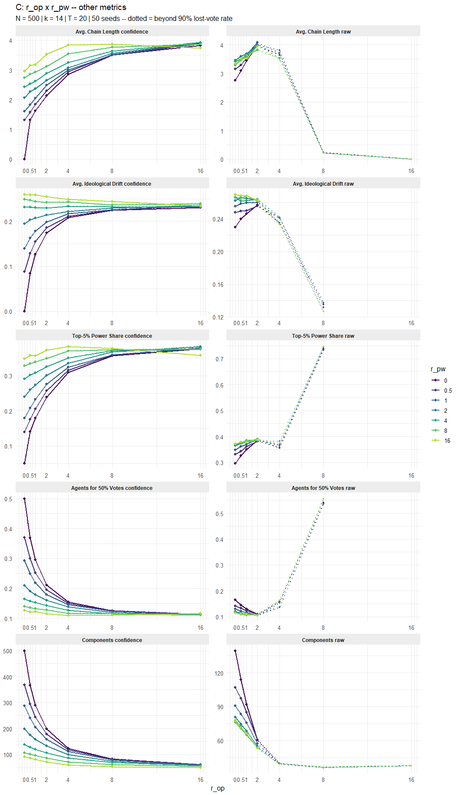
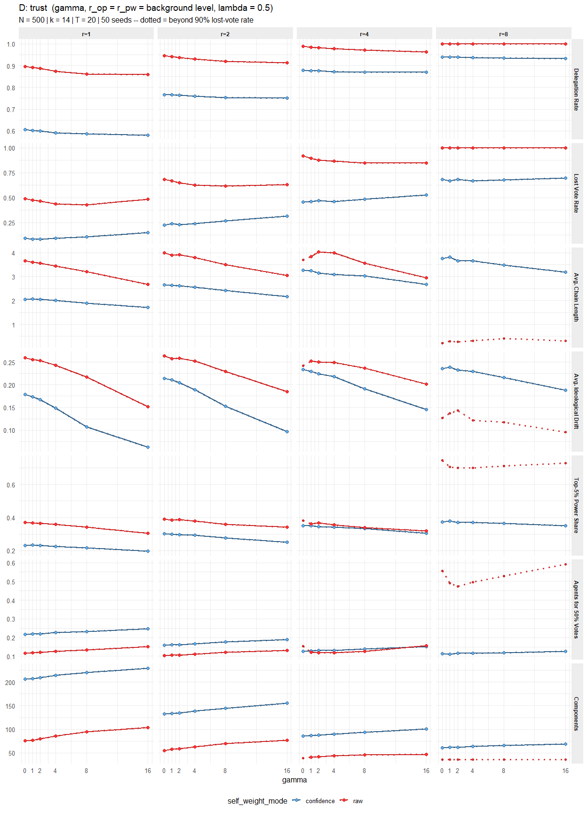

Weekly Report – Week 17: Testing the Confidence-Weighted Self-Weight
================
2026-07-09

------------------------------------------------------------------------

# 1 Purpose

The endogenous self-weight used throughout the model
(`self_weight_mode = "raw"`) computes

$$w_{\text{self}}(i) = \sigma\left(r_{op}(2|o_i-o_{j^\ast}|-1)\right)\cdot\sigma\left(r_{pw}\log\tfrac{p_i}{p_{j^\ast}}\right)$$

where $j^*$ is agent $i$’s most attractive neighbour. At
$r_{op}=r_{pw}=0$ both factors evaluate to $\sigma(0)=0.5$, so
$w_{self}^{raw}=0.25$ regardless of how unresponsive agents are — the
global delegation rate floors at roughly 75% and can never approach the
Direct Democracy limit (delegation rate $\to 0$).

New function:

$$r_{tot} = r_{op} + r_{pw} + r_{ingroup}, \qquad
  \text{conf} = \frac{r_{tot}}{1+r_{tot}}, \qquad
  w_{self} = (1-\text{conf}) + \text{conf} \cdot w_{self}^{raw}.$$

At $r_{tot}=0$: $\text{conf}=0 \Rightarrow w_{self}=1$ (Direct
Democracy). As $r_{tot}\to\infty$:
$\text{conf}\to1 \Rightarrow w_{self}\to w_{self}^{raw}$, recovering the
original model exactly. `"raw"` remains the default everywhere else in
the codebase (Report 16 and earlier reports are unaffected by this
addition).

------------------------------------------------------------------------

# 2 Testing the Self-Weight Fix

Following Report 16’s RQ1 structure: Condition A isolates $r_{op}$;
Condition B isolates $r_{pw}$; Condition D varies trust sensitivity
$\gamma$ at fixed background levels $r_{op}=r_{pw}\in\{1,2,4,8\}$;
Condition C shows the full $r_{op}\times r_{pw}$ grid. $r_{ingroup}=0$
throughout (no minority extension). Conditions A, B and D each overlay
both `"raw"` and `"confidence"` in the same plot; Condition C instead
places the two models side by side per metric, since a 2-D grid overlaid
by colour would be unreadable.

## 2.1 Condition A: $r_{op}$ only

Delegation rate and lost-vote rate, shown over the full $r_{op}$ range
(0-128, thinned to 0, 2, 4, 8, 16, 32, 64, 128), with a zoom to
$r_{op} \in [0, 16]$ directly underneath. The remaining metrics follow
further below, capped at $r_{op} \le$ 16.

<!-- -->

<!-- -->

<!-- -->

## 2.2 Condition B: $r_{pw}$ only

Delegation rate and lost-vote rate, shown over the full $r_{pw}$ range
(0-128, thinned to 0, 2, 4, 8, 16, 32, 64, 128), with a zoom to
$r_{pw} \in [0, 16]$ directly underneath. The remaining metrics follow
further below, capped at $r_{pw} \le$ 16.

<!-- -->

<!-- -->

<!-- -->

## 2.3 Condition C: $r_{op} \times r_{pw}$ (grid) — models side by side

Unlike A, B and D, the two models are **not** overlaid here — each row
is one metric, each column is one `self_weight_mode`, so the same metric
appears twice next to each other under the two models. $r_{op}$ is on
the x-axis, $r_{pw}$ is shown as one coloured line per level (as in
Report 16’s grid line plot). Delegation_rate and lost_vote_rate are
shown first, over the full $r$ range (thinned to 0, 2, 4, 8, 16, 32, 64,
128 on both axes), with a zoom to $r_{op}, r_{pw} \in [0, 16]$ directly
underneath; every other metric follows further below, capped at
$r_{op}, r_{pw} \le$ 16.

<!-- -->

<!-- -->

<!-- -->

## 2.4 Condition D: Trust ($\gamma$)

<!-- -->

------------------------------------------------------------------------
