Weekly Report – Weeks 18-19: Confidence Aggregation & Minority
Representation
================
2026-07-17

------------------------------------------------------------------------

# Part I: Delegation Dynamics in Liquid Democracy

## RQ1: Which ranges of the responsiveness parameters produce meaningful changes in delegation dynamics?

- **H1a.** The relationship between opinion responsiveness ($r_{op}$)
  and delegation dynamics is non-linear and exhibits a saturation point.
- **H2a.** The relationship between power responsiveness ($r_{pw}$) and
  delegation dynamics is non-linear and exhibits a saturation point.
- **H3a.** The joint effect of opinion and power responsiveness
  ($r_{op}=r_{pw}$) on delegation dynamics is non-linear and exhibits a
  saturation point.
- **H4a.** The relationship between trust responsiveness ($r_{trust}$)
  and delegation dynamics is non-linear and exhibits a saturation point.

*Operationalized by:* delegation rate, representative share, average
delegation chain length, cycle rate, lost-vote rate, etc.

## RQ2: How do responsiveness parameters affect the quality of political representation?

- **H1b.** Increasing opinion responsiveness improves the quality of
  political representation by reducing ideological drift.
- **H2b.** Increasing power responsiveness reduces the quality of
  political representation by increasing ideological drift.
- **H3b.** Joint increases in opinion and power responsiveness increase
  ideological drift, with the centralizing effect of power
  responsiveness outweighing gains in ideological proximity.
- **H4b.** Increasing trust responsiveness moderates the effects of
  opinion and power responsiveness on ideological drift.

*Operationalized by:* average ideological drift.

## RQ3: How do responsiveness parameters affect the concentration of voting power?

- **H1c.** Increasing opinion responsiveness increases the concentration
  of voting power.
- **H2c.** Increasing power responsiveness increases the concentration
  of voting power.
- **H3c.** Joint increases in opinion and power responsiveness further
  increase the concentration of voting power.
- **H4c.** Increasing trust responsiveness moderates the concentration
  effects of opinion and power responsiveness.

*Operationalized by:* Top 5% voting-power share, share of agents
required to accumulate 50% of the total voting power.

------------------------------------------------------------------------

# 1 Purpose

Report 17 introduced a confidence-weighted self-weight to remove the
$w_{self}^{raw}=0.25$ floor at $r_{op}=r_{pw}=0$. The active
responsiveness dimensions can be aggregated into a single confidence
signal either by their **sum** or by their **average**:

$$\text{(sum)}\quad r_{tot} = r_{op} + r_{pw} + r_{ingroup}, \qquad
  \text{(average)}\quad \bar r = \frac{r_{op} + r_{pw} + r_{ingroup}}{d}, \quad
  d = \max(1,\ \#\{r > 0\}),$$

$$\text{conf} = \frac{r_{agg}}{1+r_{agg}}, \qquad
  w_{self} = (1-\text{conf}) + \text{conf}\, w_{self}^{raw}, \qquad
  r_{agg} \in \{r_{tot}, \bar r\}.$$

An earlier version of this report replaced the sum with the average
outright, on the grounds that summing conflates the *number* of active
dimensions with their *strength*. On reflection that critique does not
clearly favour one formulation over the other: the sum treats
corroborating signals across dimensions as cumulative evidence – a
defensible modelling choice, not an artefact – while the average is
*not* monotonic in each individual $r$: activating a new, weaker
dimension can lower $\bar r$, and therefore lower confidence, which is
itself an odd property for a model where every active dimension is
supposed to make delegation more informed, not less.

Using only active dimensions in the average avoids artificially reducing
confidence when a responsiveness mechanism is disabled (here
$r_{ingroup}=0$ throughout). The boundary cases coincide for both
aggregators: $r_{agg} = 0$ gives Direct Democracy ($w_{self}=1$), while
$r_{agg} \to \infty$ recovers the original model
($w_{self} \to w_{self}^{raw}$); they differ only once two or more
dimensions are simultaneously active.

**Perception uncertainty.** All simulations below also enable
`sigma_opinion = "auto"`. Instead of assuming perfect knowledge
(`sigma_opinion = 0`), each simulation derives a perception-noise scale
from the standard deviation of the initial opinion distribution,

$$\sigma = \text{sd}\big(\{o_i\}_{i \in N}\big),$$

and transforms every neighbour observation in logit space,

$$\widehat{o_j} = \text{logit}^{-1}\big(\text{logit}(o_j) + \varepsilon\big),
  \qquad \varepsilon \sim \mathcal{N}(0, \sigma^2).$$

$\sigma$ itself is a plain probability-space quantity (the SD of the
opinions, in $[0,1]$), reused unscaled as the SD of $\varepsilon$ – only
the transformation is applied in logit space, not the SD’s derivation.
This report-wide change applies to all conditions equally and models
delegation decisions under imperfect rather than perfect perception.

*Note:* the logit-space SD ($\text{sd}(\text{logit}(o_i))$) would be the
“correct” alternative – for this report’s `runif(0,1)` opinions it is
exactly $2\pi\times$ larger ($1.81$ vs. $0.29$). $\sigma$ is kept in
probability space deliberately, as a scaling constant, not an estimate.

------------------------------------------------------------------------

# 2 Sum vs. Average: Testing the Confidence Aggregator

\*Note on
r_trust`(not applied -- for later justification):* Rather than choosing the trust decay parameter $\lambda$ arbitrarily, it can be linked to an intuitive memory horizon. In $\tau(t)=\lambda\tau(t-1)+(1-\lambda)s$, a signal from $k$ rounds ago still carries weight $\lambda^k$, giving a trust half-life of $h=\ln(0.5)/\ln(\lambda)$, or equivalently $\lambda=0.5^{1/h}$. Thus $\lambda=0.5$ corresponds to a half-life of just one round -- trust is already half-forgotten after a single interaction. Since all metrics in this report are averaged over the **last 5 rounds** (`round
\>= T-4\`), a more natural choice would be to align the trust memory
with the same time horizon, giving $\lambda=0.5^{1/5}\approx0.871$.

## 3.1 Condition A: $r_{op}$ only

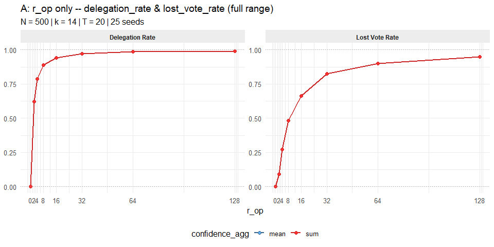<!-- -->

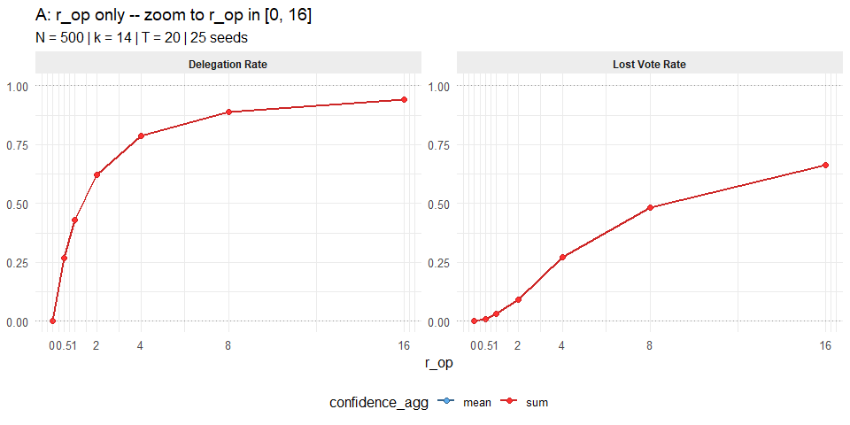<!-- -->

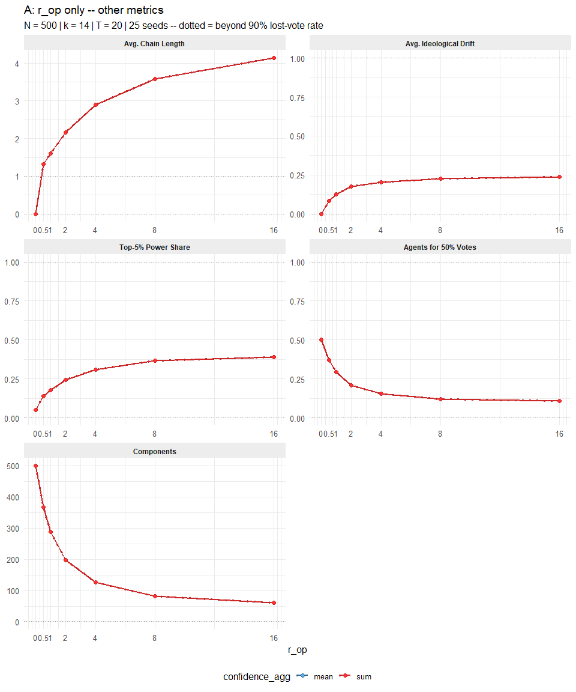<!-- -->

## 3.2 Condition B: $r_{pw}$ only

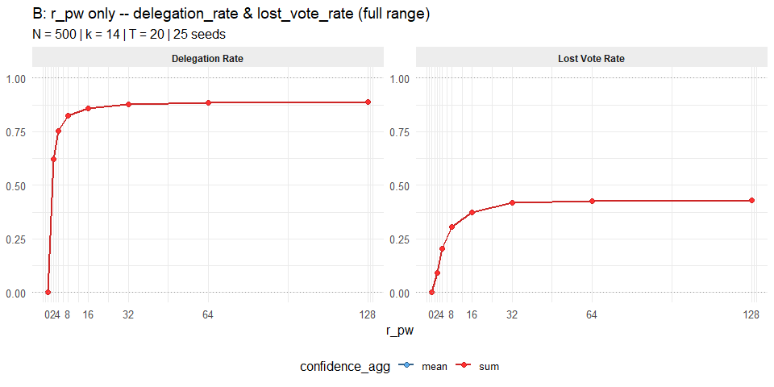<!-- -->

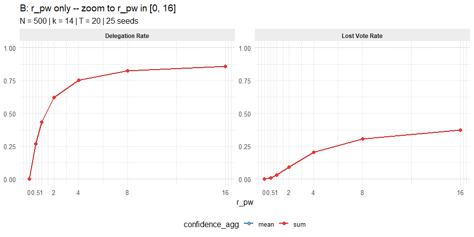<!-- -->

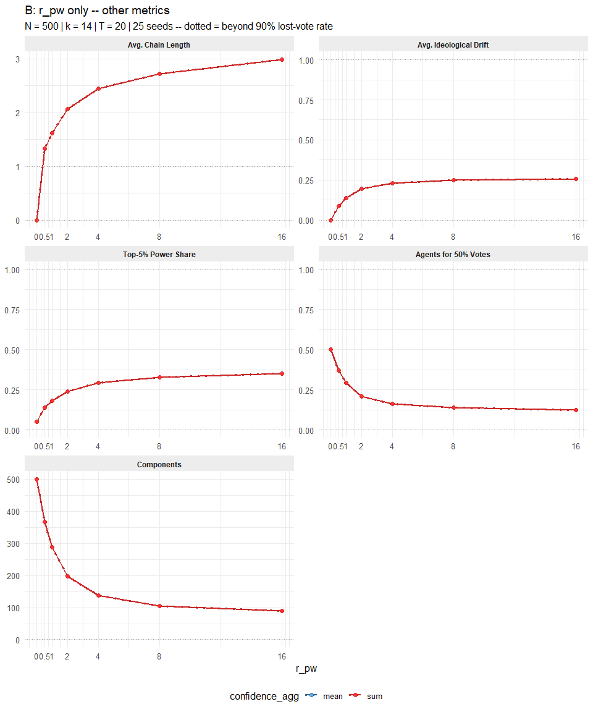<!-- -->

## 3.3 Condition C: $r_{op} \times r_{pw}$ (grid) — aggregators side by side

Unlike A, B and D, the two aggregators are **not** identical here since
we are having more than one dimension.

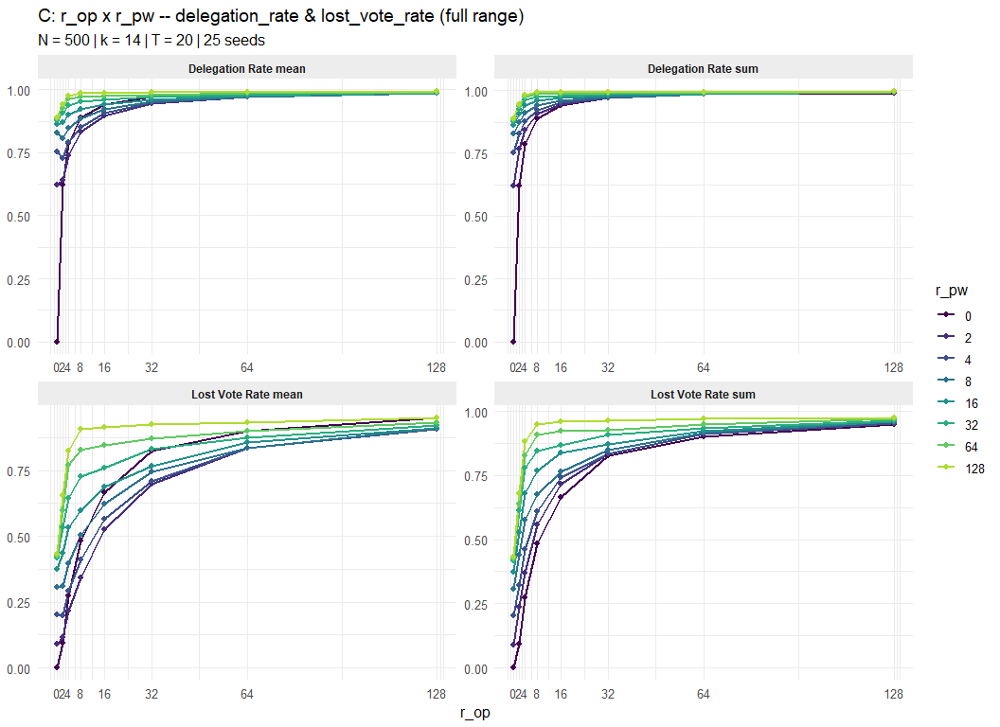<!-- -->

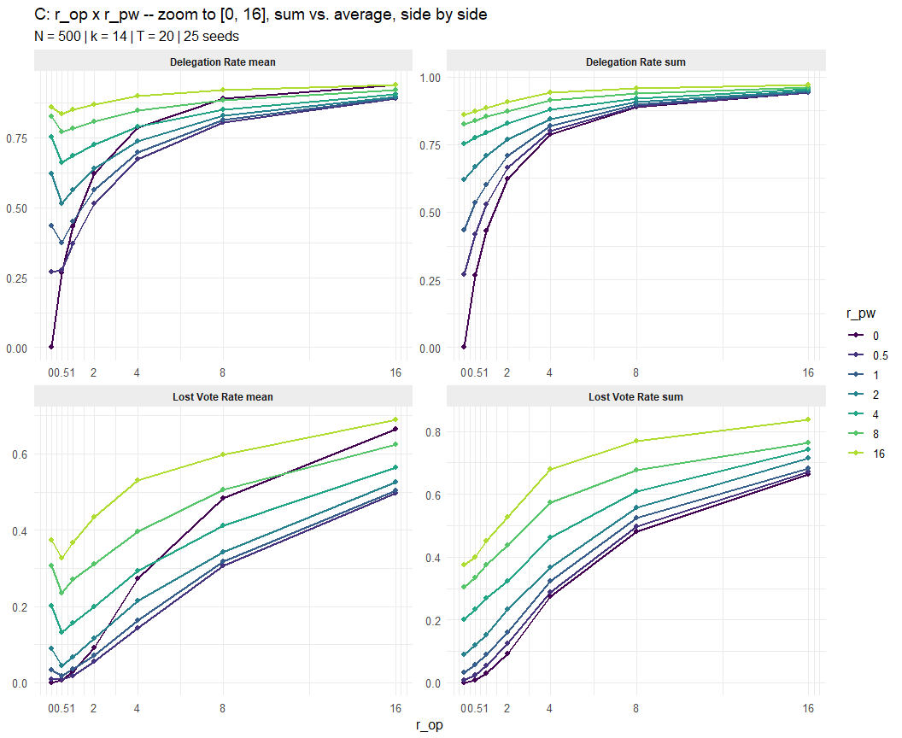<!-- -->

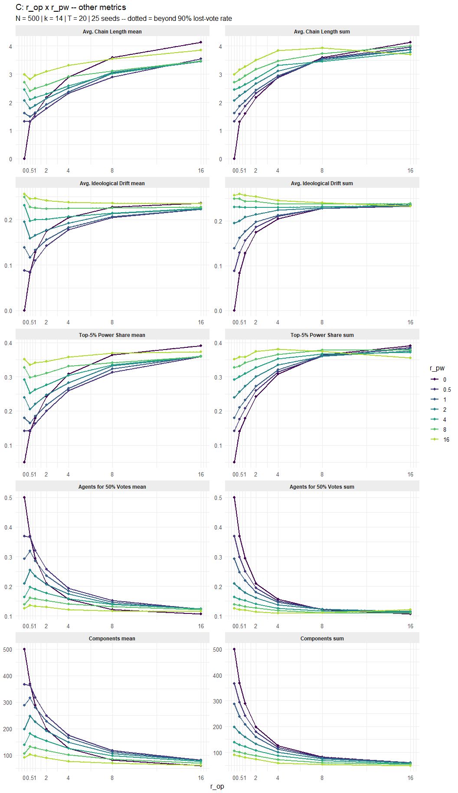<!-- -->

## 3.4 Condition D: Trust ($r_{trust}$)

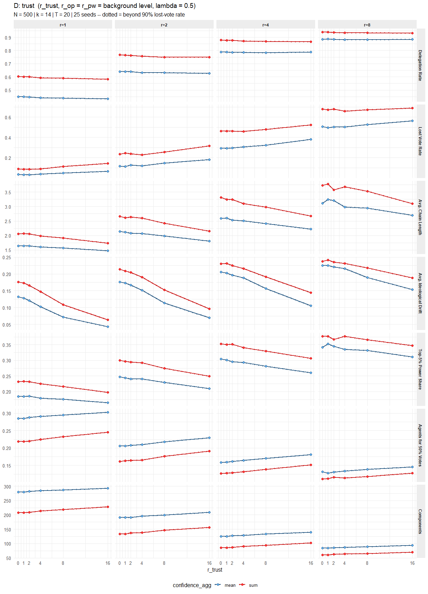<!-- -->

Although delegation decreases slightly, lost votes increase because the
trust mechanism penalizes only delegates who previously cast a
disagreeing vote. Cyclic agents cast no vote and therefore receive no
trust penalty, making them relatively more attractive delegation targets
as trust responsiveness increases.

------------------------------------------------------------------------

# 4 An Improved Trust Update: Reward and Punish

The trust update used above (`trust_mode = "punish_only"`, the only mode
that existed before this report) has two structural issues, both visible
in Condition D:

$$\tau_{ij}(t) = \lambda\tau_{ij}(t-1) - (1-\lambda)\,|o_i - v_j(t-1)|,
  \qquad \text{only if } v_j(t-1) \text{ is defined}.$$

**First**, a neighbour whose vote was lost last round (stuck in a cycle)
is skipped entirely – $\tau_{ij}$ simply isn’t updated for that pair, so
cycling carries *no* trust penalty at all, while a neighbour who
actually voted and disagreed with you does get penalized. As `r_trust`
grows, this increasingly steers delegation *away* from
honest-but-disagreeing neighbours and, by omission, relatively *toward*
neighbours already stuck in cycles – exactly the mechanism behind the
lost-vote increase in Section 3.4.

**Second**, $\tau_{ij} \le 0$ always, since every update either
subtracts a non-negative disagreement term or does nothing. That means
$\text{trust\_mod} = 2\sigma(r_{trust}\cdot\tau_{ij}) \le 1$ always:
trust can only ever shrink a neighbour’s attractiveness, never boost it.
A neighbour who has represented you perfectly for 19 rounds is no more
attractive than one you’ve never interacted with.

**New trust update (`trust_mode = "reward_punish"`):**

$$\tau_{ij}(t) = \lambda\tau_{ij}(t-1) + (1-\lambda)\cdot s, \qquad
  s = \begin{cases}
    1 - 2\,|o_i - v_j(t-1)| & \text{$j$ delivered a vote} \\
    -\kappa_{cyc} & \text{$j$'s vote was lost}
  \end{cases}$$

$s$ uses the same $2|\cdot|-1$ convention already used elsewhere in the
model’s attractiveness formula: perfect agreement gives $s=1$ (reward),
disagreement beyond the halfway point gives $s<0$ (penalty), and a
non-delivering neighbour is penalized by a fixed, separately-tunable
$\kappa_{cyc}$ regardless of what they might have voted. Two
consequences worth flagging explicitly:

- $\tau_{ij}$ can now be positive, so $\text{trust\_mod}$ can exceed 1 –
  a consistently well-agreeing delegate becomes *more* attractive than
  an untested one (at $\tau=0$, e.g. round 1), not merely “less
  suppressed.” This is closer to how trust intuitively works, but it
  also means a good representative can now accumulate delegators faster
  than under `"punish_only"`, which may show up as increased power
  concentration (`top5_power_share`, `gini_power`) alongside whatever
  happens to delegation/lost-vote rate below.
- $\kappa_{cyc}$ is fixed at 1 here (cycling penalized as harshly as
  maximal disagreement) rather than swept, for the same reason `lambda`
  is fixed rather than swept (too many tunable Parameters).

## 4.1 Condition D2: Trust, reward + punish ($r_{trust}$)

Identical setup to Condition D (same `r_op = r_pw` background levels,
same `r_trust` sweep, same `lambda = 0.5`) – only the trust-update
formula differs.

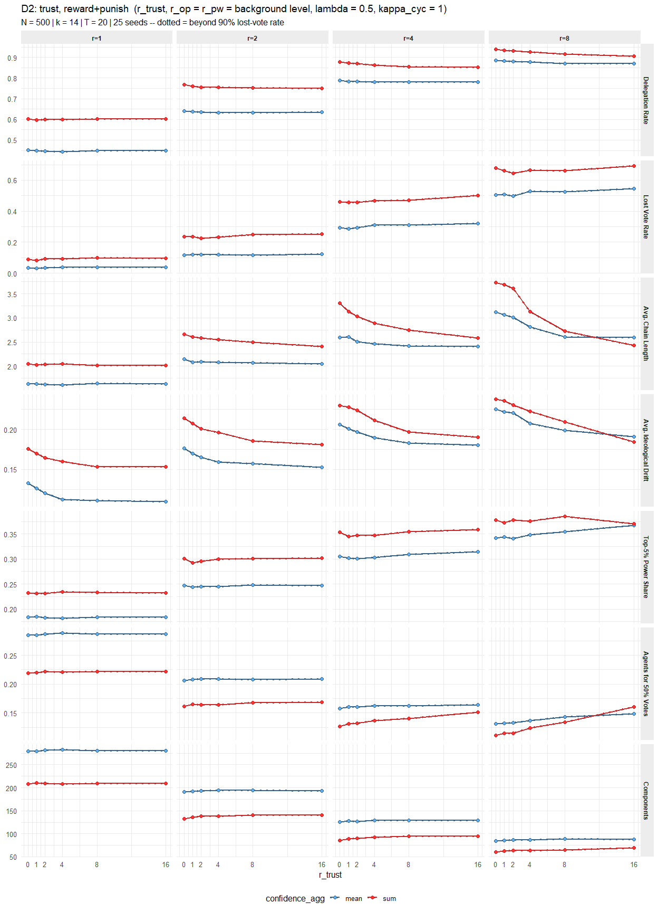<!-- -->

------------------------------------------------------------------------

# Part II: Minority Representation in Liquid Democracy

## RQ1: Which ranges of the ingroup responsiveness parameter produce meaningful changes in minority delegation behaviour?

- **H1a.** The relationship between behavioural ingroup responsiveness
  ($r_{ingroup}$) and minority delegation behaviour is non-linear and
  exhibits a saturation point.

*Operationalized by:* $RR_m$, $PC_m$, $RC_m$, $CDR$, delegation rate,
representative share, average delegation chain length.

## RQ2: How does behavioural ingroup preference affect minority representation in liquid democracy?

- **H1b.** At $r_{ingroup}=0$ under random opinion distributions,
  minority representation is proportional to the minority’s population
  share.
- **H2b.** Increasing behavioural ingroup responsiveness improves
  minority representation.
- **H3b.** Increasing behavioural ingroup responsiveness reduces
  minority power capture and minority representation capture.
- **H4b.** The effects of behavioural ingroup responsiveness on minority
  representation become stronger as opinion polarisation increases.

*Operationalized by:* $RR_m$, $PC_m$, $RC_m$.

## RQ3: Through which delegation mechanisms does behavioural ingroup preference influence minority representation?

- **H1c.** Increasing behavioural ingroup responsiveness reduces
  cross-group delegation.
- **H2c.** The reduction in cross-group delegation is stronger under
  greater opinion polarisation.
- **H3c.** Increasing behavioural ingroup responsiveness shortens
  delegation chains.
- **H4c.** Increasing behavioural ingroup responsiveness reduces
  ideological drift within both minority and majority groups.

*Operationalized by:* $CDR$, average delegation chain length, average
ideological drift.

------------------------------------------------------------------------

# 5 Purpose

Minority-representation simulation, using Section 1’s sum-aggregated
confidence self-weight and Section 4’s reward+punish trust update.

## 5.0 The Full Model

Extends Section 1’s attractiveness formula with an ingroup term:

$$\tilde{A}_{ij}(t) = \sigma\big(r_{op}(1-2|o_i-o_j|)\big) \cdot
  \sigma\!\left(r_{pw}\log\frac{p_j}{p_i}\right) \cdot
  2\sigma\big(r_{trust}\,\tau_{ij}(t)\big) \cdot
  \sigma\big(r_{ingroup}\, I(g_i=g_j)\big)$$

$$I(g_i=g_j)=\begin{cases}+1 & g_i=g_j \\ -1 & g_i\neq g_j\end{cases}$$

Self-weight and trust update are as in Sections 1 and 4, with
$r_{agg}=r_{tot}=r_{op}+r_{pw}+r_{ingroup}$ (`confidence_agg = "sum"`);
perception noise as in Section 1 (`sigma_opinion = "auto"`).
$r_{op}=r_{pw}=r_{trust} \in \{$ 1, 4, 8 $\}$ (swept, not averaged – see
5.2), $\lambda=$ 0.5, $\kappa_{cyc}=$ 1 (Section 3/4 values, reused).

## 5.1 Metrics

Averaged over the last 5 rounds (`round >= T-4`), then over 25 seeds.

**1. Voting power / share.**
$$P_M = \sum_{i \in M} p_i, \quad P_{Maj} = \sum_{i \in N\setminus M} p_i,
\quad \text{share}_M = \frac{P_M}{P_M+P_{Maj}}$$ Total power actually
cast by each group’s roots ($p_i$ = root power if $i$ is a root, else
0), and each group’s share of the total.

**2. Relative Representation.**
$$RR_m = \frac{\big(\sum_{i\in M} p_i \,/\, \sum_{i\in N} p_i\big)}{m},
\qquad m = |M|/|N|$$ Minority’s power share divided by its population
share; $1$ = proportional representation.

**3. Power Capture.**
$$PC_m = \frac{\#\{i\in M : \text{root}(i)\in N\setminus M\}}{\#\{i\in M : \text{root}(i) \text{ defined}\}},
\qquad PC_{Maj} \text{ analogous with } M \leftrightarrow N\setminus M$$
Fraction of one group’s agents whose delegation chain terminates at a
representative from the other group.

**4. Cross-group delegation, both directions.**
$$CDR_{M\to Maj} = \frac{\#\{(i,j)\in E : i\in M,\, j\notin M\}}{\#\{(i,j)\in E: i \in M\}},
\qquad
CDR_{Maj\to M} = \frac{\#\{(i,j)\in E : i\notin M,\, j\in M\}}{\#\{(i,j)\in E: i \notin M\}}$$
Share of each group’s own outgoing delegation edges that cross into the
other group.

**5. Group-specific rates.**
$$\text{DelRate}_G = \frac{\#\{i\in G : \text{delegated}(i)\}}{|G|}$$
Delegation rate within group $G$ ($G\in\{N, M, N\setminus M\}$);
lost-vote rate, chain length and ideological drift use the same
all/minority/majority split, restricted to each group’s own agents.

**6. Representatives per group.**
$$n_G = \#\{i\in G : \text{root}(i)=i\}$$ Headcount of group $G$’s
direct voters (roots), regardless of how many others delegate to them.

## 5.2 Experimental Design

| Factor | Values |
|----|----|
| Condition | `random`, `polarised`, `homophily` |
| Polarisation $\delta$ | $\{0.2, 0.4\}$ under `polarised`; fixed at 0.4 under `homophily` |
| Ingroup preference $r_{ingroup}$ | $\{0, 1, 2, 4, 8\}$ |
| Background responsiveness $r_{op}=r_{pw}=r_{trust}$ | $\{$ 1, 4, 8 $\}$ |

`random`: $\mathcal{N}(0.5,0.1^2)$ for both groups. `polarised`:
$\mathcal{N}(0.5\mp\delta/2,0.1^2)$. `homophily`: `polarised` at
$\delta=$ 0.4 + network reshuffle to opinion assortativity $\ge$ 0.9.
Every plot below repeats across all 3 background-responsiveness levels
(separate rows) rather than averaging across them, since averaging would
blend potentially different regimes (e.g. saturation effects, Section 3)
into a number that matches none of them.

------------------------------------------------------------------------

# 6 Simulation

------------------------------------------------------------------------

# 7 Representation Overview

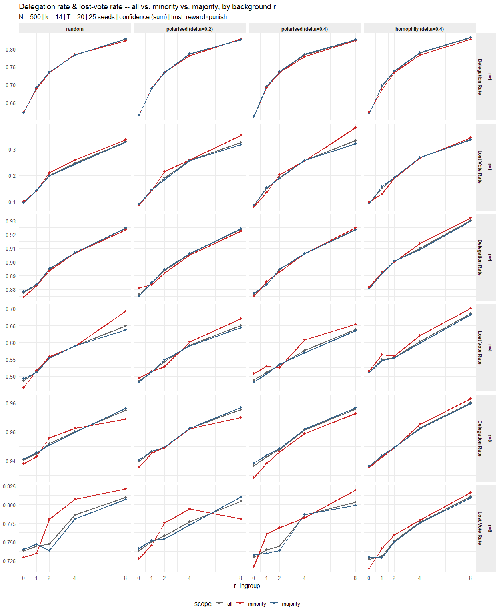<!-- -->

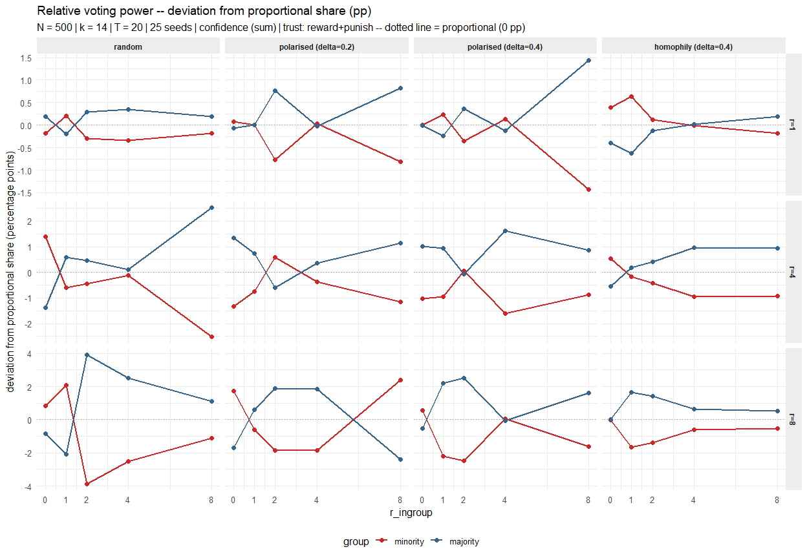<!-- -->

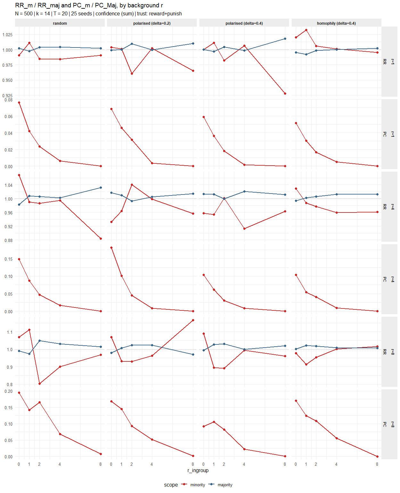<!-- -->

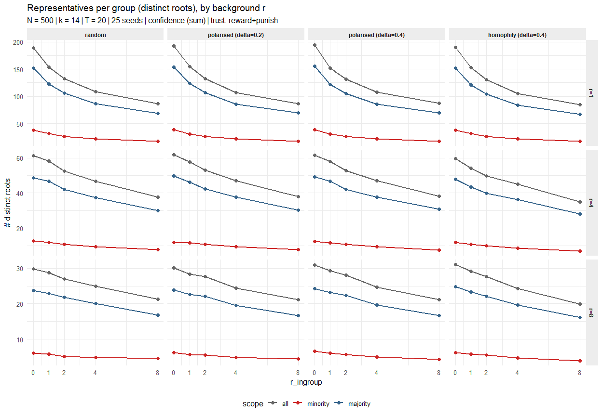<!-- -->

------------------------------------------------------------------------

# 8 Delegation Mechanisms

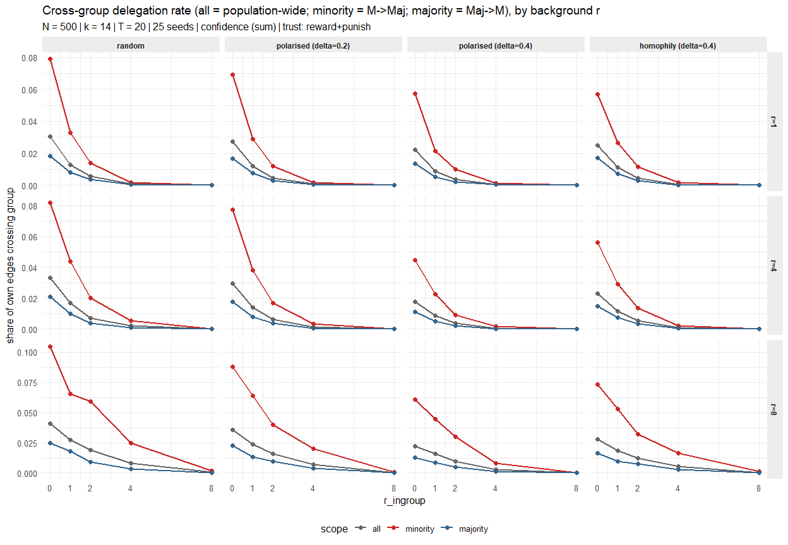<!-- -->

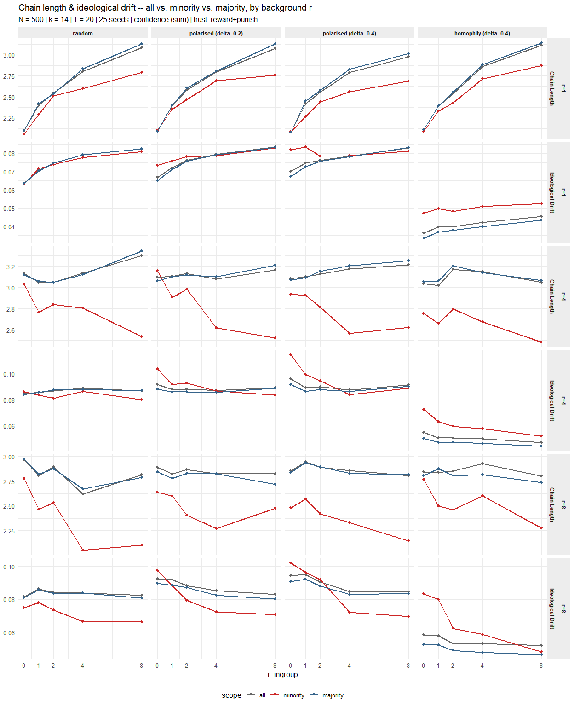<!-- -->
