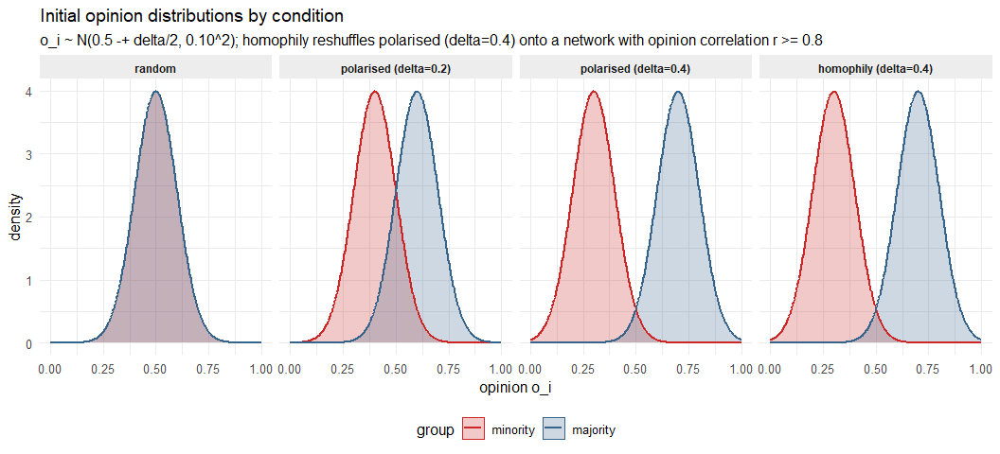
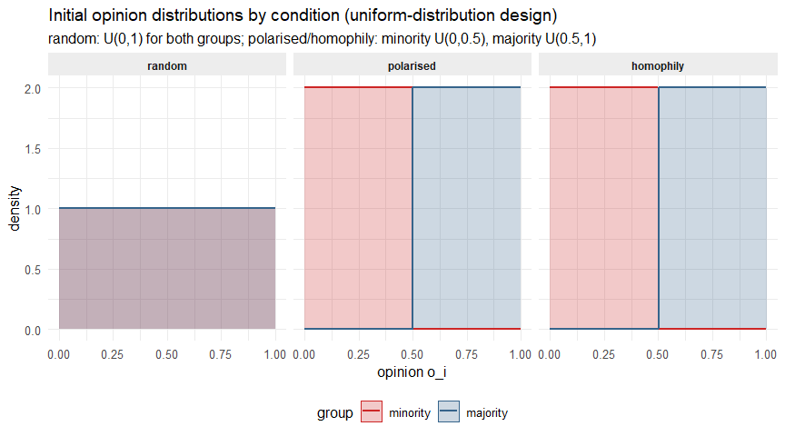
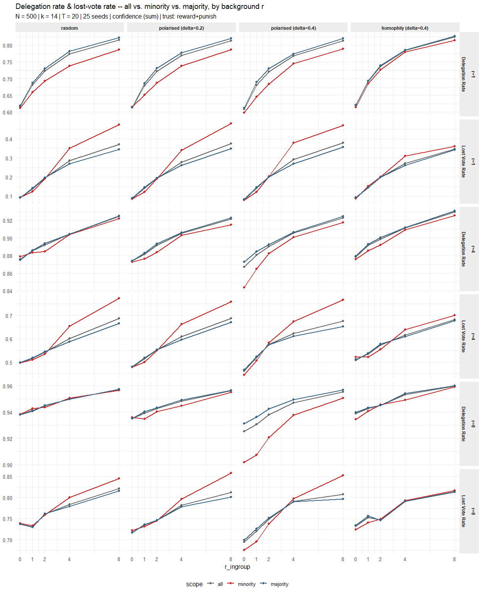
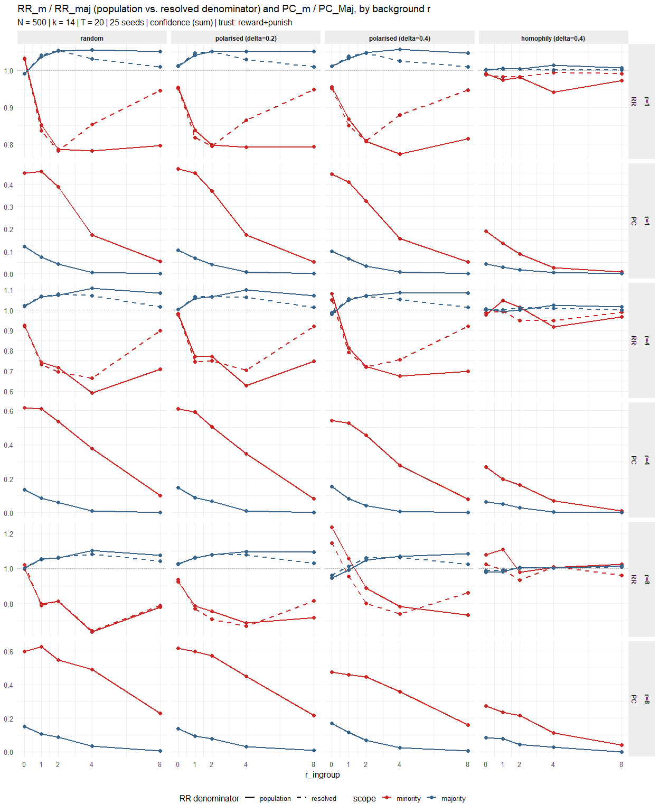
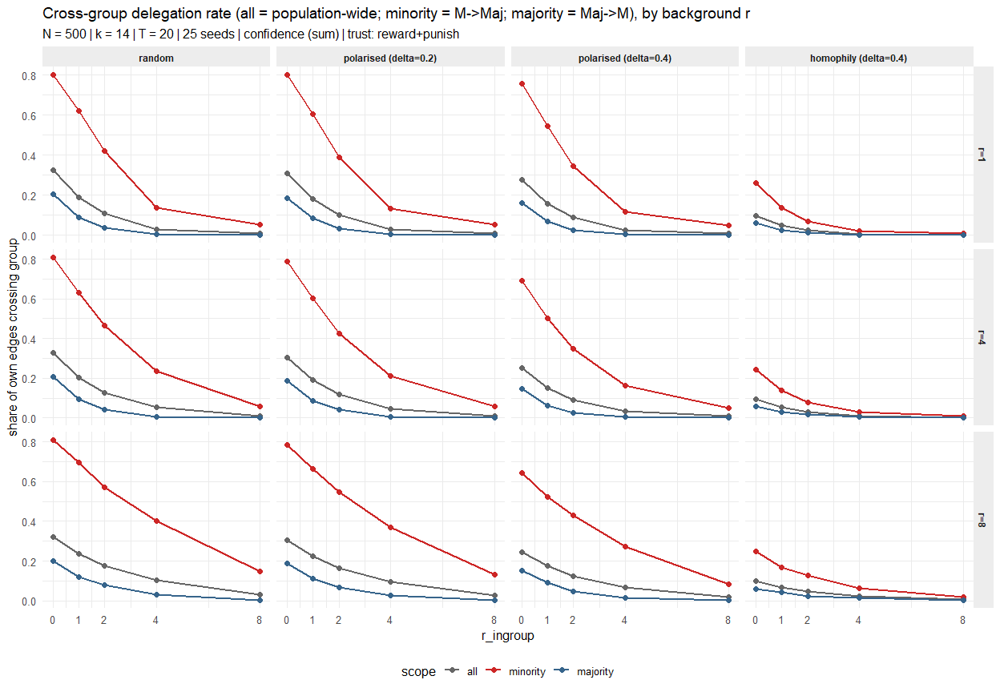
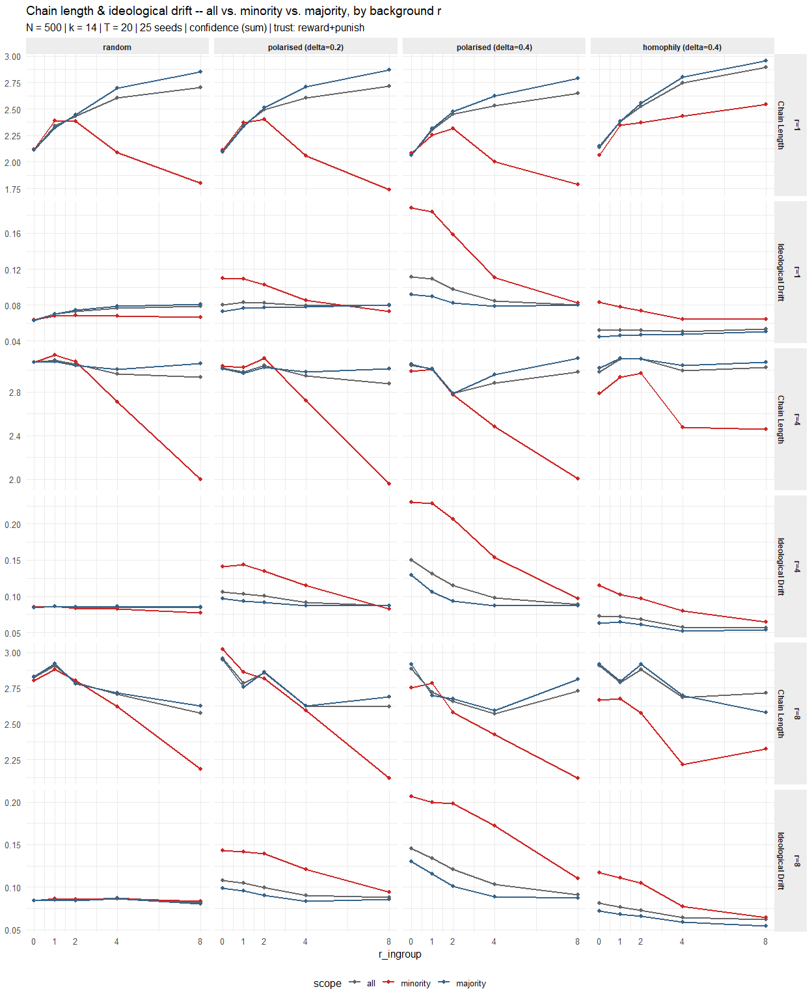
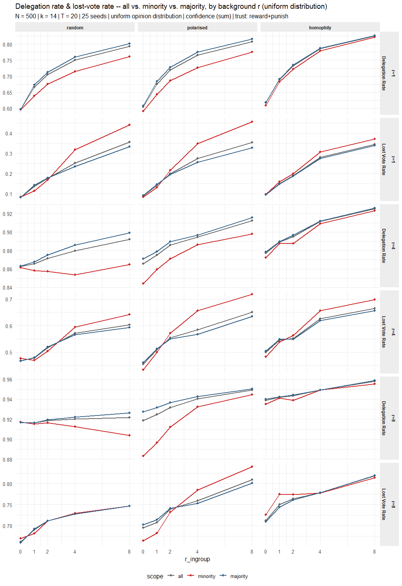
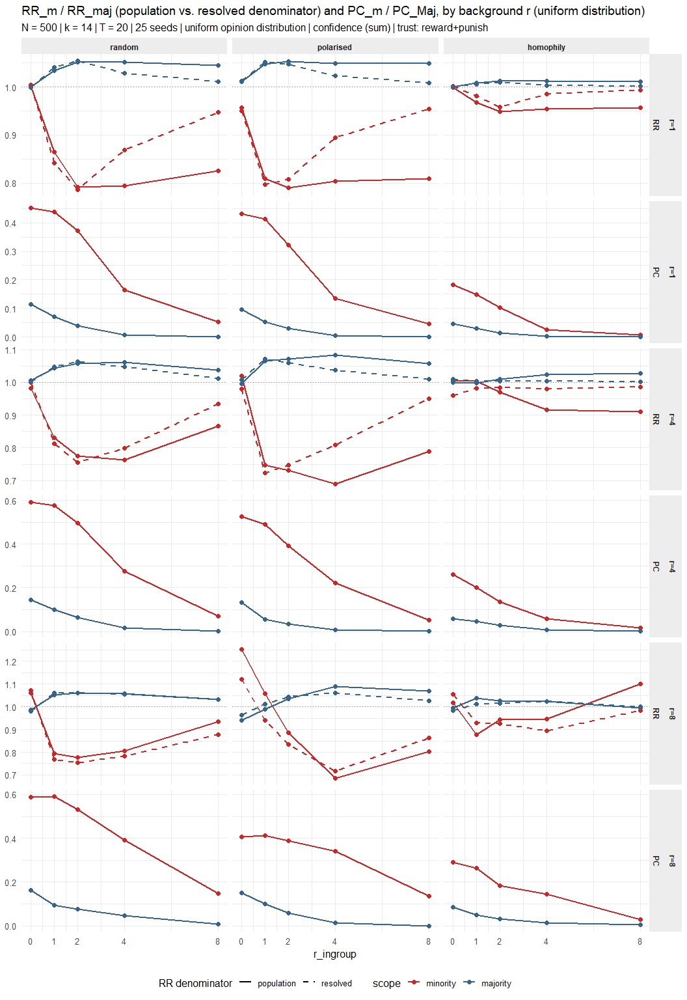
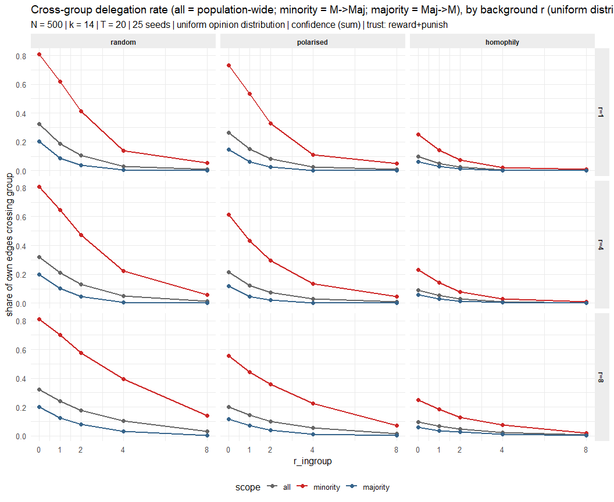
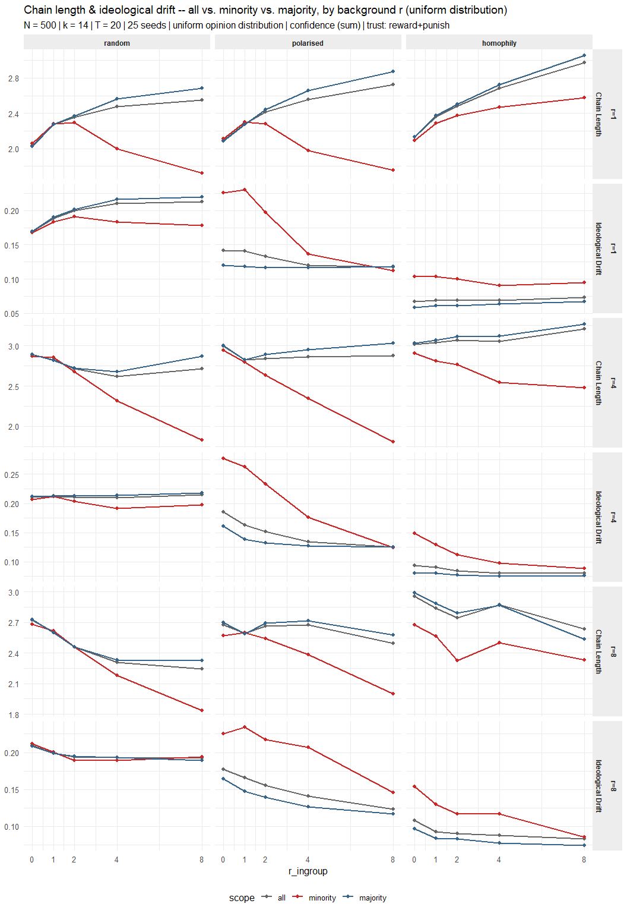

Weekly Report – Week 19: Minority Representation in Liquid Democracy
================
2026-07-21

## Opinion Distributions by Condition

Opinions are drawn once at initialisation from group-specific normal
distributions,

$$o_i \sim \begin{cases}
  \mathcal{N}(0.5-\delta/2,\ \sigma^2) & g_i = \text{minority} \quad (20\%) \\
  \mathcal{N}(0.5+\delta/2,\ \sigma^2) & g_i = \text{majority} \quad (80\%)
\end{cases}, \qquad \sigma = OP\_SIGMA = 0.1,$$

with $\delta=0$ under `random` (both groups share
$\mathcal{N}(0.5,\sigma^2)$), $\delta\in\{0.2,0.4\}$ under `polarised`,
and $\delta=0.4$ under `homophily` (same draw as `polarised`, then
reshuffled onto the network – see the *Implementation Note: Homophily*
section below).

<!-- -->

`random` and `homophily` share the same $\delta$-implied means as
`random` ($\delta{=}0$) and `polarised (delta=0.4)` respectively –
homophily changes *who sits next to whom* on the network, not the
opinion draw itself, so its marginal distribution is identical to
`polarised (delta=0.4)`.

## Opinion Distributions by Condition (Uniform-Distribution Design)

A second, independent study design keeps the same model and metrics
throughout (Sections 3-5 below) but draws opinions from a **uniform**
rather than a normal distribution:

$$o_i \sim \begin{cases}
  \mathcal{U}(0,1)     & \text{random} \quad \text{(both groups, no group difference)} \\
  \mathcal{U}(0,\,0.5) & g_i=\text{minority} \quad \text{(polarised / homophily)} \\
  \mathcal{U}(0.5,\,1) & g_i=\text{majority} \quad \text{(polarised / homophily)}
\end{cases}$$

`random` is simply $\mathcal{U}(0,1)$ for every agent, regardless of
group. `polarised` puts minority and majority on opposite sides of a
hard split at $0.5$, with no overlap; since this split is already
maximal within $[0,1]$, there is no $\delta$ to sweep here (unlike the
normal-distribution design above). `homophily` uses the same `polarised`
draw, then reshuffles it onto the network exactly as described in the
*Implementation Note: Homophily* section below. Results for this design
are reported in Section 5, using the same plots as Sections 3-4.

<!-- -->

------------------------------------------------------------------------

# Part II: Minority Representation in Liquid Democracy

## RQ1: At which point is the responsiveness to ingroup parameter saturating?

- **H1a.** The relationship between behavioural ingroup responsiveness
  ($r_{ingroup}$) and minority delegation behaviour is non-linear and
  exhibits a saturation point.

*Operationalized by:* $RR_m$, $PC_m$, $RC_m$, $CDR$, delegation rate,
representative share, average delegation chain length.

## RQ2: How does behavioural ingroup preference affect minority representation in liquid democracy?

- **H1b.** At $r_{ingroup}=0$ under random opinion distributions,
  minority representation is proportional to the minority’s population
  share.
- **H2b.** Increasing behavioural ingroup responsiveness improves
  minority representation.
- **H3b.** Increasing behavioural ingroup responsiveness reduces
  minority power capture and minority representation capture.
- **H4b.** The effects of behavioural ingroup responsiveness on minority
  representation become stronger as opinion polarisation increases.

*Operationalized by:* $RR_m$, $PC_m$, $RC_m$.

## RQ3: Through which delegation mechanisms does behavioural ingroup preference influence minority representation?

- **H1c.** Increasing behavioural ingroup responsiveness reduces
  cross-group delegation.
- **H2c.** The reduction in cross-group delegation is stronger under
  greater opinion polarisation.
- **H3c.** Increasing behavioural ingroup responsiveness shortens
  delegation chains.
- **H4c.** Increasing behavioural ingroup responsiveness reduces
  ideological drift within both minority and majority groups.

*Operationalized by:* $CDR$, average delegation chain length, average
ideological drift.

------------------------------------------------------------------------

# Implementation Note: Homophily

**Energy.** Total opinion disagreement across the friendship graph $G$:

$$E = \sum_{(i,j)\in E(G)} |o_i - o_j|$$

**Metropolis step** (`shuffle_opinions_homophily()`, repeated up to
`homophily_steps` $=10^5$ times):

1.  Draw two lay agents $i,j$ uniformly at random.
2.  Compute the *local* energy change of swapping
    $o_i \leftrightarrow o_j$ (only terms touching $i$ or $j$ change):
    $$E_{\text{before}} = \sum_{k\in \text{nbr}(i)}|o_i-o_k| + \sum_{k\in \text{nbr}(j)}|o_j-o_k|$$
    $$E_{\text{after}} = \sum_{k\in \text{nbr}(i)}|o_j-o_k| + \sum_{k\in \text{nbr}(j)}|o_i-o_k|$$
    $$\Delta E = E_{\text{after}} - E_{\text{before}}$$
3.  Accept the swap if $\Delta E<0$; otherwise accept with probability
    $$P(\text{accept}) = \exp(-\Delta E \cdot t), \qquad t = \texttt{homophily\_t} = 5.$$
4.  Every 100 steps, check the **network opinion correlation** $r$ and
    stop once $r \ge r^\star$, $r^\star=$ 0.8. $r$ is the Pearson
    correlation between the opinions sitting at either end of an edge,
    i.e. the ordinary Pearson correlation coefficient applied to the
    list of edge endpoint pairs (each undirected edge counted once in
    each direction, so both sides of the pair share the same marginal
    distribution of opinions):
    $$r = \frac{\sum_{(i,j)\in \vec E(G)} (o_i-\bar o)(o_j-\bar o)}
            {\sum_{(i,j)\in \vec E(G)} (o_i-\bar o)^2},
    \qquad \bar o = \frac{1}{N}\sum_{i} o_i,$$ where $\vec E(G)$ lists
    every edge of $G$ in both directions. $r=1$ means every edge
    connects two agents with identical opinions; $r=0$ means opinions
    are uncorrelated with network position (the untouched, randomly
    wired network).

------------------------------------------------------------------------

# 1 Model

## 1.1 Metrics

Averaged over the last 5 rounds (`round >= T-4`), then over 25 seeds.

**1. Voting power / share.**
$$P_M = \sum_{i \in M} p_i, \quad P_{Maj} = \sum_{i \in N\setminus M} p_i,
\quad \text{share}_M = \frac{P_M}{P_M+P_{Maj}}$$ Total power actually
cast by each group’s roots ($p_i$ = root power if $i$ is a root, else
0), and each group’s share of the total.

**2. Relative Representation.**
$$RR_m = \frac{\big(\sum_{i\in M} p_i \,/\, \sum_{i\in N} p_i\big)}{m},
\qquad m = |M|/|N|$$ Minority’s power share divided by its population
share; $1$ = proportional representation.

**2b. Relative Representation, resolved-population denominator.**
$$RR_m^{\text{resolved}} = \frac{\big(\sum_{i\in M} p_i \,/\, \sum_{i\in N} p_i\big)}{m_{\text{resolved}}},
\qquad m_{\text{resolved}} = \frac{\#\{i\in M : \text{root}(i) \text{ defined}\}}{\#\{i\in N : \text{root}(i) \text{ defined}\}}$$
Same power-share numerator as $RR_m$, but divided by the minority’s
share of the *resolved* population (agents whose delegation chain
reaches a root, i.e. not stuck in a cycle) instead of its total
population share $m$. $RR_m$ conflates two channels – majority capturing
minority power, and minority votes lost to cycles (which shrink the
numerator but not the fixed denominator $m$) – into one number;
$RR_m^{\text{resolved}}$ isolates the first channel alone, directly
comparable to $PC_m$ (which is resolved-only by construction already).
$RR_{Maj}^{\text{resolved}}$ is the majority counterpart, analogous to
$RR_{Maj}$.

**3. Power Capture.**
$$PC_m = \frac{\#\{i\in M : \text{root}(i)\in N\setminus M\}}{\#\{i\in M : \text{root}(i) \text{ defined}\}},
\qquad PC_{Maj} \text{ analogous with } M \leftrightarrow N\setminus M$$
Fraction of one group’s agents whose delegation chain terminates at a
representative from the other group.

**4. Cross-group delegation, both directions.**
$$CDR_{M\to Maj} = \frac{\#\{(i,j)\in E : i\in M,\, j\notin M\}}{\#\{(i,j)\in E: i \in M\}},
\qquad
CDR_{Maj\to M} = \frac{\#\{(i,j)\in E : i\notin M,\, j\in M\}}{\#\{(i,j)\in E: i \notin M\}}$$
Share of each group’s own outgoing delegation edges that cross into the
other group.

**5. Group-specific rates.**
$$\text{DelRate}_G = \frac{\#\{i\in G : \text{delegated}(i)\}}{|G|}$$
Delegation rate within group $G$ ($G\in\{N, M, N\setminus M\}$);
lost-vote rate, chain length and ideological drift use the same
all/minority/majority split, restricted to each group’s own agents.

**6. Representatives per group.**
$$n_G = \#\{i\in G : \text{root}(i)=i\}$$ Headcount of group $G$’s
direct voters (roots), regardless of how many others delegate to them.

## 1.2 Experimental Design

| Factor | Values |
|----|----|
| Condition | `random`, `polarised`, `homophily` |
| Polarisation $\delta$ | $\{0.2, 0.4\}$ under `polarised`; fixed at 0.4 under `homophily` |
| Ingroup preference $r_{ingroup}$ | $\{0, 1, 2, 4, 8\}$ |
| Background responsiveness $r_{op}=r_{pw}=r_{trust}$ | $\{$ 1, 4, 8 $\}$ |

`random`: $\mathcal{N}(0.5,0.1^2)$ for both groups. `polarised`:
$\mathcal{N}(0.5\mp\delta/2,0.1^2)$. `homophily`: `polarised` at
$\delta=$ 0.4 + network reshuffle to a network opinion correlation $\ge$
0.8 (see the *Implementation Note: Homophily* section above). Every plot
below repeats across all 3 background-responsiveness levels (separate
rows) rather than averaging across them, since averaging would blend
potentially different regimes (e.g. saturation effects) into a number
that matches none of them.

------------------------------------------------------------------------

# 2 Simulation

------------------------------------------------------------------------

# 3 Representation Overview

<!-- --> - all
minority condition tend to have higher lost vote rates due to smaller
population size.

<!-- --> - Why is
PCm and RRm relation ship positive? I would expect the behavior as it is
for majority —

# 4 Delegation Mechanisms

<!-- --> -
Difference quiete small but visible between different conditions
(direction of results as expected).
<!-- --> -
decrease of chain length of minority probably due to cycles. -
ideological drift not lowest for minority in the homophily conditions
seems not right.

------------------------------------------------------------------------

# 5 Robustness Check: Uniform Opinion Distribution

Same model, metrics and plots as Sections 3-4, using the
uniform-distribution study design introduced at the top of this report
(*Opinion Distributions by Condition (Uniform-Distribution Design)*).

## 5.1 Representation Overview

<!-- -->

<!-- -->

## 5.2 Delegation Mechanisms

<!-- -->

<!-- -->
