Report 21 – Calibration Pipeline (simplified): N/K
================
2026-08-28

# Model

Group identity is off throughout this report ($a^{ig}\equiv1,\ r_{ig}=0$
– Part I only).

**Attractiveness** of neighbour $j$ to agent $i$:
$$A_{ij}=a^{tr}_{ij}\,a^{pw}_{ij}\,a^{op}_{ij}$$
$$a^{op}_{ij}=\exp(-r_{op}|o_i-o_j|)\in(0,1],\qquad a^{pw}_{ij}=2\mathcal L\!\left(r_{pw}\left(\tfrac{p_j}{p_i}-1\right)\right)\in(0,2),\qquad a^{tr}_{ij}=2\mathcal L\!\left(r_{tr}(\tau_{ij}-1)\right)\in(0,2)$$
where $\mathcal L(x)=1/(1+e^{-x})$.

**Delegation-target choice**, once $i$ has decided to delegate:
neighbour $j$ is drawn with probability $P_i(j)=A_{ij}/\sum_k A_{ik}$.

**Self-vote probability**, applied to $A_k=\max_j A_{ij}$ (the
attractiveness of $i$’s single most attractive neighbour) – this is what
decides whether $i$ votes directly instead of delegating at all:
$$P_{\text{self}}(A_k)=\frac{M-A_k}{M+A_k\left(\frac{M-1}{c}-M\right)},\qquad M=4$$
$M=4$ is the theoretical ceiling of $A_{ij}$ ($a^{tr},a^{pw}\le2$,
$a^{op}\le1$); $c\in(0,1)$ is the self-reliance baseline –
$P_\text{self}=c$ when the best neighbour is exactly as attractive as
$i$ itself ($A_k=1$).

**Trust update**, only once $j$’s vote is resolved at the end of a
round:
$$\tau_{ij}(t)=(1-\lambda)\,\tau_{ij}(t-1)+\lambda\big(1+s_{ij}(t-1)\big),\quad \tau_{ij}(0)=1$$
$$s_{ij}(t-1)=\begin{cases}k_1\big(1-2|o_i-v_j(t-1)|\big) & i\text{ delegated to }j\text{ and }j\text{ delivered a vote}\\ -k_2 & i\text{ delegated to }j\text{ and }j\text{'s vote was lost to a cycle}\\ 0 & i\text{ did not delegate to }j\end{cases}\qquad k_1=k_2=1$$
$\lambda\in(0,1]$ is the *adaptation rate*.

**Delegating vs. voting rounds.** Every round runs the same decision +
power/vote-resolution steps above; only a subset of rounds – *voting
rounds* – additionally runs the trust update above. *Delegating rounds*
skip it entirely, so $\tau_{ij}$ simply carries over unchanged.
Controlled by `n_voting_rounds` in `simulate_liquid_democracy()`; `NULL`
(used throughout this report) means every round is a voting round.
Voting rounds are evenly spaced via
`round(seq(T/n_voting_rounds, T, length.out = n_voting_rounds))`, always
ending on round $T$ – exactly regular (constant number of delegating
rounds in between) only when $T/n_\text{voting\_rounds}$ is an integer,
e.g. 60/20 split: 60/20=3, so 20 voting rounds and 40; otherwise (when
$T/n_\text{voting\_rounds}$ isn’t an integer) spacing can vary by $\pm1$
round from rounding.

**Parameters used in this report:**

| Symbol | Role | Status here |
|----|----|----|
| $N$ | number of agents | swept (Part 1) |
| $K$ | mean degree (`node_degree`) | swept (Part 1) |
| $r_{op}$ | opinion responsiveness | varied |
| $r_{pw}$ | power responsiveness | varied |
| $r_{tr}$ | trust responsiveness (`gamma`) | varied |
| $\lambda$ | trust adaptation rate | fixed, $\lambda=1-0.5^{2/n_\text{voting\_rounds}}\approx0.0670$ |
| $c$ | self-reliance baseline | fixed, $c=0.5$ |
| $k_1,k_2$ | agreement / cycle-penalty weights | fixed at 1 |
| $r_{ig}$ | ingroup responsiveness | fixed at 0 (Part I only) |

**$\lambda$** is not swept below (only $c,r_{op},r_{pw},r_{tr}$ are); it
is fixed via a half-life condition on the trust-relaxation recursion,
$(1-\lambda)^h=0.5$ for $h=n_\text{voting\_rounds}/2$ voting-round
updates (half of however many voting rounds a run actually has), giving
$\lambda=1-0.5^{2/n_\text{voting\_rounds}}$. At this report’s
$n_\text{voting\_rounds}=20$ that is $\lambda\approx0.0670$.

------------------------------------------------------------------------

# Part 1: N and K

## N and K

Watts & Strogatz (1998) define their small-world regime by
$$N\gg K\gg\ln(N)\gg1$$

## Fixing N: the resulting theoretical corridor for K

$N=1000$ is fixed for this part; $\ln(1000)\approx6.91$, so the
theoretical corridor above says only that $K$ should sit comfortably
above $\approx7$ and well below $1000$.

## 1.1 Candidate grid

For **N = 1000**: I choose the range of K to
\${$8, 16, 24, 32, 40, 48$}\$

## 1.2 Run the grid at r = 0

## 1.2b Extreme K at N=1000, full round-by-round trace (T=600)

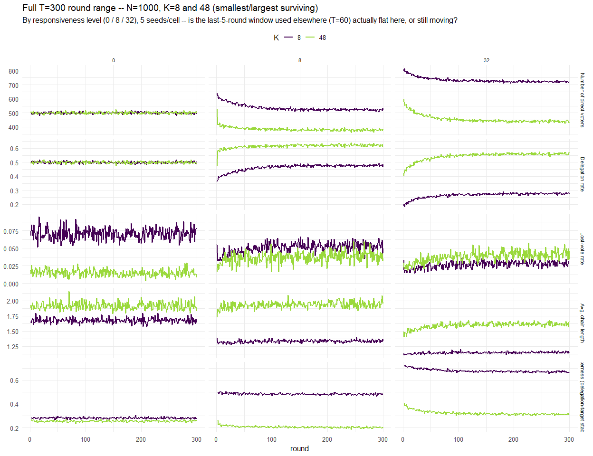<!-- -->

- 30 Rounds seems enough to have the system stabilized ( T=30 voting,
  voting rounds = 10)

## 1.3 Steady-state value vs. responsiveness, one line per K (N=1000, K=8-48)

N=1000 fixed and $r_{op}=r_{pw}=r_{tr}$ at each level.

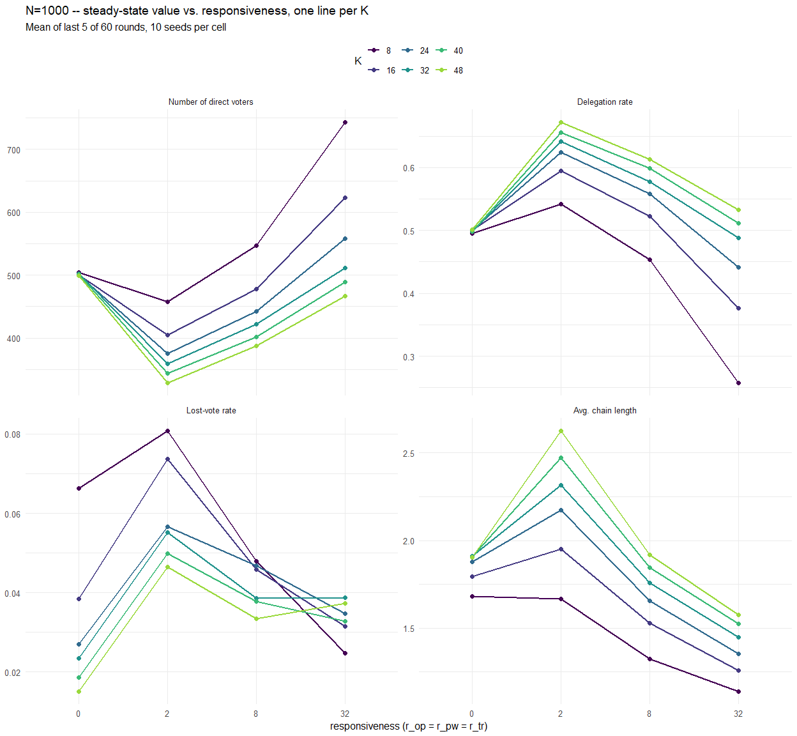<!-- --> - We see that K
has quiete a strong effect (makes sense since due to K agents have more
options therefore potentially better options)

### K = 16: a literature-anchored modelling assumption, not a fitted value

As we see K has an effect which needs to be mentioned but based on this
it is not clear which K value to choose for a LD simulation. A
delegation target must be someone whose trustworthiness *and* competence
the delegating agent can actually judge – this rules out large values
(K=50 or more) as psychologically implausible: nobody meaningfully
evaluates 50 comparable candidates for a personal delegation decision.
The relevant anchor from social-network research is Dunbar’s **sympathy
group** – the circle of people one knows well enough to judge, is
defined from 12-20 by **Dunbar & Spoors (1995)**. Therefore I would set
K to 16 and would call it something like a model assumption.

## 1.4 N-sensitivity by responsiveness, K=16 fixed

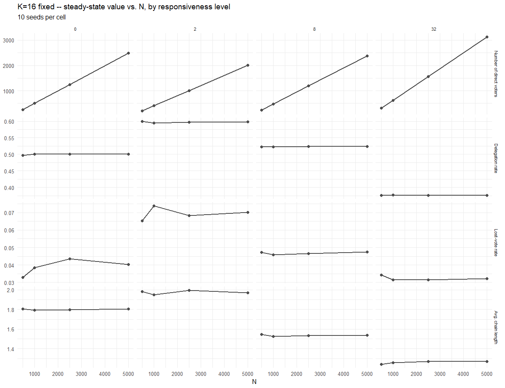<!-- -->

- Once N is sufficiently large to ensure a well-defined network
  structure, further increases in network size have little effect on the
  considered metrics. Thus, beyond a critical network size, the results
  remain largely stable with respect to N. (Need to do this again for
  Part 2 since I believe this could have a strong effect on minority
  representation)

## 1.4b Watts-Strogatz vs. Barabasi-Albert (N=1000, K=16)

Fixing N=1000, K=16 (the anchor from 1.3): does the network generator
itself matter? WS (small-world, the default used everywhere else in this
report) vs. BA (Barabasi-Albert preferential attachment – hub-like
degree heterogeneity that WS cannot produce). Same paired-sweep design
as RQ1’s “Shared design” (see the appended RQ1 section further below):
each pair of responsiveness dimensions is varied *together* across
$r\in\{1,2,4,8,16,32\}$ (log scale), while the third is held fixed at
one of three levels ($r\in\{0,4,16\}$, a reduced subset of RQ1’s own
fixed levels, kept small here to avoid clutter) – shown as differently
coloured lines, network type distinguished by line style on top of that
(WS solid, BA dashed). All three possible pairings are covered here, not
just $r_{op}=r_{pw}$, so every combination of “which two dimensions move
together, which one is held fixed” is shown at least once:

- $r_{op}=r_{pw}$ varied, $r_{tr}$ fixed
- $r_{op}=r_{tr}$ varied, $r_{pw}$ fixed
- $r_{pw}=r_{tr}$ varied, $r_{op}$ fixed

Plus two power-concentration metrics beyond the four core ones:
**top5_power_share** (share of total voting power held by the top 5% of
agents) and **share_50pct** (share of agents needed to jointly
accumulate 50% of total voting power).

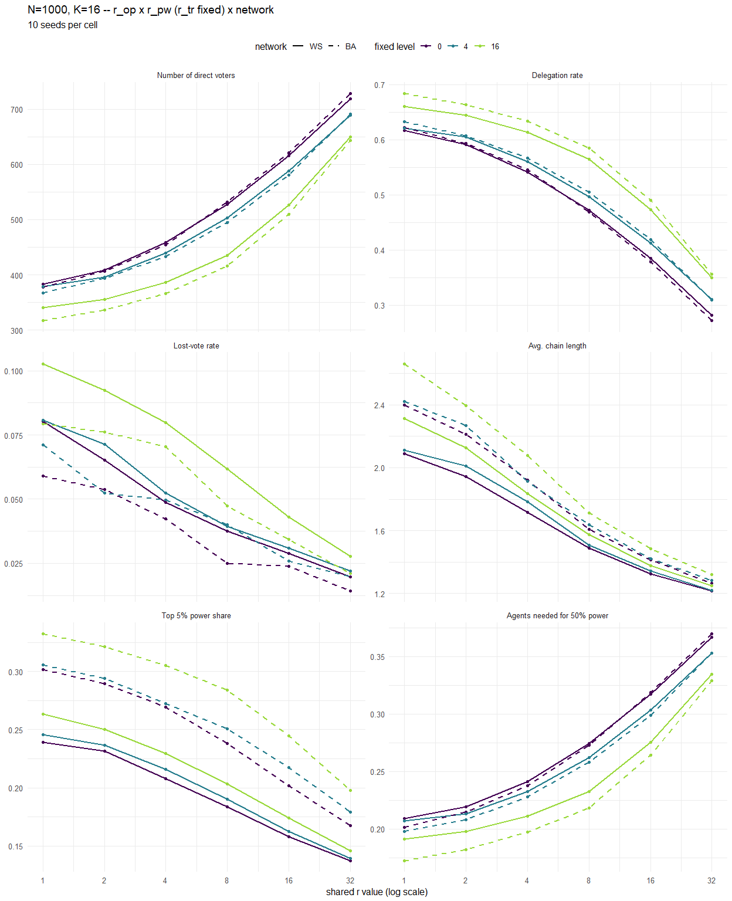<!-- -->

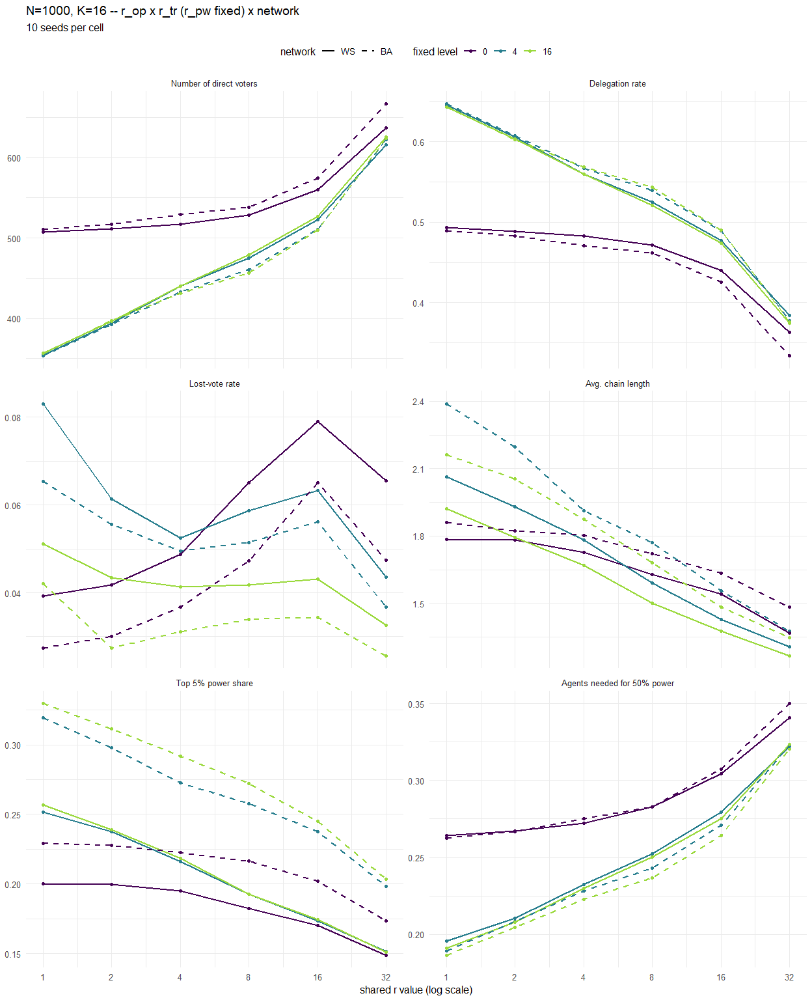<!-- -->

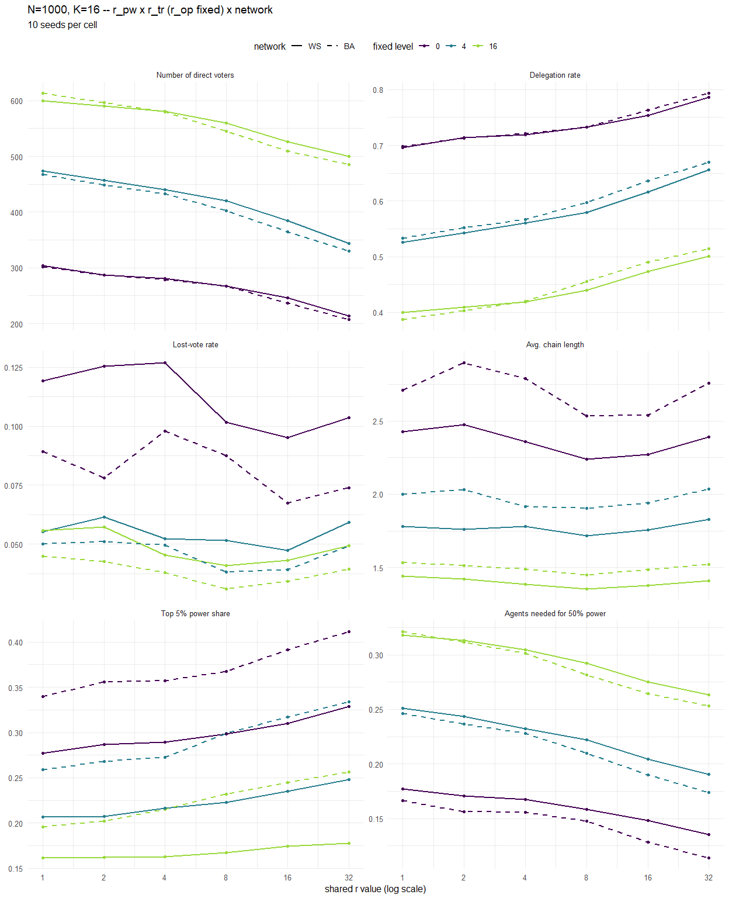<!-- -->

## 1.4c Alternative: single-dial $r_{op}=r_{pw}=r_{tr}$ (kept alongside 1.4b)

Same WS-vs-BA comparison, but reducing the three responsiveness
dimensions to one shared dial ($r_{op}=r_{pw}=r_{tr}$, varied together)

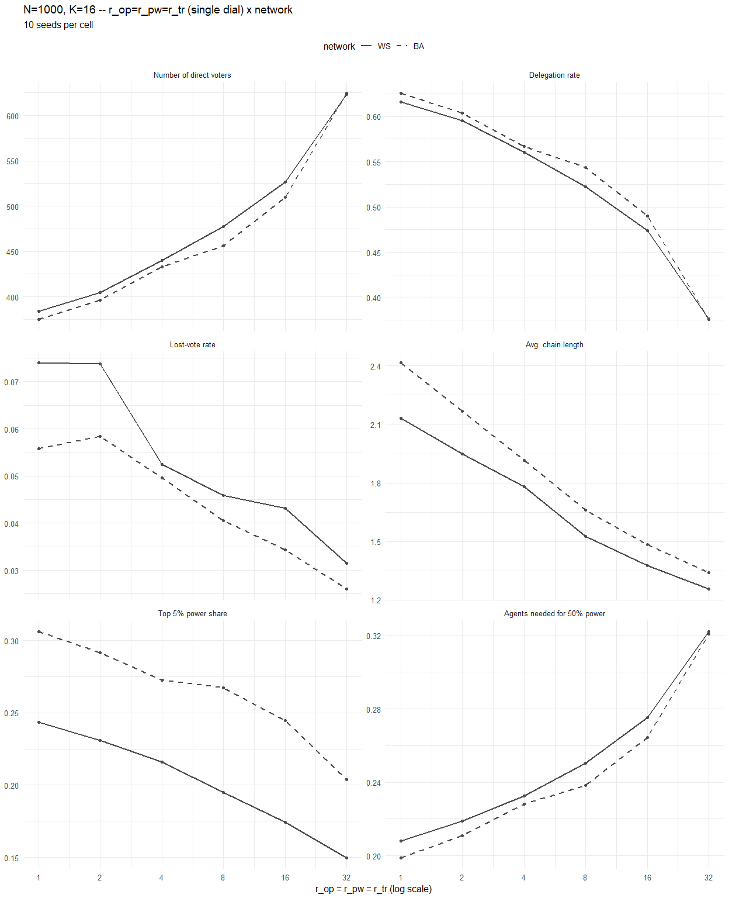<!-- -->

------------------------------------------------------------------------

# RQ1-RQ3

## Fixed inputs

**N = 500, K = 18, T = 60 (20 voting rounds), c = 0.5.**

## Extreme behaviour: single-dial vs. isolated dimensions, r up to 512

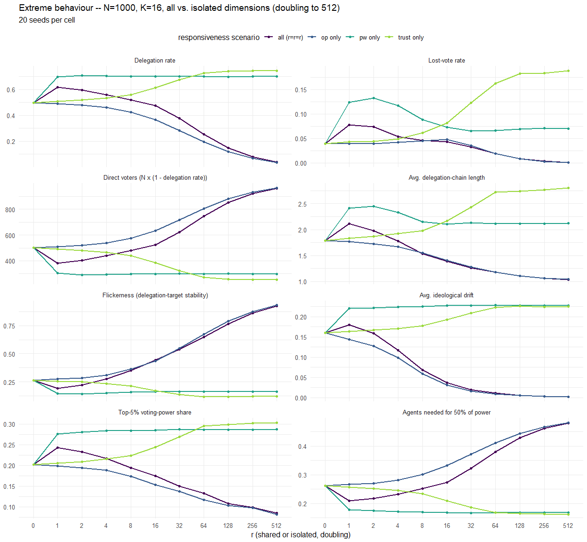<!-- -->

------------------------------------------------------------------------

## Shared design: paired sweep, third dimension held fixed

Same sweep grid for all three RQs. For each pair of responsiveness
dimensions, both are varied *together* (same shared value) across
$r \in \{1,2,4,8,16,32\}$, while the third dimension is held fixed at
one of 4 levels ($0, 1, 8, 16$).

- $r_{op} = r_{pw} \in \{1,2,4,8,16,32\}$, $r_{tr} \in \{0,1,8,16\}$
  (fixed)
- $r_{op} = r_{tr} \in \{1,2,4,8,16,32\}$, $r_{pw} \in \{0,1,8,16\}$
  (fixed)
- $r_{pw} = r_{tr} \in \{1,2,4,8,16,32\}$, $r_{op} \in \{0,1,8,16\}$
  (fixed)

------------------------------------------------------------------------

# Simulation grid (answers RQ1, RQ2 and RQ3 at once)

------------------------------------------------------------------------

# RQ1: delegation behaviour

Metrics: delegation rate, lost-vote rate, number of direct voters,
average delegation-chain length, and flickerness (share of agents
keeping the same delegation target as the previous round –
`history_flickerness` from `simulate_liquid_democracy()`, NA on round 1;
see `Network.R`’s `history_stability[t]` computation for the exact
per-round definition).

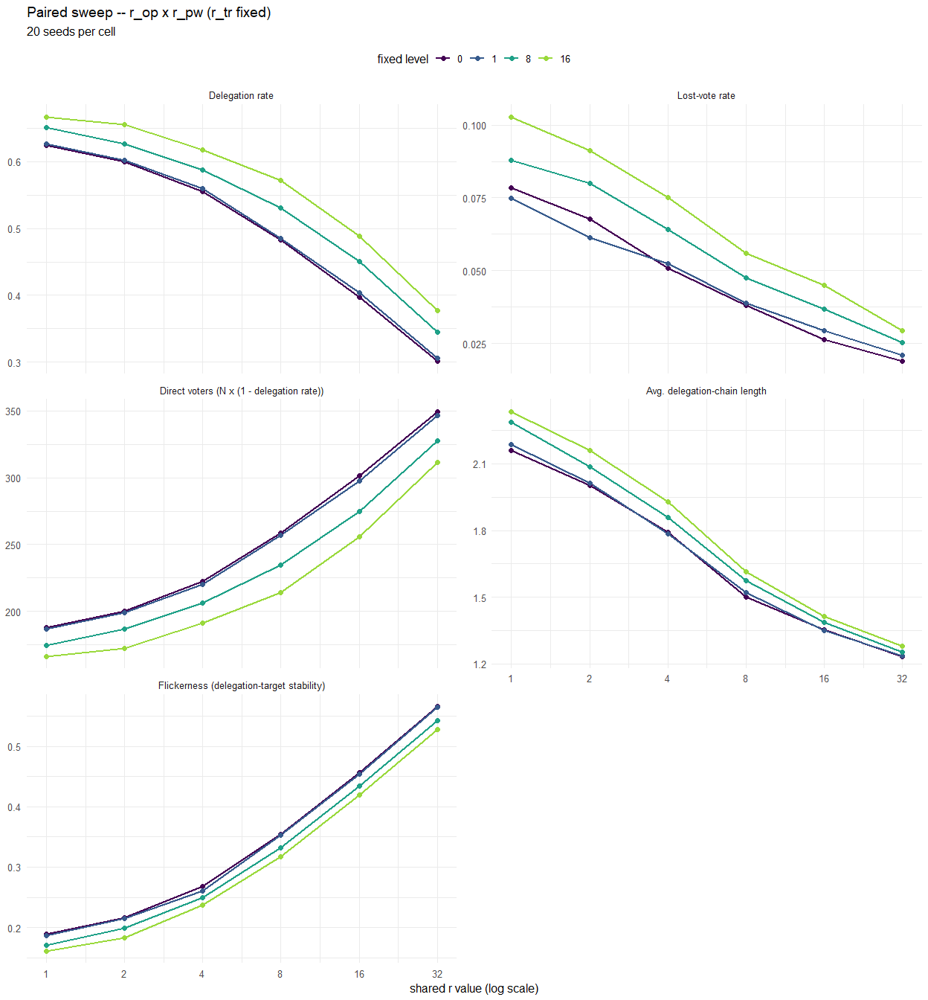<!-- -->

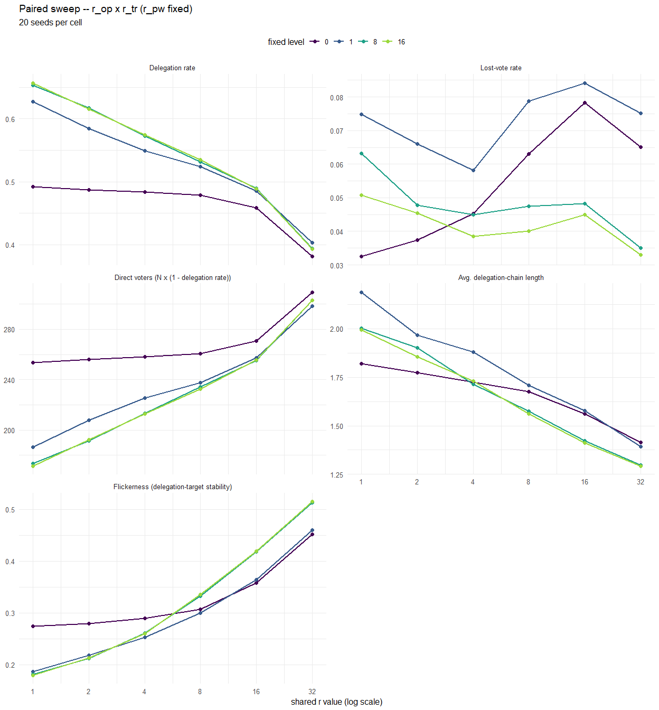<!-- -->

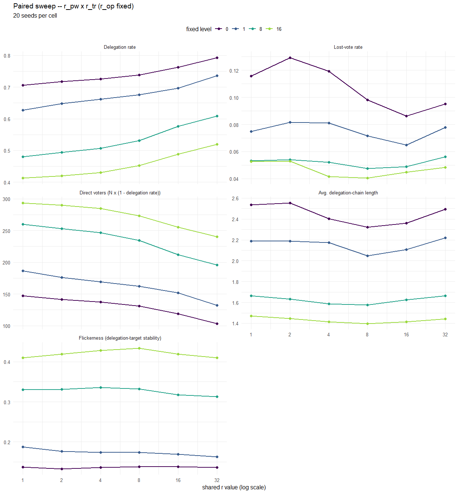<!-- -->

------------------------------------------------------------------------

# RQ2: quality of political representation

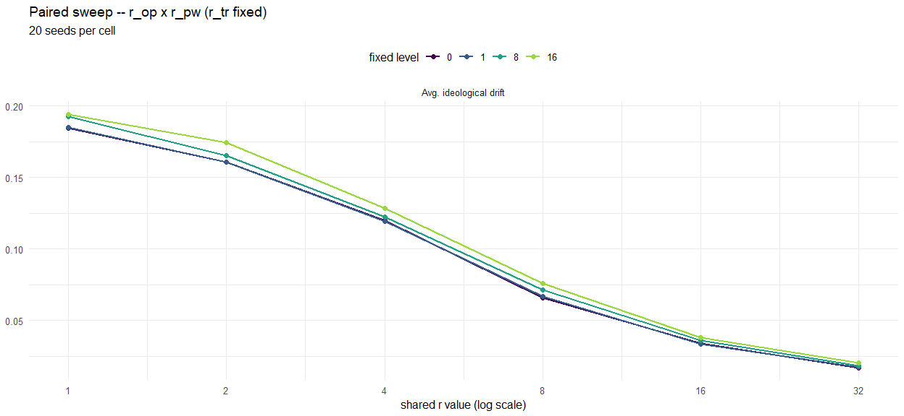<!-- -->

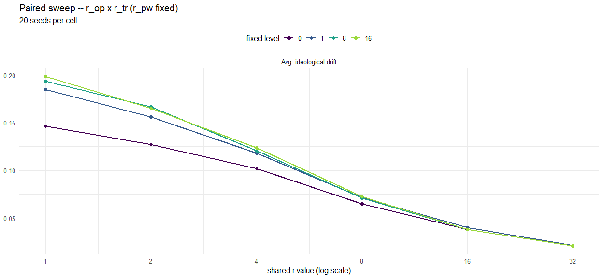<!-- -->

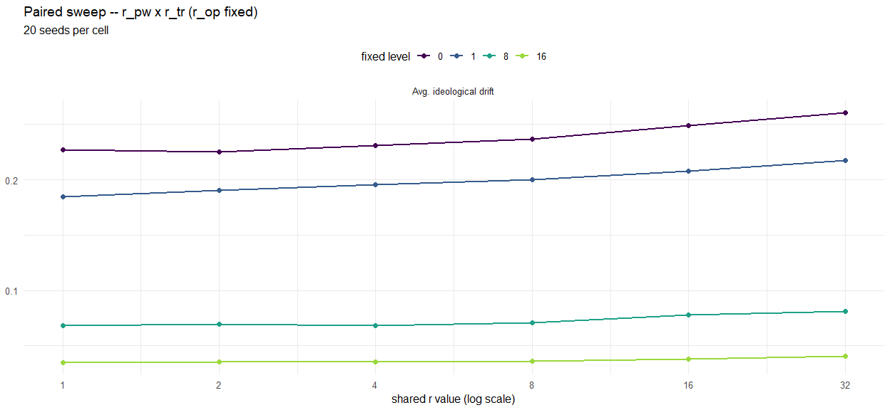<!-- -->

------------------------------------------------------------------------

# RQ3: concentration of voting power

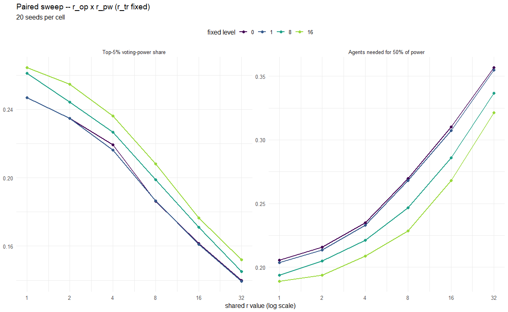<!-- -->

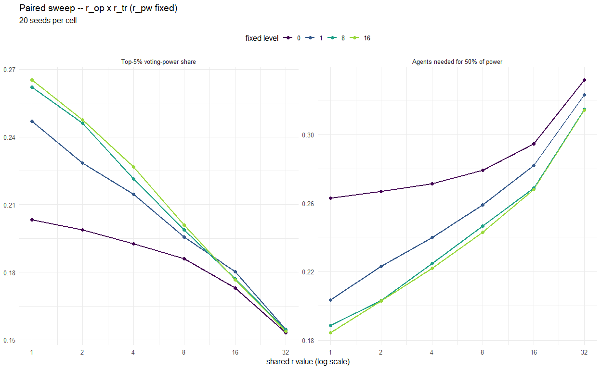<!-- -->

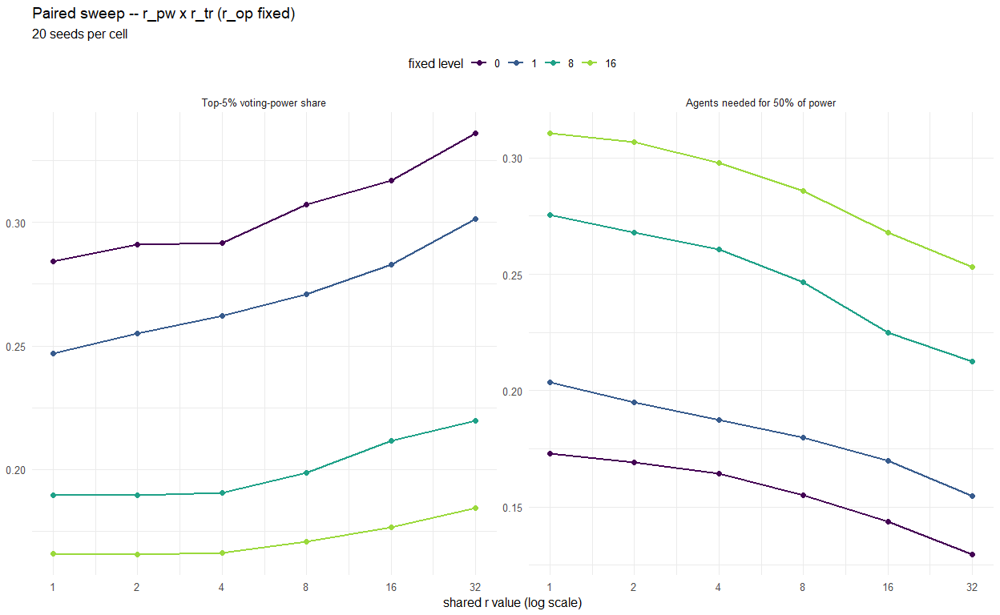<!-- -->
