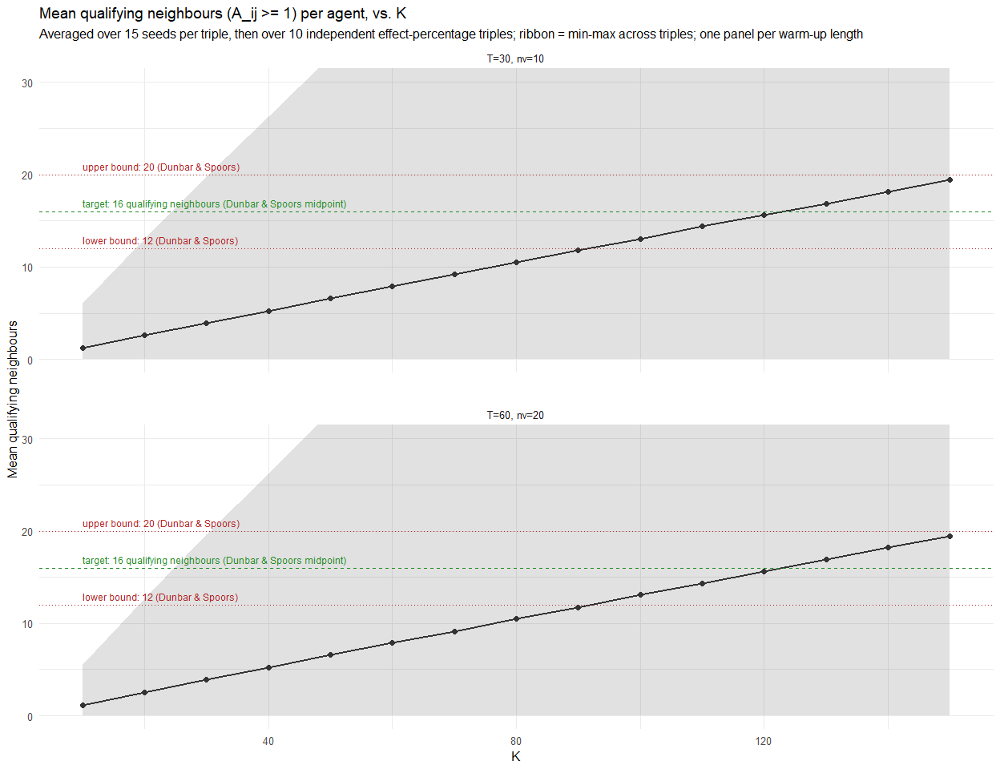
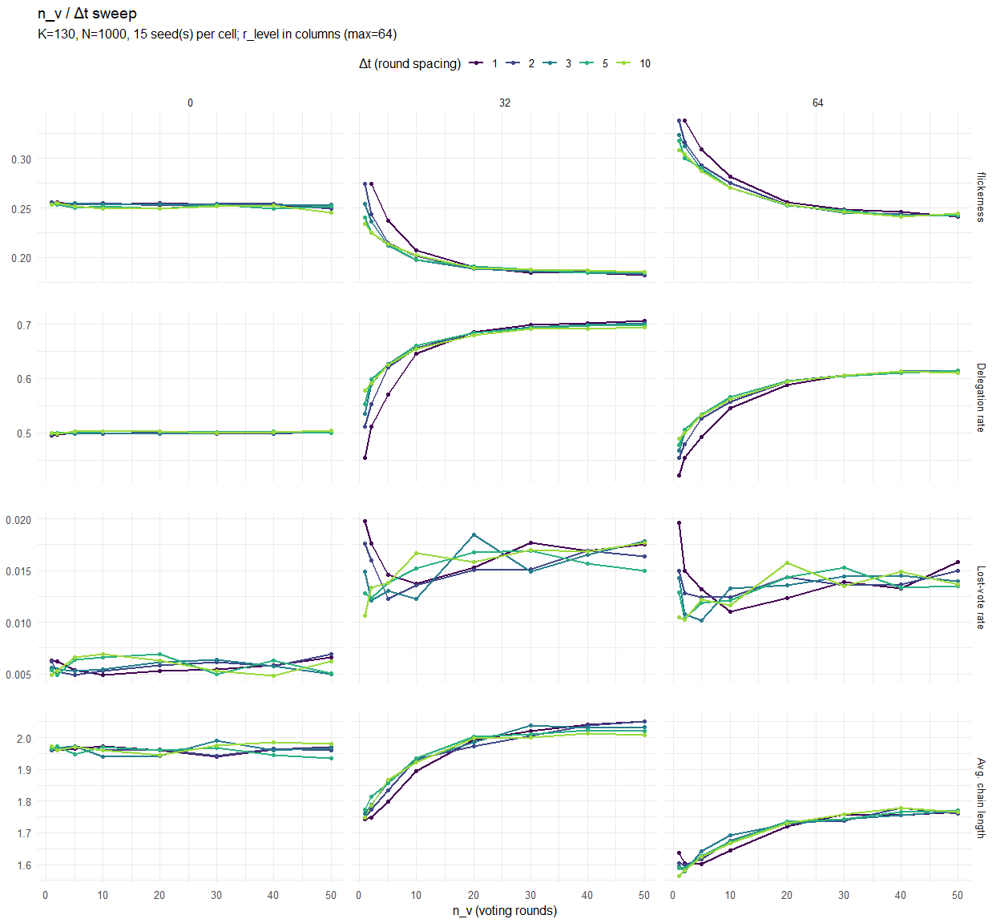
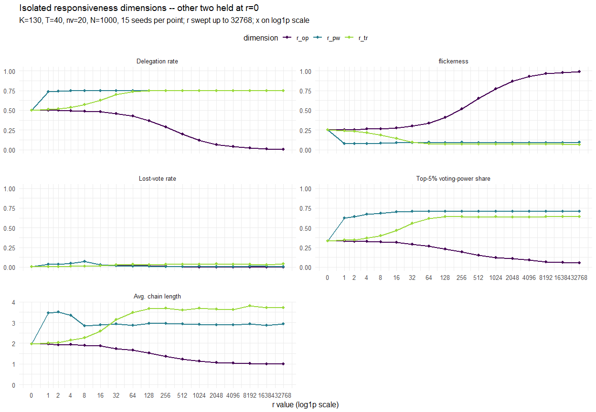
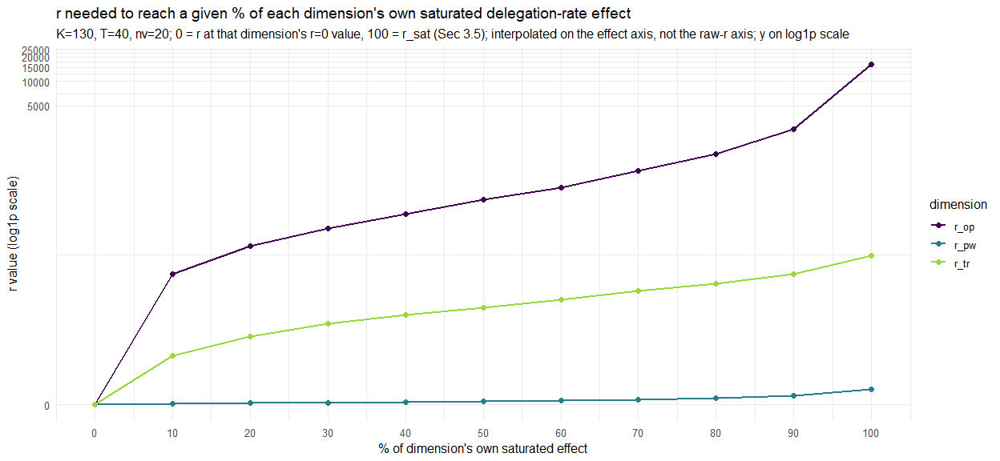
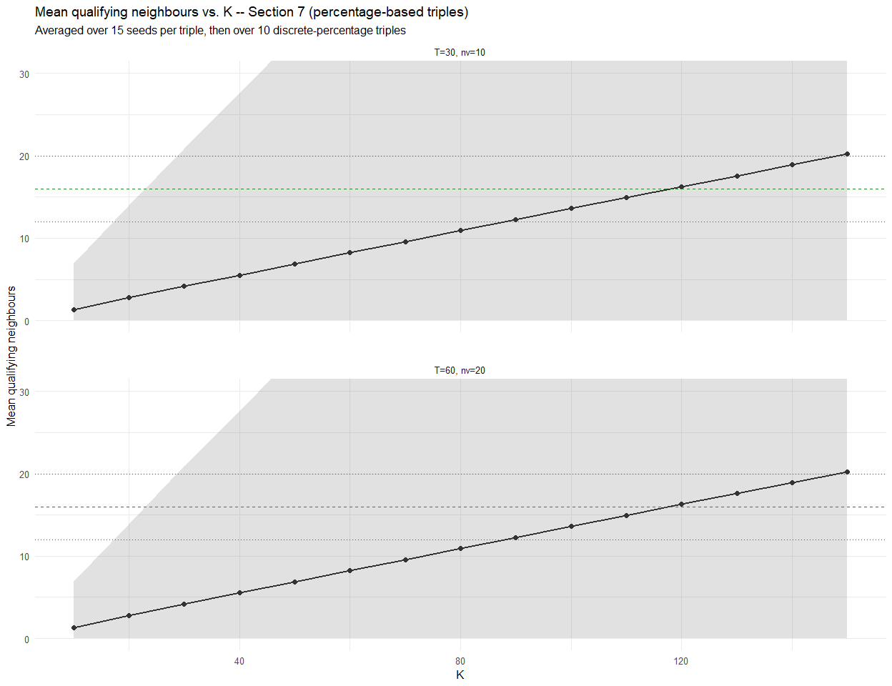
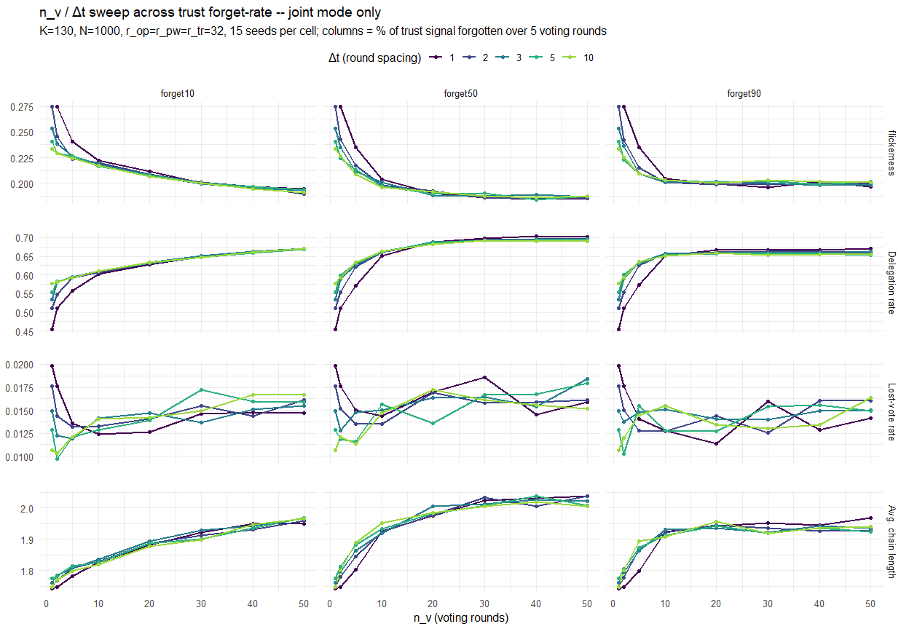
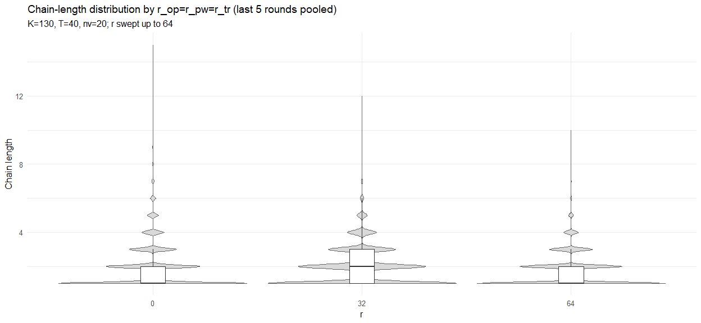
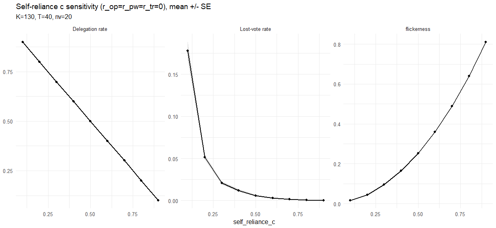
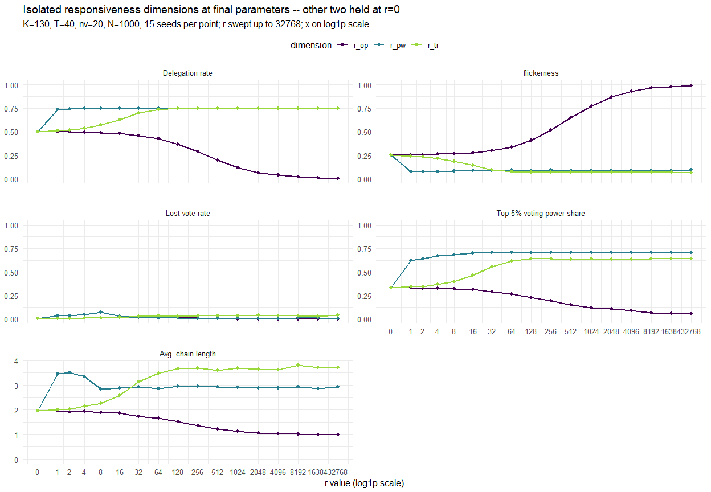
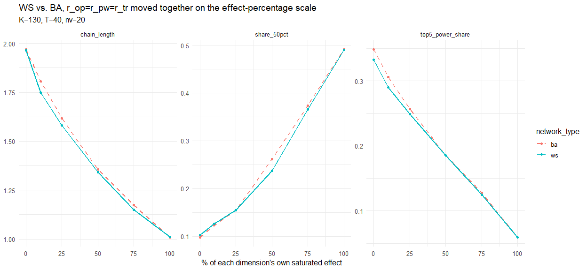

Report 22 – K, T, and r calibration
================
2026-09-06

# 2. Attractiveness-threshold validation (the K decision)

## 2.1 Definition

For agent $i$ and neighbour $j$, $j$ qualifies as a usable delegation
target if j is at least as attractive as i is (\>= 1).

## 2.3 Independent effect-percentage r-triples

| pct |    r_op | r_pw |  r_tr |
|----:|--------:|-----:|------:|
|   0 |    0.00 | 0.00 |  0.00 |
|  10 |   12.81 | 0.04 |  2.55 |
|  20 |   27.90 | 0.08 |  5.10 |
|  30 |   47.54 | 0.11 |  7.65 |
|  40 |   71.79 | 0.15 | 10.56 |
|  50 |  107.76 | 0.19 | 13.98 |
|  60 |  161.72 | 0.23 | 17.39 |
|  70 |  238.83 | 0.27 | 22.30 |
|  80 |  416.77 | 0.37 | 27.98 |
|  90 |  872.41 | 0.55 | 37.98 |
| 100 | 8192.00 | 1.14 | 54.86 |

r needed to reach a given % of each dimension’s own saturated effect
(bootstrap r-sweep)

| triple_id | pct_op | pct_pw | pct_tr |    r_op | r_pw |  r_tr |
|----------:|-------:|-------:|-------:|--------:|-----:|------:|
|         1 |     33 |     33 |     33 |   53.84 | 0.13 |  8.41 |
|         2 |     66 |     66 |     66 |  207.99 | 0.25 | 20.13 |
|         3 |    100 |    100 |    100 | 8192.00 | 1.14 | 54.86 |
|         4 |    100 |     33 |     33 | 8192.00 | 0.13 |  8.41 |
|         5 |     33 |    100 |     33 |   53.84 | 1.14 |  8.41 |
|         6 |      0 |     66 |     66 |    0.00 | 0.25 | 20.13 |
|         7 |     66 |      0 |     66 |  207.99 | 0.00 | 20.13 |
|         8 |     66 |     66 |      0 |  207.99 | 0.25 |  0.00 |
|         9 |      0 |    100 |     33 |    0.00 | 1.14 |  8.41 |
|        10 |     33 |      0 |    100 |   53.84 | 0.00 | 54.86 |

The 10 fixed effect-percentage combinations used below, translated to r
via the bootstrap r-sweep

Each row is a hand-picked $(pct_{op}, pct_{pw}, pct_{tr})$ combination
from $\{0, 33, 66, 100\}$, hand picked since i had to make sure that
$(pct_{op}$ contaions 0, since otherwise the amount of qualified number
dropped drasticly

## 2.4 First calibration of K

| warmup_label | T_warmup | nv_warmup |
|:-------------|---------:|----------:|
| T=30, nv=10  |       30 |        10 |
| T=60, nv=20  |       60 |        20 |

## 2.6 Plot

<!-- -->

## 2.7 Read-off and decision

| warmup_label | target_reached | chosen_k | max_qualifying |
|:-------------|:---------------|---------:|---------------:|
| T=30, nv=10  | TRUE           |      130 |          19.49 |
| T=60, nv=20  | TRUE           |      130 |          19.46 |

K read-off (first run)

# 2b. T/n_voting_rounds calibration

## 2b.2 Plots

<!-- -->

# 3. Responsiveness-range saturation ($r_{op}, r_{pw}, r_{tr}$)

K is fixed at 130 (Sec 2, provisional first guess – refined in Sec 5);
T=40, nv=20, Δt=2 (fixed above, Sec 2b.3).

## 3.1 Grid and computation

## 3.2 Isolated dimensions ($r_{op}$, $r_{pw}$, $r_{tr}$ swept alone)

<!-- -->

## 3.3 Step-to-step deltas

| dim |    r_val | mean_val |   delta |
|:----|---------:|---------:|--------:|
| op  |     0.00 |   0.5007 |      NA |
| op  |     1.00 |   0.5001 | -0.0006 |
| op  |     2.00 |   0.4983 | -0.0018 |
| op  |     4.00 |   0.4941 | -0.0043 |
| op  |     8.00 |   0.4904 | -0.0037 |
| op  |    16.00 |   0.4803 | -0.0101 |
| op  |    32.00 |   0.4602 | -0.0201 |
| op  |    64.00 |   0.4279 | -0.0323 |
| op  |   128.00 |   0.3667 | -0.0612 |
| op  |   256.00 |   0.2871 | -0.0796 |
| op  |   512.00 |   0.1953 | -0.0918 |
| op  |  1024.00 |   0.1211 | -0.0743 |
| op  |  2048.00 |   0.0663 | -0.0548 |
| op  |  4096.00 |   0.0371 | -0.0293 |
| op  |  8192.00 |   0.0185 | -0.0185 |
| op  | 16384.00 |   0.0100 | -0.0085 |
| pw  |     0.00 |   0.5007 |      NA |
| pw  |     0.13 |   0.6575 |  0.1568 |
| pw  |     0.27 |   0.7013 |  0.0437 |
| pw  |     0.40 |   0.7171 |  0.0159 |
| pw  |     0.53 |   0.7268 |  0.0096 |
| pw  |     0.67 |   0.7320 |  0.0052 |
| pw  |     0.80 |   0.7343 |  0.0024 |
| pw  |     0.93 |   0.7355 |  0.0012 |
| pw  |     1.07 |   0.7377 |  0.0022 |
| pw  |     1.20 |   0.7380 |  0.0003 |
| pw  |     1.33 |   0.7397 |  0.0017 |
| pw  |     1.47 |   0.7398 |  0.0001 |
| pw  |     1.60 |   0.7414 |  0.0016 |
| pw  |     1.73 |   0.7411 | -0.0003 |
| pw  |     1.87 |   0.7425 |  0.0013 |
| pw  |     2.00 |   0.7425 |  0.0000 |
| tr  |     0.00 |   0.5007 |      NA |
| tr  |    17.07 |   0.6358 |  0.1351 |
| tr  |    34.13 |   0.7050 |  0.0692 |
| tr  |    51.20 |   0.7281 |  0.0231 |
| tr  |    68.27 |   0.7371 |  0.0090 |
| tr  |    85.33 |   0.7421 |  0.0050 |
| tr  |   102.40 |   0.7432 |  0.0011 |
| tr  |   119.47 |   0.7462 |  0.0030 |
| tr  |   136.53 |   0.7458 | -0.0003 |
| tr  |   153.60 |   0.7473 |  0.0015 |
| tr  |   170.67 |   0.7472 | -0.0001 |
| tr  |   187.73 |   0.7480 |  0.0008 |
| tr  |   204.80 |   0.7477 | -0.0003 |
| tr  |   221.87 |   0.7479 |  0.0002 |
| tr  |   238.93 |   0.7480 |  0.0001 |
| tr  |   256.00 |   0.7481 |  0.0000 |

Delegation rate and step-to-step delta per r-value, one block per
isolated dimension

## 3.4 Saturation point (change stays below 1 percentage point) + chosen r ceiling

| dim |     r_sat |
|:----|----------:|
| op  | 16384.000 |
| pw  |     0.533 |
| tr  |    68.267 |

Chosen r ceiling per dimension

- **r_op = 16384.00**
- **r_pw = 0.53**
- **r_tr = 68.27**

## 3.6 r needed to reach a given % of each dimension’s own saturated effect

<!-- -->

# 5. K/T/r first values (first run)

| iter |   K |   T |  NV |  DT | r_sat_op | r_sat_pw | r_sat_tr |
|-----:|----:|----:|----:|----:|---------:|---------:|---------:|
|    0 | 130 |  40 |  20 |   2 |    16384 |    0.533 |   68.267 |

K/T/r across loop iterations

**K did NOT converge within 1 iterations** (K sequence: 130) – the
iteration-0 values below are reported as provisional, not converged. A
wider K-sweep range or a looser tolerance would be needed to close the
loop.

# 6. Final calibrated values

- **K = 130** – plot-anchored: smallest K clearing 16 qualifying
  neighbours across 10 independent effect-percentage triples,
  warm-up-length check as in Sec 2, converged at iteration 0.
- **T = 40, n_voting_rounds = 20, Δt = 2** – saturation read-off across
  5 Δt candidates, r_level=0/32/64, and both joint/trust-only modes,
  +10% buffer.
- **r ceilings** – r_op=16384.00, r_pw=0.53, r_tr=68.27 – smallest r per
  dimension at which delegation_rate stays within 1 percentage point of
  its own steady value through to the end of that dimension’s own swept
  range.

# 6. K/T re-validation

Sections 2-6 above are untouched – this is an additional robustness
check, not a replacement. Now we run with the values from the first part
the same tests again to validate.

## 7.1 Ten independent percentage triples (discrete levels)

| triple_id | pct_op | pct_pw | pct_tr |     r_op | r_pw |  r_tr |
|----------:|-------:|-------:|-------:|---------:|-----:|------:|
|         1 |    100 |      0 |     25 | 16384.00 | 0.00 |  7.47 |
|         2 |      0 |     50 |     25 |     0.00 | 0.10 |  7.47 |
|         3 |    100 |     50 |    100 | 16384.00 | 0.10 | 68.27 |
|         4 |    100 |     25 |    100 | 16384.00 | 0.05 | 68.27 |
|         5 |     75 |      0 |     50 |   943.99 | 0.00 | 14.93 |
|         6 |      0 |     25 |      0 |     0.00 | 0.05 |  0.00 |
|         7 |     25 |     50 |      0 |   116.08 | 0.10 |  0.00 |
|         8 |     75 |      0 |     50 |   943.99 | 0.00 | 14.93 |
|         9 |     25 |      0 |     25 |   116.08 | 0.00 |  7.47 |
|        10 |     50 |      0 |     75 |   344.51 | 0.00 | 27.48 |

The 10 discrete-percentage triples used below (levels: 0, 25, 50, 75,
100), translated to r via Section 3’s r3_isolated_final/r_sat_isolated

## 7.2 K decision re-run with these triples

<!-- -->

| warmup_label | target_reached | chosen_k | max_qualifying |
|:-------------|:---------------|---------:|---------------:|
| T=30, nv=10  | TRUE           |      120 |          20.24 |
| T=60, nv=20  | TRUE           |      120 |          20.22 |

Section 7 K read-off per warm-up length (percentage-based triples)

**Section 2 (continuous percentage sampling): K = 130. Section 7
(discrete percentage levels 0/25/50/75/100): K = 120.** They do NOT
agree – the larger (more conservative) of the two, K = 130, is the one
to lean toward for the thesis, since it’s the one that clears the
qualifying-neighbour target under both sampling schemes.

## 7.3 Δt x λ (trust forget-rate) interaction, joint mode only

For reference: the report’s own default `LAMBDA_CONTEXT = 0.1000`
corresponds to **41.0% forgotten after 5 voting rounds** – this falls
between the `forget10` and `forget50` columns below, not at either one,
so neither sweep column should be read as reproducing the report’s
actual working default.

**Warning: 84 (nv, dt, lambda) combinations have fewer than 3 voting
rounds in the last-5-calendar-round steady-state window**
(e.g. nv=1,dt=1,forget10; nv=1,dt=1,forget50; nv=1,dt=1,forget90;
nv=1,dt=2,forget10; nv=1,dt=2,forget50) – their steady-state values may
look unsaturated simply because trust had too few updates in that
window, not because of dt or lambda itself. Read these cells with
caution.

<!-- -->

# 8. Additional checks

## 8.1 Chain-length distribution (violin)

<!-- -->

## 8.2 Self-reliance c sensitivity

<!-- -->

## 8.3 Final parameter table

| Parameter | Value | Note |
|:---|:---|:---|
| K | 130 | Attractiveness-threshold, Sec 2/5 |
| N | 1000 | Fixed |
| T | 40 | = nv \* dt, Sec 2b/5 |
| n_voting_rounds | 20 | Sec 2b/5 |
| delta_t | 2 | Sec 2b/5 |
| lambda | 0.1000 | 41.0% of a trust signal forgotten over the 5-round averaging window (metrics are always meaned over the last 5 voting rounds); half-life = 6.6 voting rounds |
| self_reliance_c | 0.5 | See Sec 8.2 for sensitivity |
| r_op ceiling | 16384.00 | re-run at final nv/dt, above |
| r_pw ceiling | 0.53 | re-run at final nv/dt, above |
| r_tr ceiling | 68.27 | re-run at final nv/dt, above |

<!-- -->

## 8.4 WS vs. BA on the percentage r-scale

<!-- -->

## 8.5 Lost-vote cycle-length breakdown

No lost votes observed at the tested r-levels.
