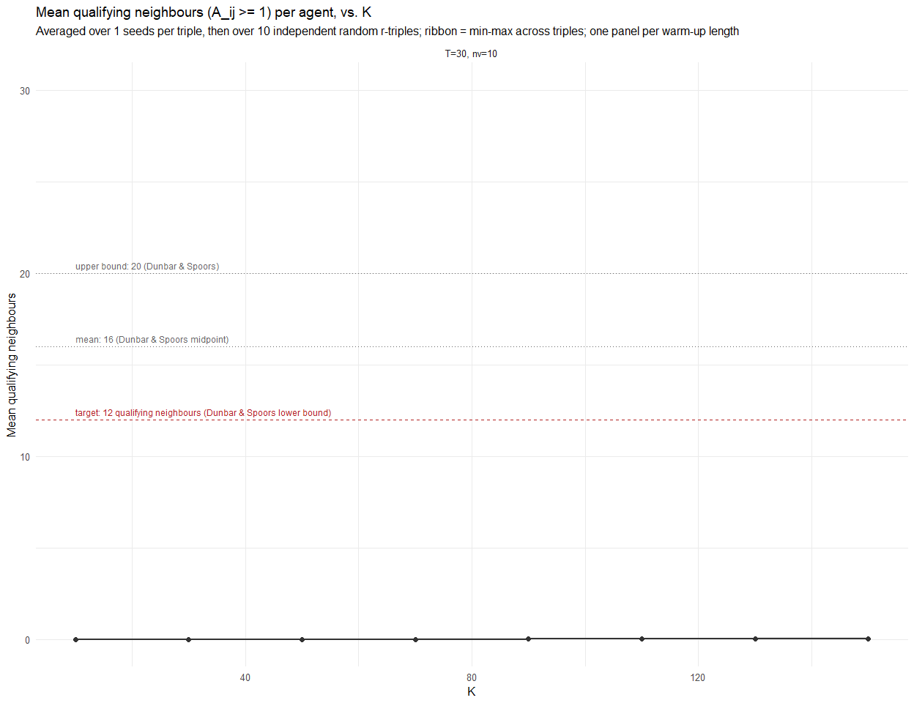

Report 22, Part 2 – Attractiveness-threshold validation (the K decision)
================
2026-09-05

> **Split note:** Split out of `Report_22.Rmd` so each part can be knit
> independently. See `Report_22_3_RSaturation.Rmd` and
> `Report_22_4_ChainCycles.Rmd` for the rest (a context-only
> `Report_22_1_KContext.Rmd`, reconstructing Report 21’s exploratory
> K=8-48 sweep, was dropped – nothing downstream depends on it). This
> part is fully self-contained and is the one that produces
> `CHOSEN_K_22` (reused, recomputed via the same cache, by Parts 3 and
> 4).

# 2. Attractiveness-threshold validation (the actual K decision)

**This section replaces an earlier version of itself.** That version
drifted from the actual task in three ways, corrected here: (a) it used
Dunbar & Spoors’ 16 midpoint instead of their 12 lower bound as the
target; (b) it used 4 fixed $(r_{op}=r_{pw}=r_{tr})$ values applied as a
*shared* dial, which only tests the diagonal of the 3-dimensional
parameter space, not genuinely independent settings; (c) it silently
picked one warm-up simulation length without acknowledging that
T/n_voting_rounds haven’t actually been calibrated yet, so K’s
calibration is implicitly running ahead of T’s. All three are fixed
below.

## 2.1 Definition

For agent $i$ and neighbour $j$, $j$ **qualifies** as a usable
delegation target if $A_{ij}\geq 1$ – at least as attractive to $i$ as
$i$ itself (the self/no-delegation baseline; see Report 21’s Model
section, $M=4$ ceiling, $A_{ij}=1$ at the
identical-opinion/identical-power/neutral-trust point). $A_{ij}$ is
computed with `Network.R`’s own `attractiveness_expose()` and the same
trust-modifier factor used inside `simulate_liquid_democracy()`’s round
loop – not re-derived.

## 2.2 Ten independent random $(r_{op}, r_{pw}, r_{tr})$ triples

Back to drawing genuinely independent settings across the 3-dimensional
parameter space (not tied together as a shared dial) – but now, rather
than a blind $\text{Uniform}(0, 64)$ guess for all three dimensions,
each dimension is drawn from **its own range**, informed by
`Report_22_3_RSaturation.Rmd`’s per-dimension chosen r ceiling (Sec 3.5
there). K (here) and r’s ceiling (there) are mutually dependent – K
needs an r-range here, the r-range there needs a K – so this is
deliberately **not** live-reproduced from Part 3’s own `run_cached()`
output (that would be circular); the three ranges below are fixed
reference values instead, filled in from Part 3’s last knitted numbers.
**This is an explicit first-pass approximation**: start with these fixed
values, then re-run the full K -\> T -\> r -\> K loop once everything is
calibrated to check the two are still consistent with each other (a
separately scoped later step, same as the K/T/r joint-stability check
already flagged elsewhere in this report).

| triple_id |    r_op | r_pw |   r_tr |
|----------:|--------:|-----:|-------:|
|         1 | 1816.53 | 0.50 | 123.76 |
|         2 | 3666.30 | 0.69 | 115.76 |
|         3 | 1012.21 | 0.75 |  97.39 |
|         4 | 2690.75 | 0.57 |   6.32 |
|         5 |  332.98 | 0.12 |  97.75 |
|         6 | 2645.02 | 1.68 |  43.43 |
|         7 | 1890.16 | 1.81 |  26.66 |
|         8 | 2065.39 | 1.12 | 100.74 |
|         9 |  740.02 | 1.55 |  91.92 |
|        10 | 1929.70 | 0.29 | 126.33 |

The 10 independent random r-triples used below (seed=20220), each
dimension drawn from its own Part-3-informed range

`R_SHARED_LEVELS <- c(0, 1, 4, 16, 32)` (the 5 shared dial levels used
by an earlier version of this section) is no longer needed here at all –
it only still exists as an extra line inside
`Report_22_2b_TCalibration.Rmd`’s and `Report_22_3_RSaturation.Rmd`’s
own copies of the `reused-k-decision` chunk, kept there purely because
Part 2b’s own T-calibration robustness check reuses it for something
unrelated to K; it no longer feeds into `r_triples` above.

## 2.3 The warm-up-length problem

Computing $A_{ij}$ needs agents to have non-trivial power and trust
first: at pure initial state ($p_i=1$, $\tau_{ij}=1$ for everyone), both
$a^{pw}_{ij}=2\mathcal L(r_{pw}(p_j/p_i-1))$ and
$a^{tr}_{ij}=2\mathcal L(r_{tr}(\tau_{ij}-1))$ evaluate to **exactly 1
regardless of $r_{pw}$ or $r_{tr}$** (the ratio/deviation inside each
$\mathcal L(\cdot)$ is 0 for everyone), collapsing $A_{ij}$ to depend on
$r_{op}$ alone – trivially $A_{ij}=1$ for all $j$ at $r_{op}=0$
(qualifying count = K, always), trivially $A_{ij}<1$ for virtually all
$j$ at any $r_{op}>0$. Neither is informative, so a short warm-up
simulation runs first.

**But T/n_voting_rounds have not been calibrated yet** (a separate,
not-yet-done task) – any warm-up length used here is necessarily a
placeholder, which means K’s calibration is implicitly running ahead of
T’s. Rather than picking one arbitrary length and moving on silently,
**two placeholder warm-up lengths are run and compared**:

| warmup_label | T_warmup | nv_warmup |
|:-------------|---------:|----------:|
| T=30, nv=10  |       30 |        10 |

If the two give materially the same K read-off, that read-off is treated
as robust to the (still uncalibrated) warm-up length below. If they
disagree, that is reported plainly rather than resolved by picking one –
it would mean K genuinely can’t be finalised independently of T.

## 2.4 Grid and computation

A comfortable “N $\gg$ K” margin at the sweep’s top end (K=150) needs N
well above the naive N=1000 baseline (N/K $\approx$ 6.7 there is not a
comfortable margin). At N=1000, K=150: $\ln(N)=$ 6.91, $K/\ln(N)=$ 21.7,
$N/K=$ 6.7.

**FAST-RUN note:** N_THRESH is currently 1000 for a fast first pass – at
this value the N/K margin above is the same weak ~6.7 ratio this
paragraph argues against, NOT a comfortable one; restore N_THRESH to
2000+ before treating the K read-off below as final.

## 2.5 Plot

<!-- -->

## 2.6 Read-off and decision

| warmup_label | target_reached | chosen_k | max_qualifying |
|:-------------|:---------------|---------:|---------------:|
| T=30, nv=10  | FALSE          |      150 |           0.02 |

K read-off per warm-up length

**Single warm-up length used (`T=30, nv=10`) – K = 150.** Target of 12
qualifying neighbours was NOT reached anywhere in the swept range (max
0.02) – the sweep ceiling K=150 is adopted as a placeholder. **This is a
reduced fast-run configuration**: WARMUP_CONFIGS normally holds two rows
(`T=30/nv=10` and `T=60/nv=20`) to check the K read-off is robust to the
still-uncalibrated warm-up length (Sec 2.3) – that comparison is skipped
here. Restore both rows before treating this K as final.

K is chosen as **the smallest network degree at which agents have, on
average, at least 12 attractiveness-qualifying neighbours across 10
independent random $(r_{op}, r_{pw}, r_{tr})$ triples** – a
plot-anchored modelling assumption, in the same style Report 21 used for
its own K choice, not a fitted or “true” value. Report 21’s original
K=8-48 sweep (reconstructed only as exploratory context in an earlier
version of this split, since dropped) is not the basis for the final K
choice; **this** plot, not that sweep and not the Dunbar citation alone,
is what actually decides K here.
