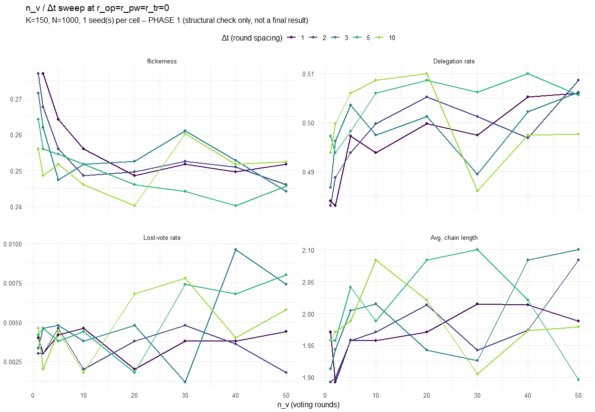
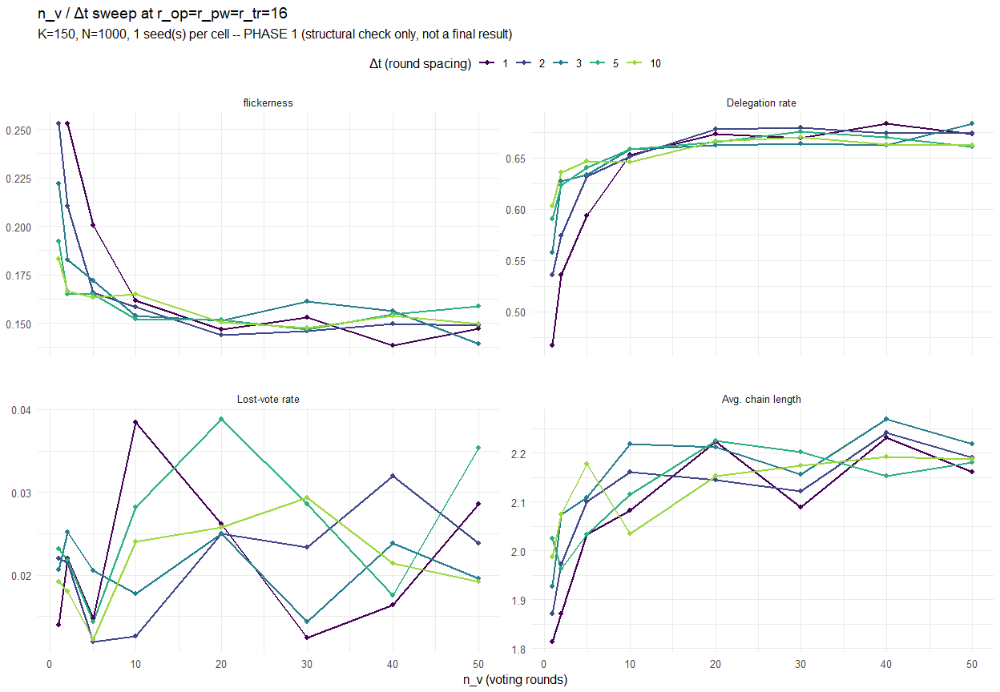

Report 22, Part 2b – T/n_voting_rounds calibration
================
2026-09-05

> **Split note:** Runs directly after Part 2
> (`Report_22_2_KDecision.Rmd`, which decides K) and before Part 3
> (`Report_22_3_RSaturation.Rmd`, which sweeps r). Needs `CHOSEN_K_22`
> from Part 2, so the hidden `reused-k-decision` chunk below silently
> re-runs Part 2’s full computation to obtain it, via the same
> `run_cached()` disk cache Part 2 populates – see
> `Report_22_2_KDecision.Rmd` for the annotated version.
>
> **This file was reworked to fix an invalid earlier design**: it used
> to read multiple $n_v$ values off a *single* long simulation run (one
> run per $\Delta t$/r-level/seed, with `n_voting_rounds = NV_MAX`,
> indexing into its history arrays at each intermediate voting round).
> That is **not** valid: $n_v$ determines *which* rounds are voting
> rounds via `round(seq(T/n_v, T, length.out = n_v))`, and the model
> tracks `pct_T = t/T` per round (`Network.R`’s snapshot fields) – so
> the state at round 50 of a $T=500$ run is not the same as the state at
> round 50 of a fresh $T=50$ run, even when both happen to share the
> same voting-round schedule up to that point. Every $(n_v, \Delta t)$
> cell below is now its own independent, complete
> `simulate_liquid_democracy()` call.
>
> **This file currently implements Phase 1 only**: a 1-seed structural/
> sanity check that the sweep is built correctly and the plot shape
> looks plausible. Phase 2 (many seeds, averaged steady-state,
> saturation read-off, final $(n_v, \Delta t, T)$ decision) is
> deliberately **not** implemented yet, so this file no longer produces
> `CHOSEN_NV_22`/ `CHOSEN_DT_22`/`CHOSEN_T_22`. **Known consequence, not
> fixed here (out of scope for this pass):**
> `Report_22_3_RSaturation.Rmd`’s own `reused-t-calibration` chunk still
> mirrors the old (invalid) single-long-run method and still produces
> those three values – Part 3 needs rewiring to this file’s real Phase 2
> output once that exists.

# 2b. T/n_voting_rounds calibration (Phase 1: structural sweep)

T/n_voting_rounds has been a completely unaddressed placeholder
throughout this report (flagged explicitly in Sec 2.3 above as a source
of circularity in K’s own calibration). This section calibrates it:
`n_voting_rounds` ($n_v$) is swept for a handful of round-spacing values
$\Delta t \in \{1, 2, 3, 5, 10\}$; $T = n_v \times \Delta t$ is
*derived*, not swept independently. Robustness is checked against two
background responsiveness settings,
$r_{op}=r_{pw}=r_{tr} \in \{0, 16\}$, at K = 150 (this section’s own
`reused-k-decision` chunk). The same `metrics_core` used throughout the
rest of this report (no new metrics) are used here too.

**Every $(n_v, \Delta t, r)$ cell below is its own independent, complete
`simulate_liquid_democracy()` call** at that cell’s own $T = n_v \times
\Delta t$ – not read off a single longer run at different checkpoints.
An earlier version of this section did exactly that (one run per
$\Delta t$/r/ seed with `n_voting_rounds = NV_MAX`, indexing its history
arrays at each intermediate voting round to save compute) and it is
invalid: $n_v$ determines *which* rounds are voting rounds
(`round(seq(T/n_v, T, length.out = n_v))`), and the model tracks
`pct_T = t/T` per round, so the state at round 50 of a much longer run
is not the same as the state at round 50 of a run whose $T$ actually is
50. By construction below (a fresh `simulate_liquid_democracy()` call
per grid row), no two $n_v$ values on the same $\Delta t$/r line share a
run object.

**This section currently implements Phase 1 only**: 1 seed per cell,
purely to confirm the sweep is built correctly and the plot shape looks
plausible – not a final, low-noise result. Phase 2 (Sec 2b.4) is not yet
implemented.

## 2b.1 Grid and computation

## 2b.2 Plots

One plot per background r-setting, faceted by metric, $n_v$ on the
x-axis, one line per $\Delta t$ – the direct analogue of
`Report_20.Rmd`’s `1.2b` plot (`facet_wrap(~metric)`, one coloured line
per grouping variable), with `x = nv` and `colour = factor(dt)` instead
of `x = round`/`colour = factor(K)`.

<!-- -->

<!-- -->

## 2b.3 Phase 1 sanity check

Before doing anything else with this sweep: confirm above that the shape
looks plausible (no implausible sharp jump between $n_v=1$ and the rest
of a line, which is what the earlier, invalid single-long-run version
produced). With only 1 seed per cell, the lines are expected to look
noisy; that alone is not a problem. If `NV_SWEEP`’s upper end (50)
doesn’t show a visible plateau for any metric/$\Delta t$/ r-setting
combination above, extend `NV_SWEEP` further and re-knit before moving
on.

## 2b.4 Phase 2 – not yet implemented

Once Sec 2b.2’s plots have been reviewed and confirmed structurally
sound, Phase 2 will: raise `N_SEEDS_T` (e.g. to 10) and average
steady-state values across seeds per cell before plotting; read off, by
inspection (annotated directly in prose, no automated changepoint
detector), the smallest $n_v$ beyond which further increases no longer
visibly change any metric across all $\Delta t$ lines, take the largest
such $n_v$ across the 4 metrics, add a small safety margin (e.g. +10%),
and cross-check that the same $\Delta t$ also sits past its own
saturation point; cross-check the two r-settings against each other,
taking the more conservative (larger) $n_v$/$\Delta t$ if they disagree;
and finally state the chosen $(n_v, \Delta t, T)$ explicitly, in the
same “plot-anchored modelling assumption” style used elsewhere in this
report for K, producing `CHOSEN_NV_22`/`CHOSEN_DT_22`/ `CHOSEN_T_22` for
Part 3 to consume. **None of that is implemented in this file yet** – do
not silently jump ahead to it.
