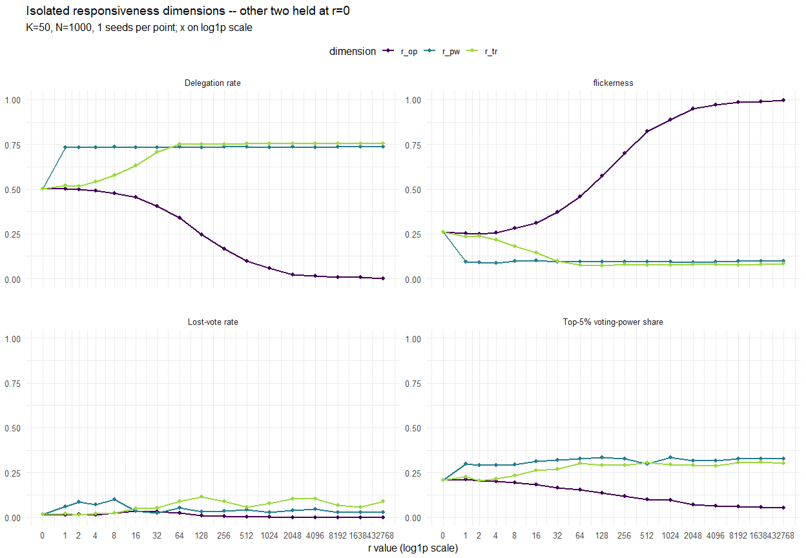
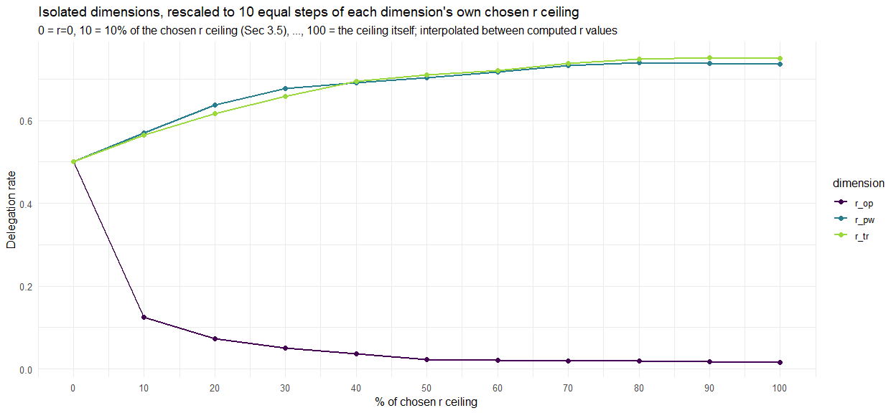

Report 22, Part 3 – Responsiveness-range saturation
================
2026-09-05

> **Split note:** Split out of `Report_22.Rmd` so each part can be knit
> independently. See `Report_22_2_KDecision.Rmd` and
> `Report_22_2b_TCalibration.Rmd` (also `Report_22_4_ChainCycles.Rmd`,
> not yet wired to this pipeline) for the rest (a context-only
> `Report_22_1_KContext.Rmd` was dropped – nothing downstream depends on
> it). This part needs `CHOSEN_K_22` from Part 2 and `CHOSEN_T_22`/
> `CHOSEN_NV_22` from Part 2b, so the hidden `reused-k-decision` and
> `reused-t-calibration` chunks below silently re-run those parts’ full
> computations – via the same `run_cached()` disk caches those parts
> populate, so if they’ve already been knit once this hits the cache and
> is fast, not a full re-simulation. See `Report_22_2_KDecision.Rmd` and
> `Report_22_2b_TCalibration.Rmd` for the annotated versions of this
> same computation.

# 3. Responsiveness-range saturation ($r_{op}, r_{pw}, r_{tr}$)

Where does each responsiveness parameter stop changing delegation
behaviour as it grows? This runs in two passes. **Coarse pass** (Sec
3.1-3.2): each dimension is swept **in isolation** (the other two held
at r=0) from 0 up to a shared ceiling of 32768 (doubling:
$0,1,2,4,8,16,32,64,128,256,512,1024,2048,4096,8192,16384,32768$),
tracking `delegation_rate`, `flickerness`, `lost_vote_rate`, and
`top5_power_share`. This coarse grid is far too sparse near the low end
to resolve a fast-saturating dimension – $r_{pw}$ in particular can
already be fully saturated somewhere between r=0 and r=1 (a gap the
doubling grid cannot see into at all), because power ratios are
unbounded once delegation concentrates power on hub agents, unlike
opinion/trust deviations, which stay bounded. **Fine pass** (Sec
3.3-3.6): a rough saturation estimate from the coarse pass is used to
size a second, evenly-spaced grid for the fast-saturating dimensions –
the same point count $r_{op}$ needed on the coarse grid, spread linearly
across each dimension’s own coarse range – and it is *that* fine pass
which actually decides the final chosen r ceiling per dimension, based
on **`delegation_rate` alone** (the most directly interpretable of the
four metrics, and the one every other metric here is itself downstream
of).

K is fixed at 50 (the Part 2 result), and T/n_voting_rounds are taken
from Part 2b’s calibration (50 rounds / 50 voting rounds, $\Delta t=$ 1)
rather than a placeholder – see `Report_22_2b_TCalibration.Rmd`.
$\lambda=$ 0.1 remains a fixed illustrative value, unchanged.

## 3.1 Grid and computation

## 3.2 Isolated dimensions ($r_{op}$, $r_{pw}$, $r_{tr}$ swept alone)

<!-- -->

## 3.3 Fine, evenly-spaced grid for the fast-saturating dimensions

$r_{op}$ already has ample near-origin resolution from the coarse
doubling grid above across its own wide range, so its points are kept
as-is below (up to its own coarse saturation estimate). $r_{pw}$ and
$r_{tr}$, which Sec 3.2 shows saturating far earlier, get a fresh,
**evenly (linearly) spaced** grid instead – the same point count
$r_{op}$ needed on the coarse grid to reach its own coarse estimate, but
spread across each of *their* own (much smaller) coarse range, so their
fast transition near r=0 finally gets resolved instead of jumping
straight from r=0 to r=1.

A rough coarse estimate per dimension comes first – same rule as Sec
3.5’s final read-off below, applied here just to size the fine grid, not
as the final answer:

$r_{op}$’s coarse estimate is 4096, reached at the 14-th coarse grid
point – so $r_{pw}$ and $r_{tr}$ each get 14 fresh points, evenly spaced
from 0 to their own coarse estimate (falling back to the full coarse
range if a dimension never coarse-saturated).

## 3.4 Step-to-step deltas

Delegation rate only – the metric the chosen r ceiling (Sec 3.5) is
actually based on. $r_{op}$’s rows below are its original coarse points;
$r_{pw}$/$r_{tr}$’s are the new fine, evenly-spaced points from Sec 3.3.

| dim |   r_val | mean_val |   delta |
|:----|--------:|---------:|--------:|
| op  |    0.00 |   0.5008 |      NA |
| op  |    1.00 |   0.5004 | -0.0004 |
| op  |    2.00 |   0.5000 | -0.0004 |
| op  |    4.00 |   0.4926 | -0.0074 |
| op  |    8.00 |   0.4768 | -0.0158 |
| op  |   16.00 |   0.4548 | -0.0220 |
| op  |   32.00 |   0.4054 | -0.0494 |
| op  |   64.00 |   0.3412 | -0.0642 |
| op  |  128.00 |   0.2462 | -0.0950 |
| op  |  256.00 |   0.1678 | -0.0784 |
| op  |  512.00 |   0.0964 | -0.0714 |
| op  | 1024.00 |   0.0576 | -0.0388 |
| op  | 2048.00 |   0.0230 | -0.0346 |
| op  | 4096.00 |   0.0156 | -0.0074 |
| pw  |    0.00 |   0.5008 |      NA |
| pw  |    0.15 |   0.6716 |  0.1708 |
| pw  |    0.31 |   0.7026 |  0.0310 |
| pw  |    0.46 |   0.7390 |  0.0364 |
| pw  |    0.62 |   0.7368 | -0.0022 |
| pw  |    0.77 |   0.7368 |  0.0000 |
| pw  |    0.92 |   0.7334 | -0.0034 |
| pw  |    1.08 |   0.7344 |  0.0010 |
| pw  |    1.23 |   0.7318 | -0.0026 |
| pw  |    1.38 |   0.7348 |  0.0030 |
| pw  |    1.54 |   0.7326 | -0.0022 |
| pw  |    1.69 |   0.7336 |  0.0010 |
| pw  |    1.85 |   0.7320 | -0.0016 |
| pw  |    2.00 |   0.7314 | -0.0006 |
| tr  |    0.00 |   0.5008 |      NA |
| tr  |    9.85 |   0.5924 |  0.0916 |
| tr  |   19.69 |   0.6522 |  0.0598 |
| tr  |   29.54 |   0.7058 |  0.0536 |
| tr  |   39.38 |   0.7154 |  0.0096 |
| tr  |   49.23 |   0.7404 |  0.0250 |
| tr  |   59.08 |   0.7528 |  0.0124 |
| tr  |   68.92 |   0.7504 | -0.0024 |
| tr  |   78.77 |   0.7544 |  0.0040 |
| tr  |   88.62 |   0.7512 | -0.0032 |
| tr  |   98.46 |   0.7508 | -0.0004 |
| tr  |  108.31 |   0.7504 | -0.0004 |
| tr  |  118.15 |   0.7524 |  0.0020 |
| tr  |  128.00 |   0.7514 | -0.0010 |

Delegation rate and step-to-step delta per r-value, one block per
isolated dimension

## 3.5 Saturation point (change stays below 1 percentage point) + chosen r ceiling

Same rule as Sec 3.3’s coarse estimate, now applied to
`r3_isolated_final` (op’s coarse points + pw/tr’s fine points) – this is
the actual final answer, not just a sizing estimate. Requiring the
change to *stay* below threshold, not just dip below it once, still
matters: a naive first-crossing read would latch onto an early quiet
patch (r_op/r_pw/r_tr often barely move right around r=0, too small to
have much effect yet, not because the curve has already flattened) and
report an implausibly small r as “saturated” even when the curve keeps
changing meaningfully afterwards. `NA` if the change never stays below
threshold through to the end of that dimension’s own range. This r-value
becomes the **chosen r ceiling** for that dimension.

| dim |    r_sat |
|:----|---------:|
| op  | 4096.000 |
| pw  |    0.615 |
| tr  |   68.923 |

Chosen r ceiling per dimension (NA = change never stayed below 1
percentage point through to the end of that dimension’s own range)

- **r_op = 4096.00**
- **r_pw = 0.62**
- **r_tr = 68.92**

**FAST-RUN note:** N_SEEDS_R=1 currently, so every point above is a
single simulation run, not a seed-averaged mean – a single noisy step
could cross the 1-percentage-point threshold early or late by chance.
Restore N_SEEDS_R to 5+ before treating the r ceilings above as final.

## 3.6 Isolated dimensions rescaled to 10 equal steps of the chosen r ceiling

Each dimension’s r-axis (Sec 3.4) is rescaled here to **11 evenly spaced
steps of that dimension’s own chosen r ceiling** from Sec 3.5 above – 0
= r=0, 10 = 10% of the ceiling, 20 = 20%, …, 100 = the ceiling itself –
so all three dimensions, despite reaching saturation at very different
raw r values, land on exactly the same x-positions and become directly
comparable. The value plotted at each mark is **linearly interpolated**
between the two nearest actually-computed r values (`stats::approx()`) –
not a new simulation. Dimensions where no ceiling was found (`r_sat` is
`NA`) are dropped from this plot (there is nothing to rescale by).

<!-- -->
