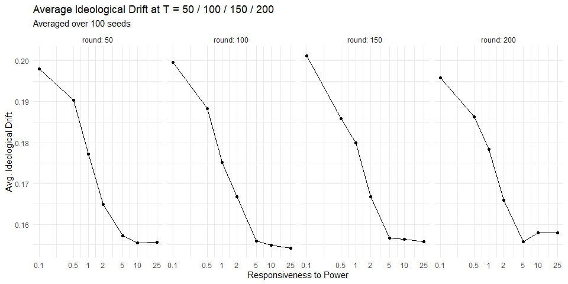
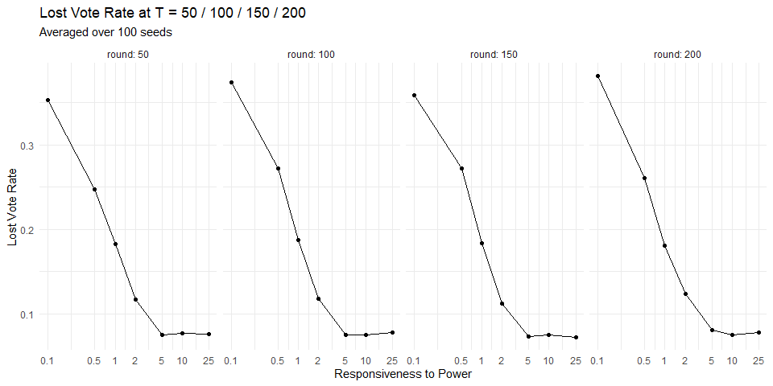
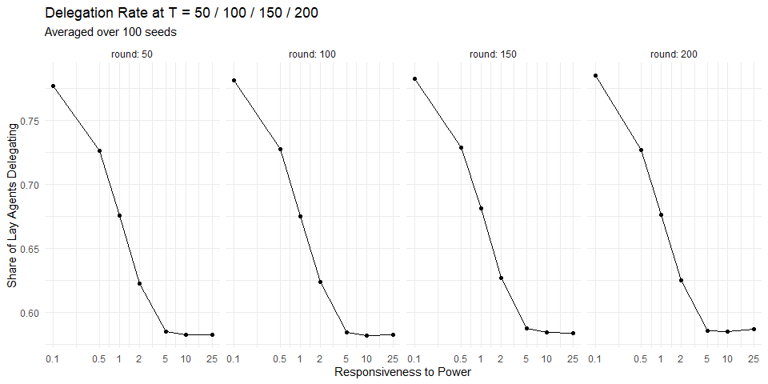
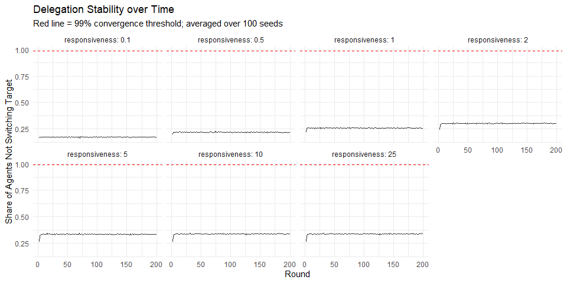
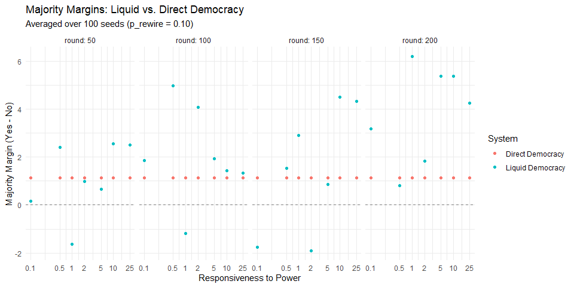

Weekly Report — Week 5 (20.03.2026 – 26.03.2026)
================
2026-03-20

## Summary

- 100-seed averaging framework, snapshot tracking at T = 50/100/150/200,
  per-round history for cheap metrics, parallel execution via `furrr`
- Added `inertia` parameter (default 0 = memoryless baseline)
- Experiment 3: effect of responsiveness to power, p_rewire = 0.10, 100
  seeds, T = 200

------------------------------------------------------------------------

## Experiment Design

| Parameter      | Values                               |
|----------------|--------------------------------------|
| Responsiveness | 0.1, 0.5, 1, 2, 5, 10, 25            |
| Rewiring (p)   | 0.10                                 |
| Seeds          | 1 – 100                              |
| Agents         | 250 lay, 1 community                 |
| T              | 200 (snapshots at 50, 100, 150, 200) |
| Inertia        | 0                                    |

------------------------------------------------------------------------

## Results

### Ideological Drift

Drift decreases monotonically with responsiveness and stabilises early —
results are nearly identical across all four snapshots, indicating the
system reaches its stochastic equilibrium well before T = 50.

<!-- -->

### Lost Vote Rate

Vote loss drops sharply as responsiveness increases, driven by lower
delegation rates reducing the number of mutual cycles that can form.

<!-- -->

### Delegation Rate

Delegation rate decreases with responsiveness as agents with
above-average local power increasingly prefer to vote directly,
consistent with the self-weight formula.

<!-- -->

### Delegation Stability over Time

Stability never reaches the 99% threshold under the memoryless baseline,
confirming the system settles into a stochastic equilibrium rather than
a fixed delegation structure.

<!-- -->

### Majority Margins

With 100 seeds the Direct Democracy margin shows noticeable sampling
noise around zero (SE ≈ 1.58), while the Liquid Democracy margin tracks
closely but varies with responsiveness.

<!-- -->

------------------------------------------------------------------------

## Open Issues
