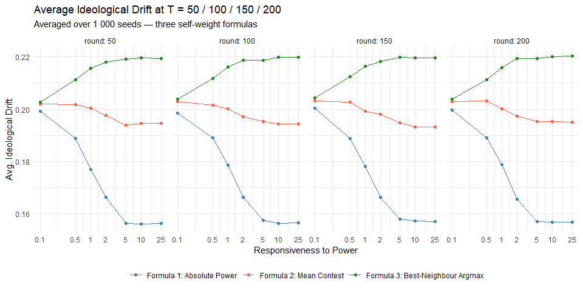
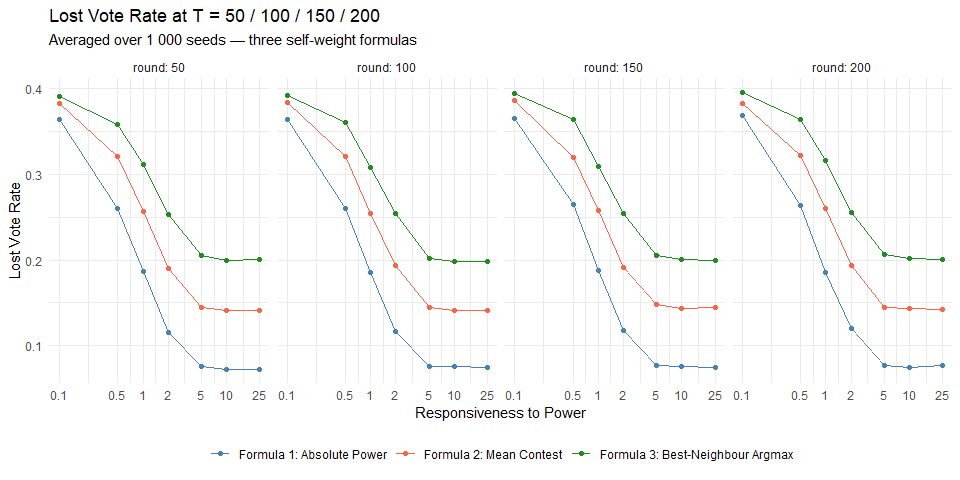
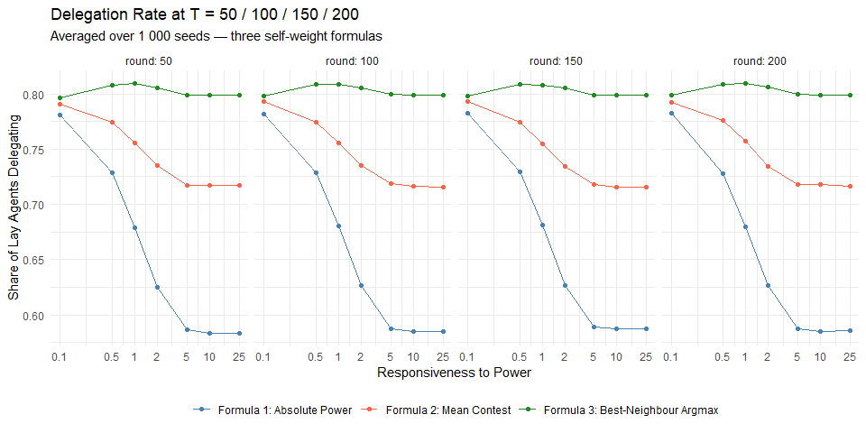
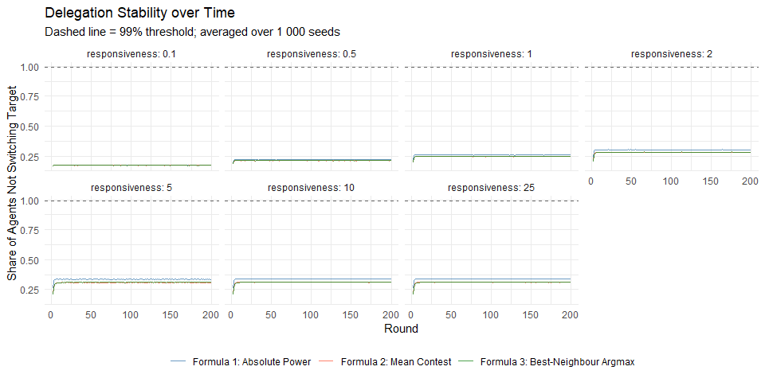
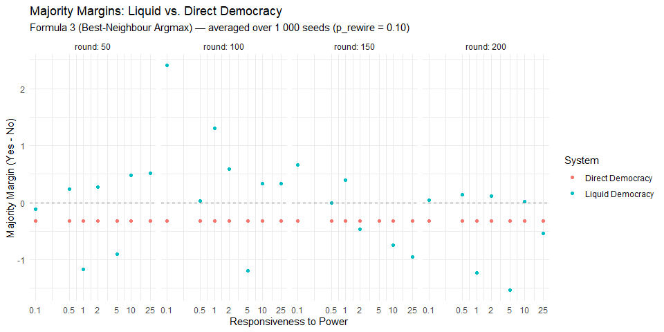

Weekly Report — Week 6 (27.03.2026 – 02.04.2026)
================
2026-03-27

## Summary

- Iterated on the self-weight formula across three versions and
  validated each with 1 000-seed runs
- Final formula: agent identifies best available delegate via $A_{ij}$,
  then compares own power against that single neighbour

------------------------------------------------------------------------

## 1. Self-Weight Formula Evolution

**Formula 1 — Absolute Power:** `w_self = sigmoid(r × own_power)` Used
absolute power, so `r` inflated self-confidence independently of any
social comparison. At high `r`, even an agent with power = 1 had
self-weight ≈ 1, suppressing delegation before any power hierarchy could
form.

**Formula 2 — Mean Contest:**
`w_self = mean over neighbours j of sigmoid(r × (own_power − power_j))`
Compared own power against each neighbour individually and averaged the
win probabilities. Symmetric with the neighbour formula, but ignores
ideology entirely — a powerful ideologically distant neighbour pulled
self-weight down just as much as a powerful ideologically close one.

**Formula 3 — Best-Neighbour Argmax:** `j* = argmax A_ij`,
`w_self = sigmoid(r × (own_power − power_j*))` Agent first identifies
the most attractive available delegate — the neighbour who best combines
ideological proximity and power — then compares own power only against
that single best alternative. Ideology filters the candidate in Step 1;
power decides the contest in Step 2.

------------------------------------------------------------------------

## 2. Formula Comparison — 1 000 Seeds

### Ideological Drift

<!-- -->

### Lost Vote Rate

<!-- -->

### Delegation Rate

<!-- -->

### Delegation Stability over Time

<!-- -->

------------------------------------------------------------------------

## 3. Majority Margins (Formula 3, 1 000 Seeds)

With 1 000 seeds the Direct Democracy margin converges close to its
theoretical expectation of 0 (uniform preferences, n = 250), confirming
the earlier deviation with 100 seeds was purely sampling noise (SE ≈
1.58 at 100 seeds, ≈ 0.50 at 1 000 seeds).

<!-- -->

------------------------------------------------------------------------

## 4. Seed Validation

The table below shows key metrics for 15 individual seeds
(responsiveness = 1, p_rewire = 0.10, T = 1, n = 250). Direct and Liquid
margins vary in sign and magnitude around zero across seeds, confirming
independent sampling. Lost votes reflect delegation cycles formed in
round 1 before any power hierarchy exists.

| Seed | Direct Yes | Direct No | Direct Margin |
|-----:|-----------:|----------:|--------------:|
|    1 |          0 |         0 |             0 |
|    2 |          0 |         0 |             0 |
|    3 |          0 |         0 |             0 |
|    4 |          0 |         0 |             0 |
|    5 |          0 |         0 |             0 |
|    6 |          0 |         0 |             0 |
|    7 |          0 |         0 |             0 |
|    8 |          0 |         0 |             0 |
|    9 |          0 |         0 |             0 |
|   10 |          0 |         0 |             0 |
|   11 |          0 |         0 |             0 |
|   12 |          0 |         0 |             0 |
|   13 |          0 |         0 |             0 |
|   14 |          0 |         0 |             0 |
|   15 |          0 |         0 |             0 |

Per-seed metrics at T = 1 (n = 250, responsiveness = 1, p_rewire = 0.10)

------------------------------------------------------------------------

## Open Issues

- Self-weight: another alterative: Competitive Residual Self-Weight: 1 -
  max(w_nb) (The core idea is to treat Self-Confidence not as a fixed
  value, but as the residual trust left over after evaluating the best
  available alternative)
- How to deal with cycles: Ranked fallback (2nd best option) or keep
  cycles?
