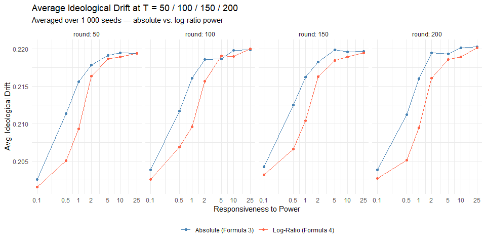
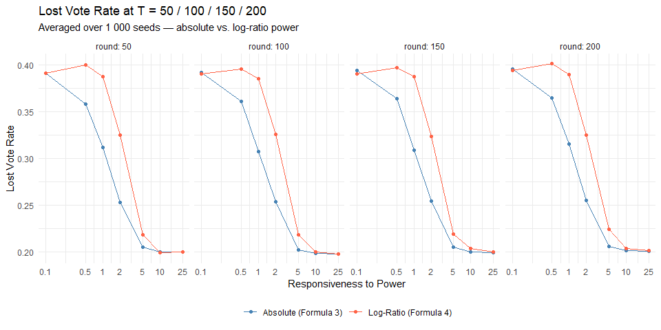
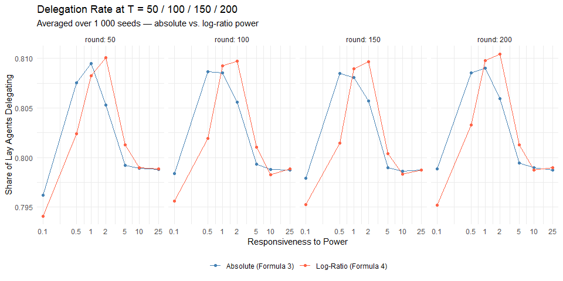
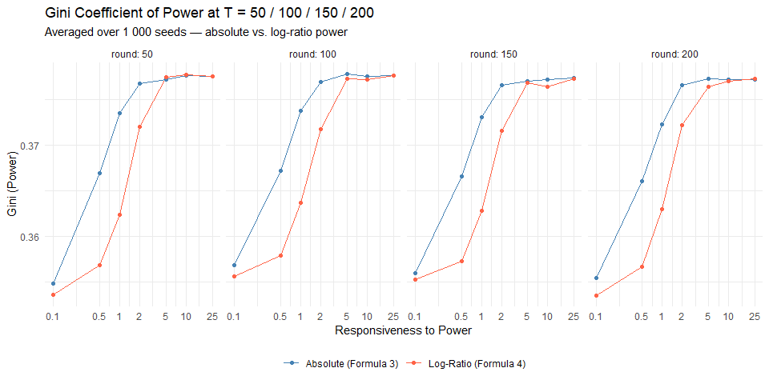
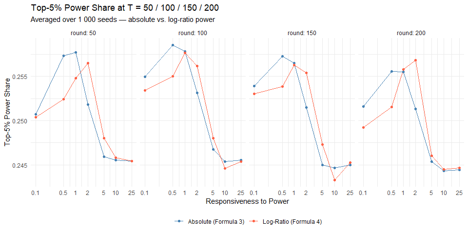
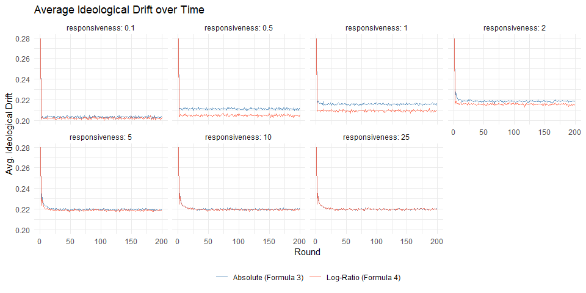
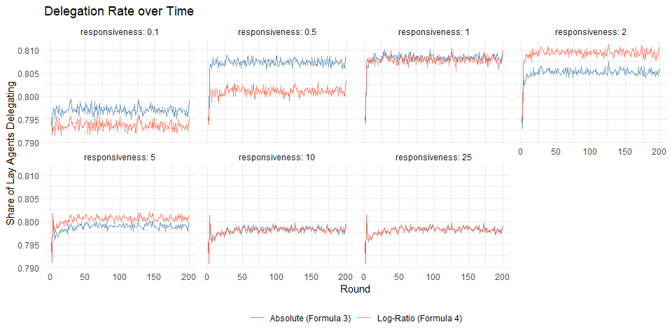
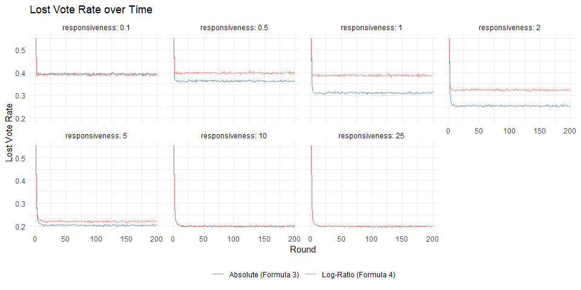

Weekly Report — Week 7 (03.04.2026 – 09.04.2026)
================
2026-04-05

## Summary

- Switched the power term in both the neighbour attractiveness and
  self-weight formulas from absolute differences to log-ratios
- Old formula: `sigmoid(r × (power_j − power_i))`
- New formula: `sigmoid(r × log(power_j / power_i))`
- Motivation: absolute differences cause sigmoid saturation once a power
  hierarchy forms, making `r` lose interpretive meaning after early
  rounds; log-ratios keep `r` consistent across all rounds
- Both formulas run on 1 000 seeds, p_rewire = 0.10, T = 200

------------------------------------------------------------------------

## 1. Formula Comparison

**Formula 3 — Absolute Power Difference** (archived):
`A_ij = (1 - |pref_i - pref_j|) × sigmoid(r × (power_j - power_i))`

Once a hierarchy forms (e.g. round 20+), power differences easily reach
10–50. For r = 1, sigmoid(10) ≈ 1 and sigmoid(50) ≈ 1 —
indistinguishable. The formula is effectively binary (always delegate /
never delegate) long before T = 200.

**Formula 4 — Log-Ratio Power** (current default):
`A_ij = (1 - |pref_i - pref_j|) × sigmoid(r × log(power_j / power_i))`

A 5:1 power ratio produces log(5) ≈ 1.61 regardless of whether the
absolute values are 1 vs 5 or 100 vs 500. The sigmoid input stays on a
bounded, interpretable scale throughout the simulation.

------------------------------------------------------------------------

## 2. Snapshot Comparisons (T = 50 / 100 / 150 / 200)

### Ideological Drift

<!-- -->

### Lost Vote Rate

<!-- -->

### Delegation Rate

<!-- -->

### Power Concentration — Gini

<!-- -->

### Power Concentration — Top-5% Share

<!-- -->

## 3. Time Series Comparisons (all 200 rounds)

### Ideological Drift over Time

<!-- -->

### Delegation Rate over Time

<!-- -->

### Lost Vote Rate over Time

<!-- -->
