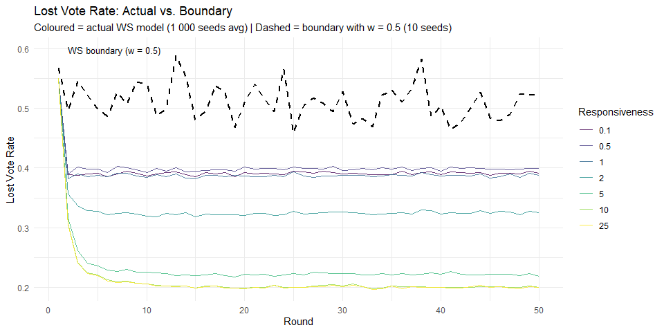
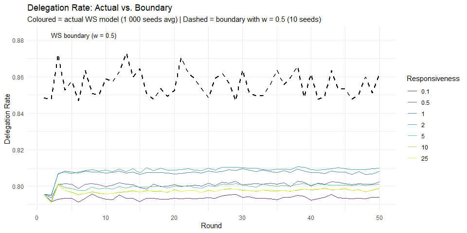

Weekly Report — Week 8 (10.04.2026 – 16.04.2026)
================
2026-04-10

## Summary

- Validated whether the lost vote rate and delegation rate of the actual
  simulation are within a structurally plausible range
- Approach: run the same Watts-Strogatz network (n = 250, k = 6, p =
  0.10) for 50 rounds with all weights fixed at **w = 0.5** — the
  maximum the log-ratio formula can produce when preferences align and
  powers are equal
- This gives a **structural upper bound**: the highest delegation and
  lost vote rate the network topology can generate, independent of any
  power or preference dynamics
- If the actual model stays below this boundary, the numbers are valid

------------------------------------------------------------------------

## Boundary Simulation Setup

------------------------------------------------------------------------

## 1. Lost Vote Rate: Actual vs. Boundary

<!-- -->

## 2. Delegation Rate: Actual vs. Boundary

<!-- -->

------------------------------------------------------------------------

## 3. Comparison Table (T = 50)

| Model | Delegation_Rate_mean | Lost_Vote_Rate_Mean | Lost_Vote_Rate_Max |
|:---|---:|---:|---:|
| Actual WS (1 000 seeds, avg over r) | 0.8020 | 0.3032 | 0.3999 |
| WS boundary (w = 0.5, 10 seeds) | 0.8616 | 0.5240 | 0.7040 |

**Interpretation:** If the actual model’s lost vote rate stays below the
boundary values, the observed rates are structurally valid — they are
lower than what the network topology would produce under the most
delegation-friendly conditions possible.

------------------------------------------------------------------------

## 4. Perceived Opinion and Power

So far agents observe the **true** opinion and power of their
neighbours. This is unrealistic. The next modelling step introduces
perception noise so that delegation decisions are based on **perceived**
values.

### Implementation

Two noise parameters are added to `simulate_liquid_democracy()`:

- `sigma_opinion` — SD of Gaussian noise in **logit space** (opinion ∈
  \[0, 1\])
- `sigma_pow` — SD of Gaussian noise in **log space** (power \> 0)

Setting both to 0 (default) reproduces the current model exactly.

**Perceived opinion** of agent i about neighbour j:
$$\hat{p}_{ij} = \text{logistic}\!\left(\text{logit}(p_j) + \varepsilon\right), \quad \varepsilon \sim \mathcal{N}(0,\, \sigma_{\text{opinion}}^2)$$

Logit space is used so the output stays in \[0, 1\]. The noise is
symmetric on the logit scale and compresses near the boundaries —
extreme opinions are perceived with slightly less distortion than
moderate ones.

**Perceived power** of agent i about neighbour j:
$$\widehat{\text{pow}}_{ij} = \text{pow}_j \cdot \exp(\eta), \quad \eta \sim \mathcal{N}(0,\, \sigma_{\text{pow}}^2)$$

Log space ensures the output stays positive and makes the noise
multiplicative — a factor-of-2 error is equally likely whether the true
power is 2 or 200. This is more realistic than additive noise for a
quantity that spans several orders of magnitude as hierarchies form.

In both cases agents know their **own** opinion and power exactly.

### What different sigma values mean

| sigma | Opinion: 68% CI around p = 0.5 | Power: 68% CI around true pow |
|-------|--------------------------------|-------------------------------|
| 0.0   | \[0.50, 0.50\] — no noise      | \[1.00, 1.00\] × pow          |
| 0.5   | \[0.38, 0.62\]                 | \[0.61, 1.65\] × pow          |
| 1.0   | \[0.27, 0.73\]                 | \[0.37, 2.72\] × pow          |

------------------------------------------------------------------------

## 5. Open Questions for Discussion

**1. What should agents observe?**

- **Option A:** Noisy signal of true opinion and true power *(current
  implementation)*
- **Option B:** Observable proxies
  - Opinion → last observed vote (possibly already delegated,
    i.e. reflects the opinion of the neighbour’s own delegate rather
    than the neighbour’s true position)
  - Power → local prominence (e.g. number of direct neighbours
    delegating to j, which is a lower bound on true transitive power and
    grows increasingly inaccurate as delegation chains lengthen)

→ *Which interpretation is more appropriate for the model?*

------------------------------------------------------------------------

**2. How should uncertainty be modelled?**

- **Option A:** Global noise parameters — same σ for all agents
  *(current implementation)*
- **Option B:** Heterogeneous noise
  - By agent (some agents are better informed than others)
  - By relationship (closer neighbours → less noise, e.g. σ_ij decreases
    with network distance or interaction history)

→ *Is a simple global σ sufficient, or should heterogeneity be
included?*

------------------------------------------------------------------------

**3. Should perception change over time (learning)?**

- **Option A:** Fixed noise — no learning *(current implementation)*
- **Option B:** Decreasing uncertainty with repeated interaction, e.g.:
  $$\sigma_{ij}(t) = \frac{\sigma_0}{\sqrt{1 + n_{ij}(t)}}$$ where
  $n_{ij}(t)$ counts past rounds in which i observed j. Early rounds
  become noisier and more exploratory; later rounds more stable as
  beliefs converge.

→ *Do we want agents to “learn” about others over time?*

------------------------------------------------------------------------

**4. Should perception include systematic bias (not just noise)?**

- **Option A:** Purely random error *(current approach)*
- **Option B:** Biased perception, e.g. egocentric bias — others are
  perceived as closer to one’s own opinion than they actually are:
  $$\hat{p}_{ij} = \text{logistic}\!\left(\text{logit}(p_j) + \beta\,(p_i - p_j) + \varepsilon\right)$$
  where β \> 0 pulls perceived opinions toward the observer’s own view.
  This could produce echo-chamber effects even with a diverse true
  opinion distribution.

→ *Is it worth including simple bias mechanisms at this stage?*

------------------------------------------------------------------------

**5. How realistic vs. how simple should the first version be?**

- **Option A:** Keep noisy true values — simple, controlled baseline
  *(current implementation)*
- **Option B:** Move to proxy-based perception — more realistic, but
  adds complexity in both implementation and interpretation

→ *Which level of complexity is appropriate for this project?*
