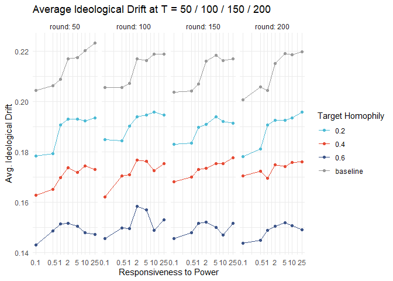
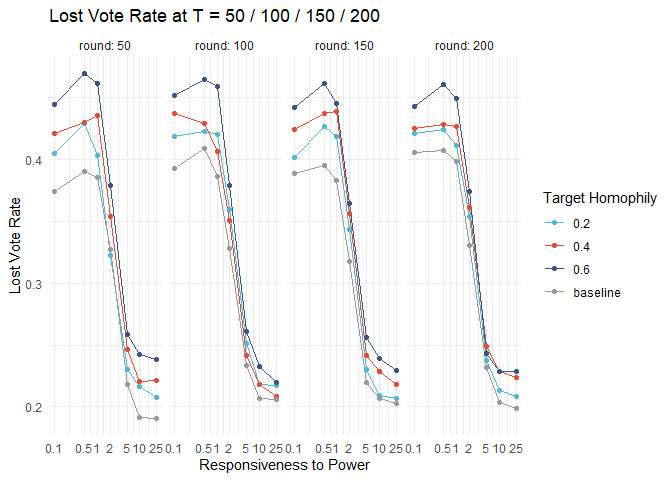
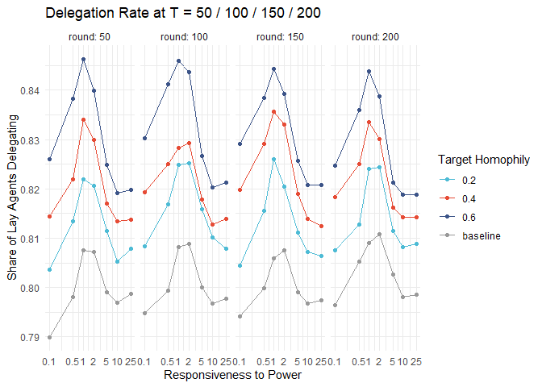

Weekly Report — Week 9 (17.04.2026 – 23.04.2026)
================
2026-04-17

## Summary

- Implemented structural homophily via a Metropolis opinion-shuffle step
- The shuffle runs once on the fixed network before the simulation loop;
  it stops as soon as a specified target assortativity is reached
- Added `compute_network_homophily()` to measure the degree of homophily
  of any friendship graph
- Ran the responsiveness experiment across three target assortativity
  levels (0.2, 0.4, 0.6) plus the random baseline

------------------------------------------------------------------------

## 1. Homophily Algorithm

The standard model assigns opinions randomly, so connected agents are no
more similar than any two strangers. The Metropolis opinion-shuffle
redistributes lay opinions on the **fixed** network until a target level
of structural homophily is reached.

**What stays fixed:** the entire network topology — edges, degree
sequence, clustering, path lengths. Experts are excluded throughout.

**What changes:** the assignment of opinion values to lay nodes. The
same set of values drawn from $\text{Uniform}[0,1]$ is preserved; only
their allocation is reshuffled.

**Algorithm.** Repeat up to `homophily_steps` times:

1.  Draw two random lay agents $i$ and $j$
2.  Compute total opinion disagreement on all lay-to-lay edges touching
    $i$ or $j$, excluding the $i$–$j$ edge (cancels):
    $$E = \sum_{v \in N_i \setminus \{j\}} |op_i - op_v| + \sum_{v \in N_j \setminus \{i\}} |op_j - op_v|$$
3.  Propose swapping $op_i \leftrightarrow op_j$; compute $E'$
4.  Accept if $E' < E$; otherwise accept with probability
    $e^{-(E'-E)\cdot \text{homophily\_t}}$
5.  Every 100 steps: compute opinion assortativity on the lay subgraph;
    **stop** as soon as $r_{op} \geq \text{target\_homophily}$

The parameter `homophily_t` (Metropolis temperature) controls how
strictly improvements are enforced — higher values make the algorithm
more greedy and converge faster. The algorithm is disabled entirely when
`target_homophily = NULL`.

**Measuring homophily.** `compute_network_homophily(gF, agents)` returns
two metrics on the lay subgraph:

| Metric                   | Range     | Random baseline | Perfect homophily |
|--------------------------|-----------|-----------------|-------------------|
| `assortativity`          | $[-1, 1]$ | $\approx 0$     | $1$               |
| `mean_edge_disagreement` | $[0, 1]$  | $\approx 0.33$  | $0$               |

The assortativity is the stopping criterion. The mean edge disagreement
is directly proportional to the energy $E$ the shuffle minimises, making
it the most natural companion metric.

------------------------------------------------------------------------

## 2. Results — Responsiveness × Target Homophily

Simulation parameters: n = 250 lay agents, 1 community, k = 6, p_rewire
= 0.10, T = 200, 100 seeds, `homophily_t` = 5.

### Ideological Drift

<!-- -->

### Lost Vote Rate

<!-- -->

### Delegation Rate

<!-- -->
